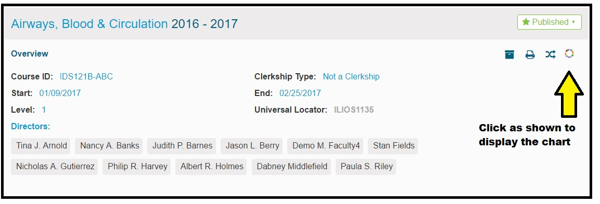
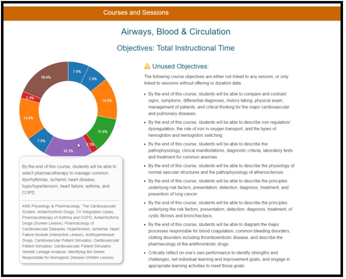

# Visualizations

Visualization are graphs and charted information to help make informed decisions about how Ilios is being used and how this use could be improved.

One of the available charts displays the usage of Objectives and how frequently they are utilized in a Course ... or more importantly let you know when they are not being used.

As shown below, mousing over any of the Objectives will display the full text of the Objective as well as the names of the Sessions to which it has been attached. Unused Objectives are simply listed for reference and are not included in the chart.

