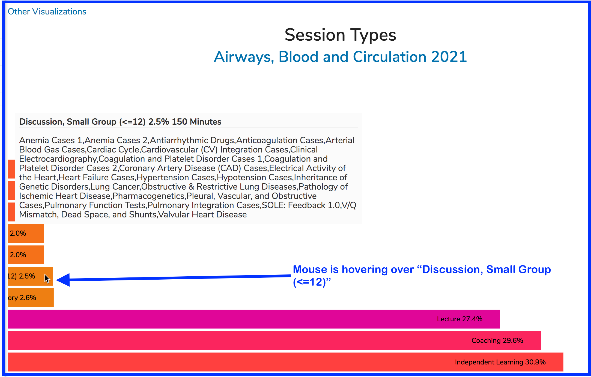

# Visualizations

Visualization are graphs and charted information intended to help make informed decisions about how Ilios is being used and how this use could be improved.

One of the available charts displays the usage of Objectives and how frequently they are utilized in a Course ... or more importantly let you know when they are not being used.

After clicking on the graph icon as shown above, you will see a screen similar to the following with \(at the time of update\) four different visualizations available to review.

#### Course Visualizations

#### Objectives

The example below is from a user clicking on the **Objectives** visualization \(the one in the upper left corner\). It is displayed as shown below.

Mousing over any of the Objectives will display the full text of the Objective as well as the names of the Sessions to which it has been attached. Unused Objectives are simply listed for reference and are not included in the chart.

#### Session Types

The Session Types visualization is laid out horizontally rather than in a pie chart like the Objectives visualization in the section above. In the example below, I am hovering over a specific Session Type to review the usage specific of that session type in this particular course. 

