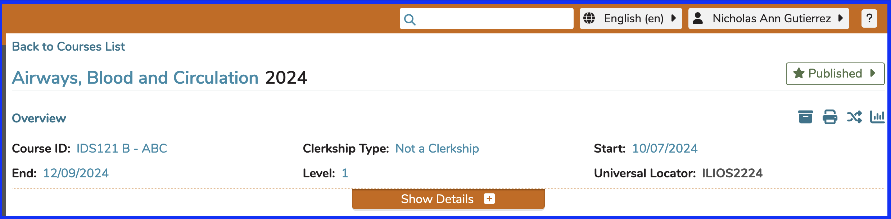
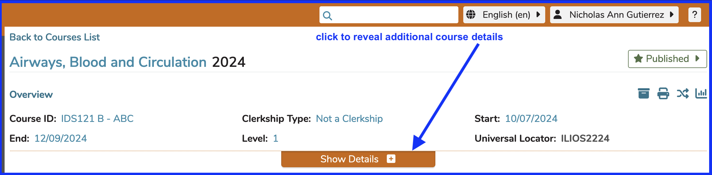
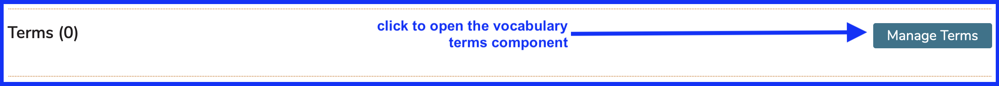
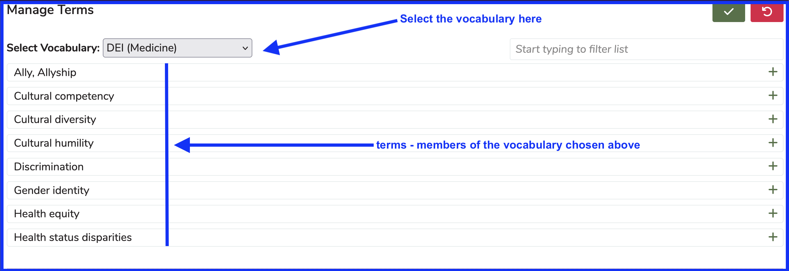
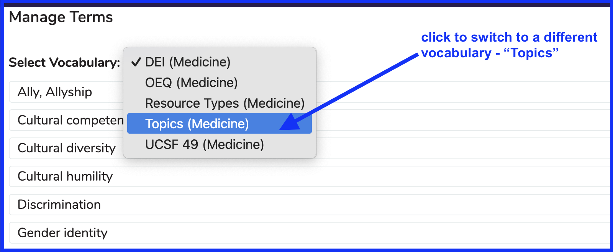
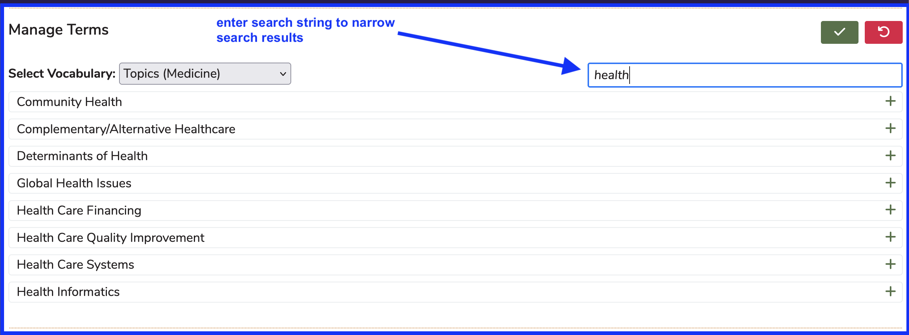
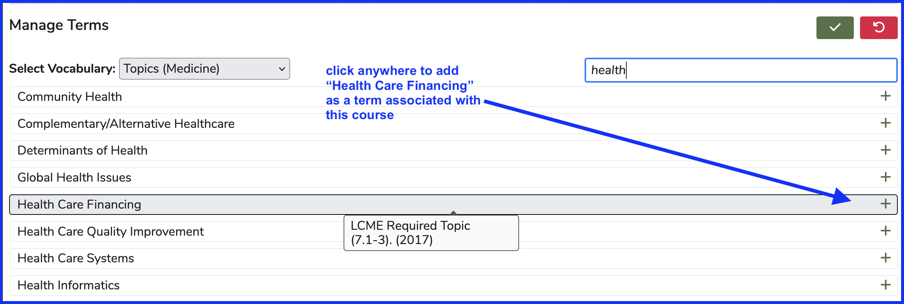
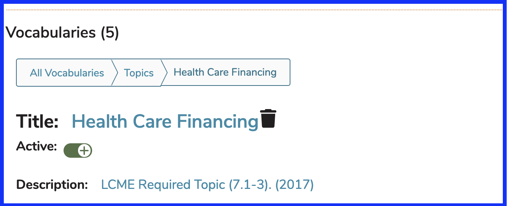

Attaching and modifying terms (grouped by vocabularies in Ilios) is performed at both the course level as well as at the [session](https://iliosproject.gitbook.io/ilios-user-guide/courses-and-sessions/sessions/session_actions/edit-session#manage-vocabulary-terms) level. 

# Add Vocabulary Term

For the sake of demonstration, we will start with a course that has not had any vocabulary terms attached at this point.

## Select Course 

The course has been selected (Airways, Blood and Circulation - 2024). The [Edit Course](https://iliosproject.gitbook.io/ilios-user-guide/courses-and-sessions/courses/course_actions/edit-course) section has good information about searching for and selecting a course to view/modify.

## Show Details

When a course is selected initially, the course details are hidden. Click "Show Details" as shown below to reveal these other field maintenance areas.

Scrolling down the page past Leadership, Objectives, Learning Materials, and Competencies, you will find the Term maintenance area. Activating this functionality is accomplished by the clicking "Manage Terms" as shown below. 

## Manage Terms

After clicking as shown above, the screen appears as follows. These terms and vocabularies are configured at the school level. The term maintenance area appears as shown below.

## Switch Vocabulary 

Using the vocabulary swticher, a different vocabulary can be selected. In this case, we are chosing "Topics". 

Now that "Topics" has been chosen as the vocabulary selected, the terms available for selection will reflect this choice. Only terms from the vocabulary "Topics" will be available.

## Updated Vocabulary 

There is also filtering available allowing for the terms in any selected vocabulary to be searched and made easier to find for attachment to this course.

## Select Term

The selection process is straightforward. You can search to limit the result set or scroll to find the correct one to add to this course. In the example, we are selecting "Health Care Financing" to be added as a term (from the "Topics" vocabulary). 

The details about this term are included to show that the mouse-over pop-up reveals the term's description. This is from the Schools >> Vocabularies section of Ilios.

