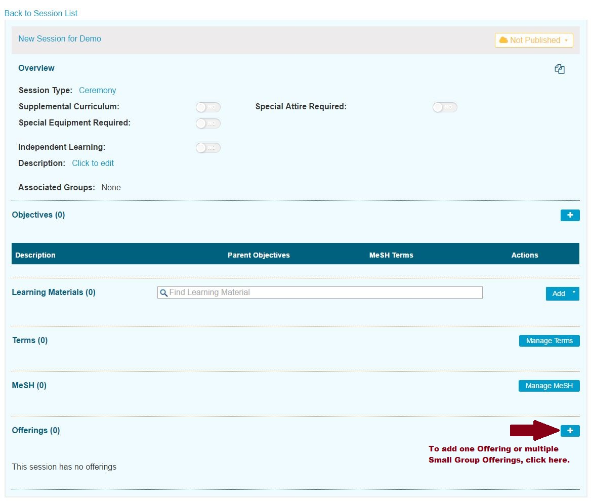
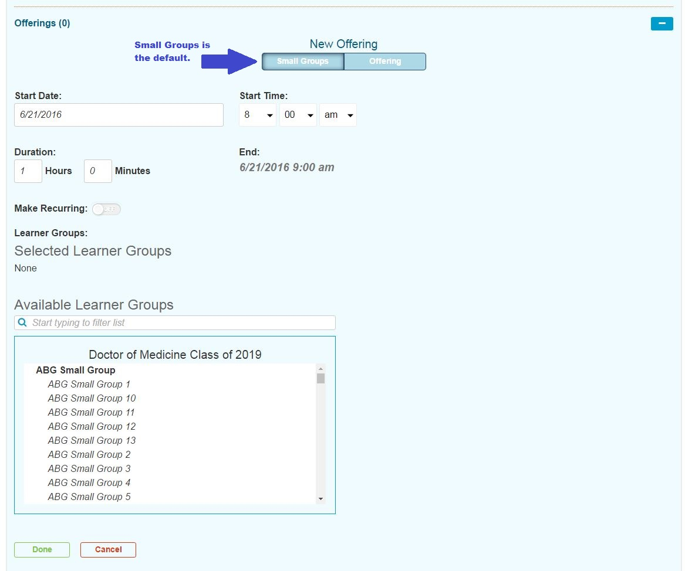

# Offerings

Offerings represent the scheduled \(time and place\) representation or event of a Session or teaching unit, represented on the calendar: in other words, when the curriculum for a particular session is “offered”. Offerings represent the final step for Students to see the actual time and place where they need to be in order to learn what is being offering in the Session.

## Offering Attributes

The attributes of an Offering are listed and described here. For more information on using the interface to change these values, please refer to [Edit Offering](https://iliosproject.gitbook.io/ilios-user-guide/courses-and-sessions/offerings/edit-offering).

* **Start Date**: Selected using a calendar control.
* **Start Time**: Selected using a combination of three drop-down boxes \(Hour, Minutes, AM/PM\)                          
* **Duration**: The length of the Offering entered using a combination of Hours and Minutes.
* **End**: This gets calculated after the above information has been entered.
* **Location**: This is entered manually, or the default is applied.
* **Instructors**: Search to find Instructors and / or Instructor Groups to indicate who will be teaching the Offering.
* **Learner Groups**: This is how Students are assigned into Offerings. If a Student is a member of a Learner Group that is attached to an Offering, the Offering will appear on their calendar.
  * **Selected Learner Groups**: This frame will be populated with any and all Learner Groups associated with the Offering.
  * **Available Learner Groups**: Learner Groups that are not associated with the Offering are available for selection here.

Offerings can be created as ...

* [**Single Offering**](https://iliosproject.gitbook.io/ilios-user-guide/courses-and-sessions/offerings/create-single-offering)**:**  A single \(or even multiple\) event\(s\) for one or more Learner Groups to attend at the same time, in the same place and with the same Instructors.
* [**Small Group Offering**](https://iliosproject.gitbook.io/ilios-user-guide/courses-and-sessions/offerings/create-small-group-offerings)**:**  A single event or a series of events for a number of smaller Learner Groups that can be offered at the same time \(or a different time\) but with each individual Learner Group meeting in a different location.  
* [**Recurring Event**](https://iliosproject.gitbook.io/ilios-user-guide/courses-and-sessions/offerings/recurring-event)**:**  A recurring event that occurs multiple times for a specified number of weeks.  This is activated by utilizing the "Make Recurring" slider to toggle this functionality to the "On" position.

Here are a couple of instructional screen shots. More details on how to accomplish the actions listed above are coming soon.

Click to add a new offering as shown by the arrow in the screen shot below. First, an existing course and session must have been selected.

 The screen now appears as shown below to continue taking action to add the offering\(s\). Recent upgrade to the interface include the fact that End Time is no longer manually entered. It is determined automatically based on the Duration of the Offering that is entered here. Also "Available Learner Groups" is now a searchable field.

