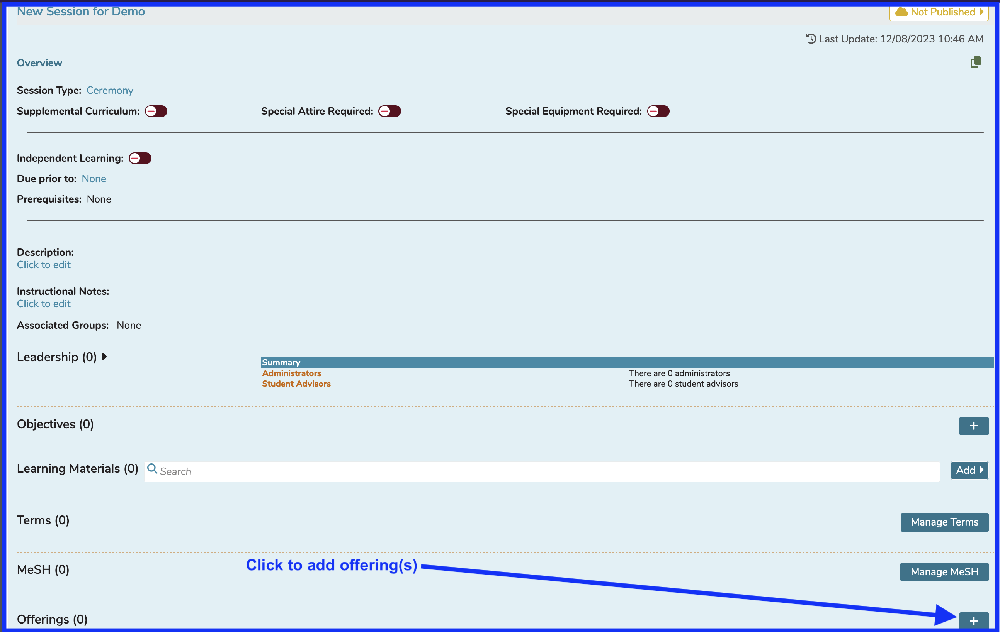
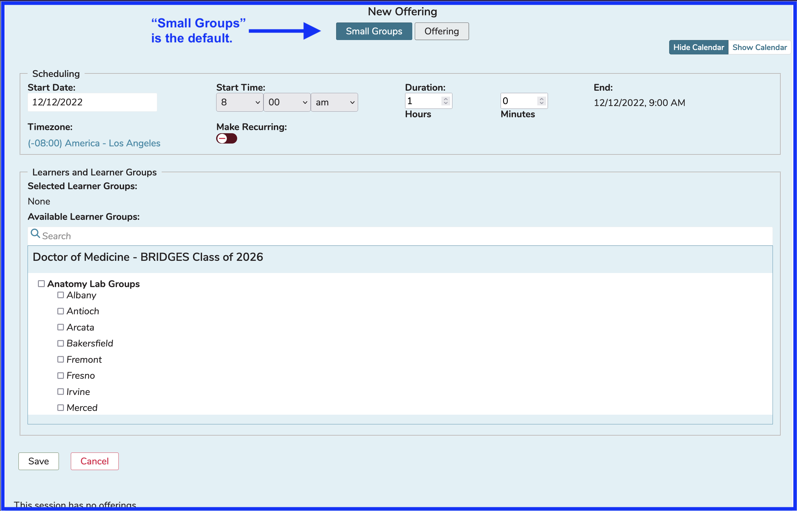

# Offerings

Offerings represent the scheduled (time and place) representation or event of a Session or teaching unit, represented on the calendar: in other words, when the curriculum for a particular session is “offered”. Offerings represent the final step for Students to see the actual time and place where they need to be in order to learn what is being offering in the Session. They also have full access to the Learning Materials for the session and course along with any other learning activities associated with the session.

## Offering Attributes

The attributes of an Offering are listed and described here. For more information on using the interface to change these values, please refer to [Edit Offering](https://iliosproject.gitbook.io/ilios-user-guide/courses-and-sessions/offerings/edit-offering).

* **Start Date**: Selected using a calendar control.
* **Start Time**: Selected using a combination of three drop-down boxes (Hour, Minutes, AM/PM)
* **Duration**: The length of the Offering entered using a combination of Hours and Minutes.
* **End**: This gets calculated after the above information has been entered.
* **Timezone**: This was created for schools that may have campuses in different timezones or if an Ilios user happens to be using a computer that is set to an alternate zone. The timezone for the offering (regardless of the computer's settings) can be set here. The resulting saved offer will still be displayed using the computer's timezone settings.
* **Location**: This is entered manually, or the default is applied (in the case of Small Group offerings).
* **Virtual Learning Link:** Paste in a URL for a virtual offering location. Defaults are applied in the case of Small Group offerings.
* **Instructors**: Search to find Instructors and / or Instructor Groups to indicate who will be teaching the Offering. Small Group defaults apply here as well.
* **Learners (Individual)**: Individual learners (who may or may not be in a Learner Group or Cohort) can be added as well. This is the exception rather than the rule and can be used as a work around.
* **Learner Groups**: This is how Students are assigned into Offerings. If a Student is a member of a Learner Group that is attached to an Offering, the Offering will appear on their calendar.
  * **Selected Learner Groups**: This frame will be populated with any and all Learner Groups associated with the Offering.
  * **Available Learner Groups**: Learner Groups that are not associated with the Offering are available for selection here.

## Offering Options

Offerings can be created as ...

* [**Single Offering**](https://iliosproject.gitbook.io/ilios-user-guide/courses-and-sessions/offerings/create-single-offering)**:**  A single (or even multiple) event(s) for one or more Learner Groups to attend at the same time, in the same place and with the same Instructors. Single offerings can be saved without specifying the learner group. This information can be added later or individual learners may be added to any offering.
* [**Small Group Offering**](https://iliosproject.gitbook.io/ilios-user-guide/courses-and-sessions/offerings/create-small-group-offerings)**:**  A single event or a series of events for a number of smaller Learner Groups that can be offered at the same time (or a different time) but with each individual Learner Group meeting in a different location. Learner group attachment is required for small group offerings because default attributes are applied based on the groups selected. This can also be modified later.
* [**Recurring Event**](https://iliosproject.gitbook.io/ilios-user-guide/courses-and-sessions/offerings/recurring-event)**:**  A recurring event that occurs multiple times for a specified number of weeks.  This is activated by utilizing the "Make Recurring" slider to toggle this functionality to the "On" position.
* [**Multi-Day Event**](https://iliosproject.gitbook.io/ilios-user-guide/courses-and-sessions/offerings/multi-day-offerings)**:** Offerings that start on one day and continue on until the next or a future day are considered multi-day offerings. They are tracked in a slightly different manner than other offerings in Ilios.

Click to add a new offering as shown by the arrow in the screen shot below. First, an existing course and session must have been selected.

The screen now appears as shown below to continue taking action to add the offering(s). End Time is determined automatically based on the Duration of the Offering that is entered here. Also "Available Learner Groups" is a searchable field.

