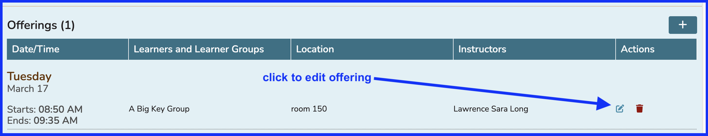
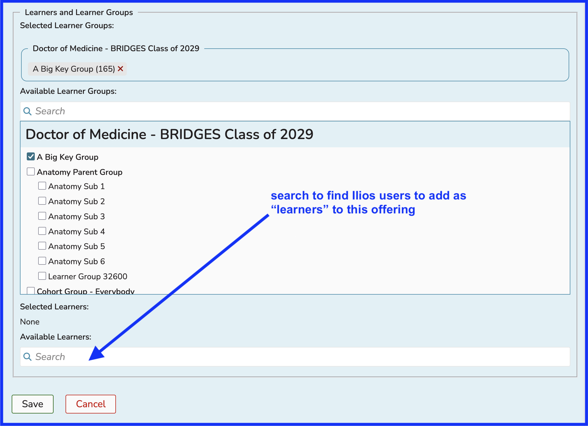
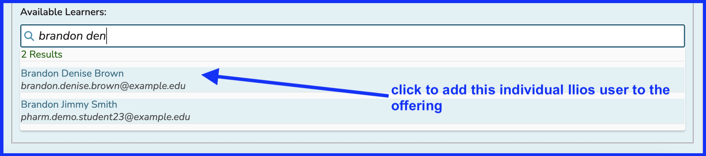
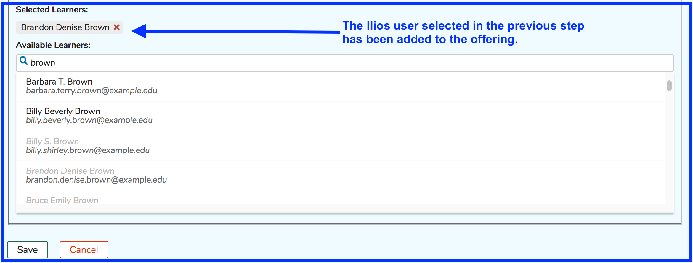
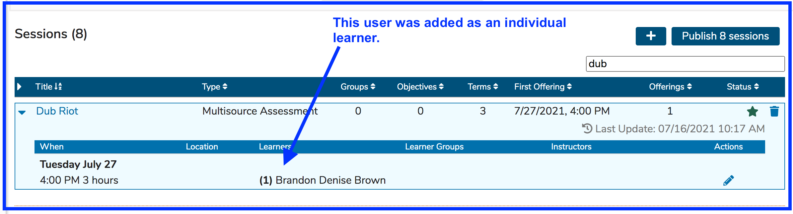

# Add Individual Learners

Individual learners can be attached to offerings in Ilios. One thing to remember is that anyone who is an Ilios user can be added to offerings using this technique. They do not need to be in any Cohort associated with this course.

* Perform the search as shown below and click on the name of the person to add to attend this offering.

**NOTE**: This addition of individual learners to offerings can be reviewed in two places currently ...

* The offering editor itself - in edit mode
* In the Session list with the session expanded - described below ...

Mousing over will expose all learners - members of learner groups along with individual learners. A simple example of this is shown below. When there are more learners than can be displayed, hovering over with the mouse will reveal the additional users designated as individual learners.\

