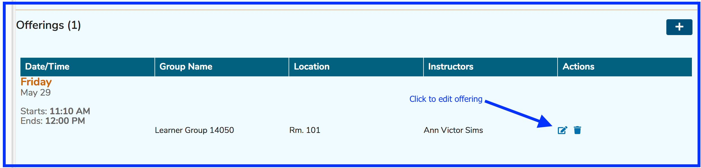
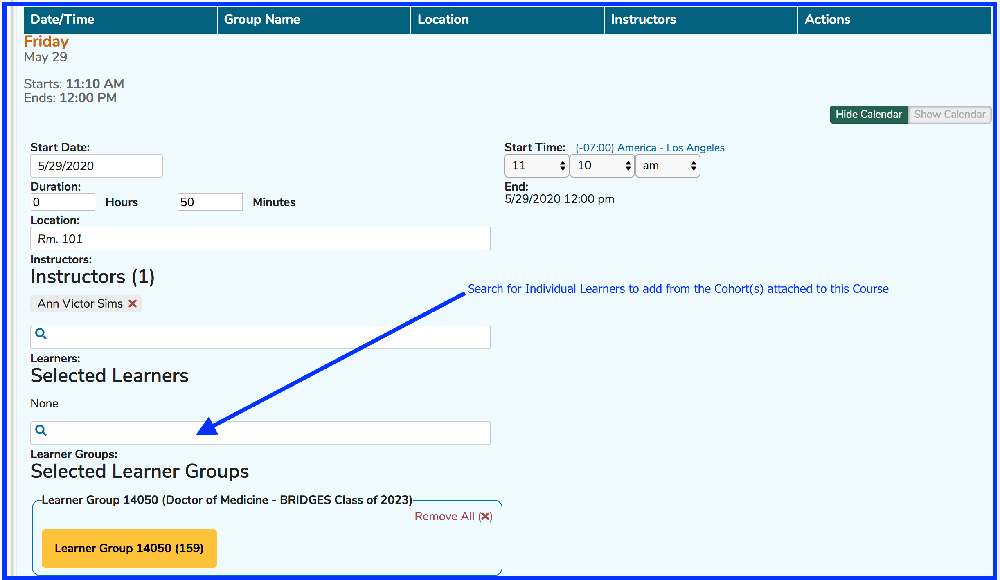
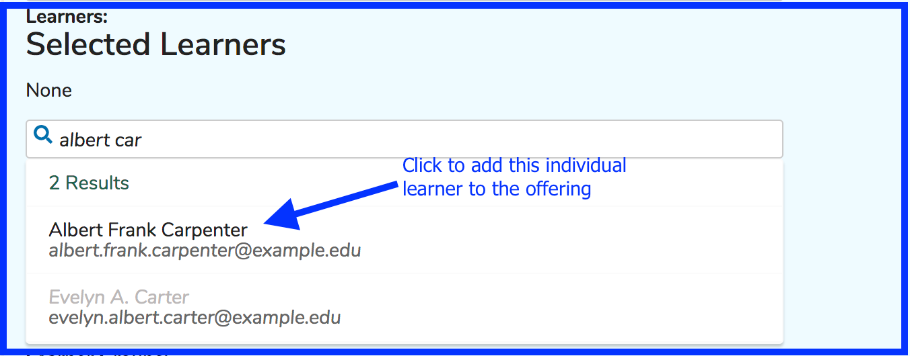

# Add Individual Learners

Individual learners can be attached to offerings in Ilios. One thing to remember is that anyone who is an Ilios user can be added to offerings using this technique. They do not need to be in any Cohort associated with this course.

* Perform the search as shown below and click on the name of the person to add to attend this offering. 

**NOTE**: Currently the only place to review and verify this addition of individual learners to offerings is in the offering editor. This will be updated soon.

