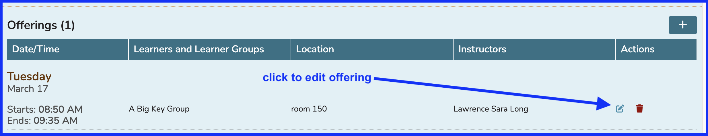
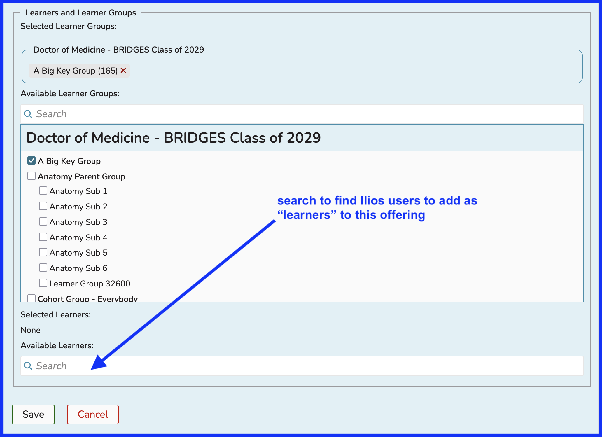
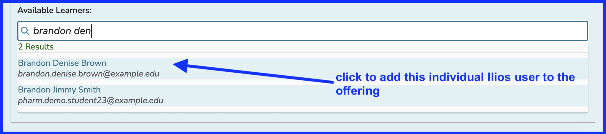
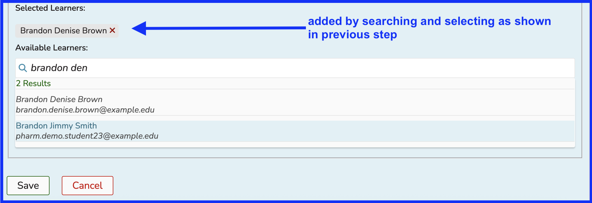
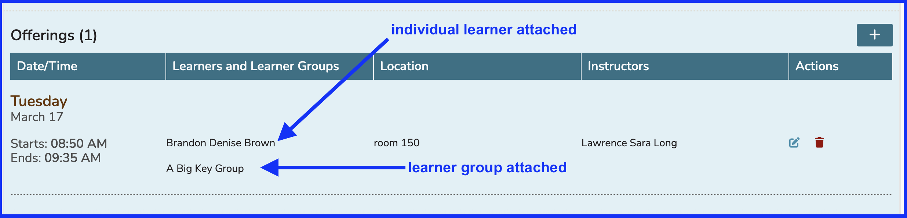
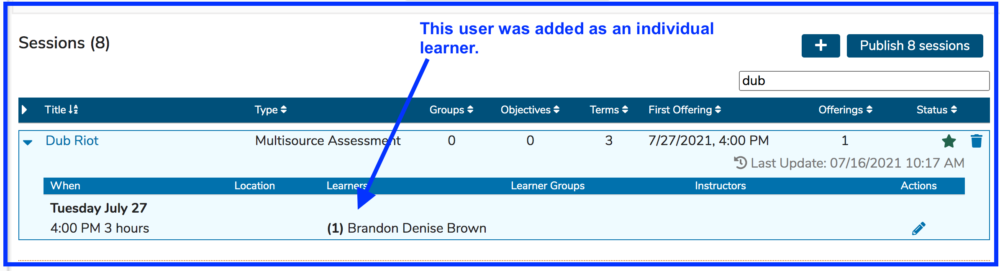

# Add Individual Learners

Individual learners can be attached to offerings in Ilios. One thing to remember is that anyone who is an Ilios user can be added to offerings using this technique. They do not need to be in any Cohort associated with this course.

## Click to Edit

## Search for User 

Perform the search as shown below and click on the name of the person to add to this offering.

## Click to Add

## Save

At this point, it is assumed the user has clicked "Save" to complete the process of adding the individual learner to the offering.

## Review

This addition of individual learners to offerings can be reviewed in two places currently ...

## Offering Editor View

* The offering editor itself - in edit mode. Both individual learners and learner groups are displayed as shown below. This is an easy way to review the correct learner attachments to offerings.

## Session List View 

* In the Session list - described below ...

Mousing over will expose all learners - members of learner groups along with individual learners. A simple example of this is shown below. When there are more learners than can be displayed, hovering over with the mouse will reveal the additional users designated as individual learners.

