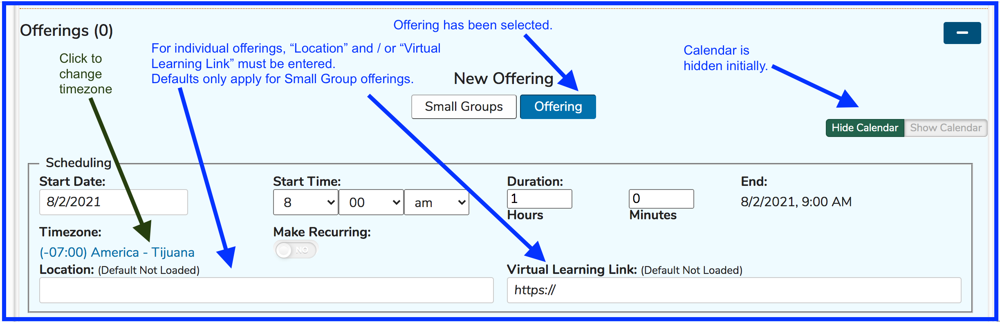
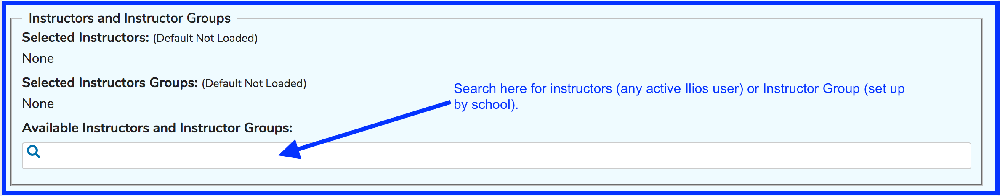
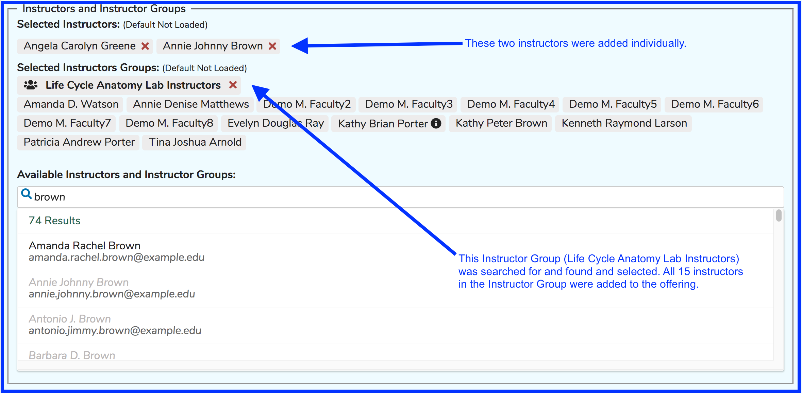
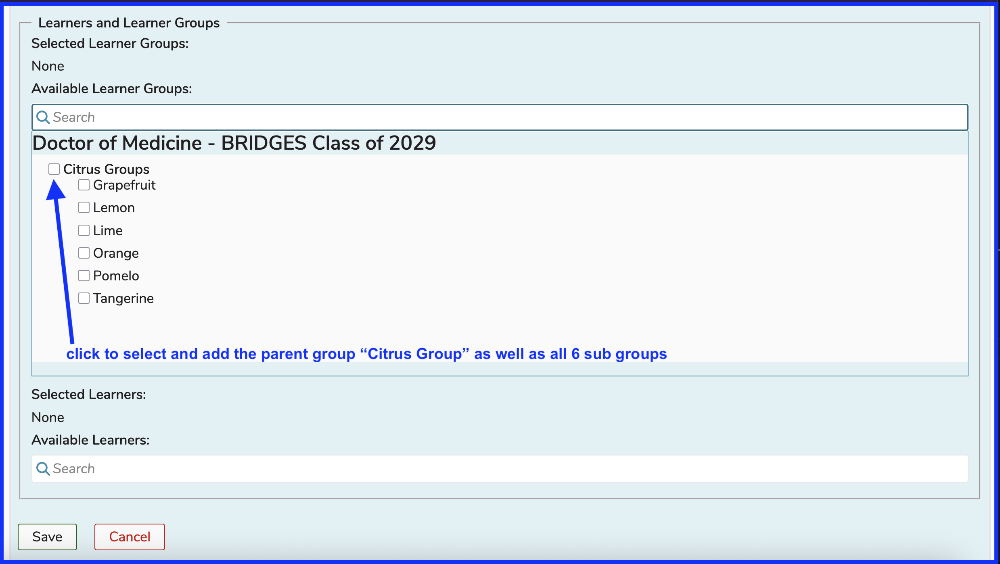
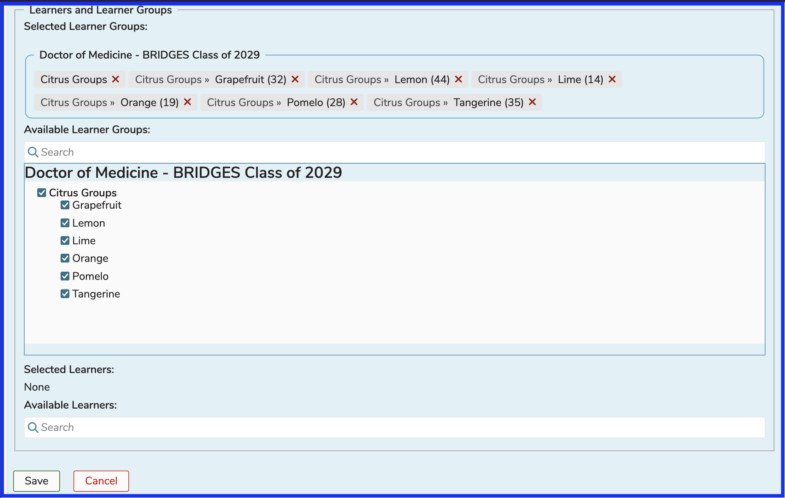
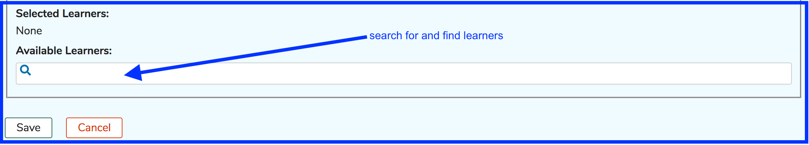
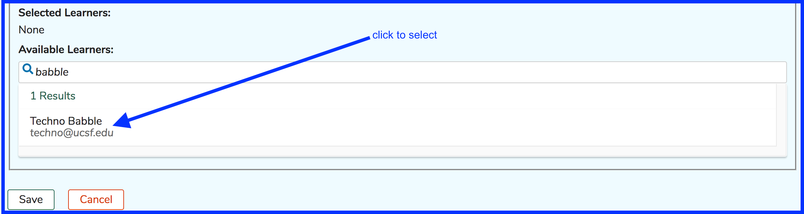
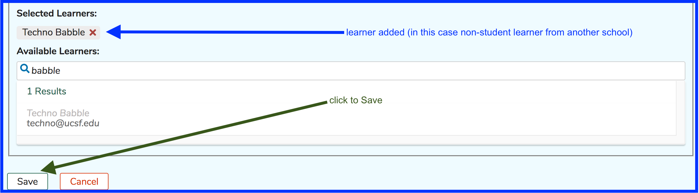
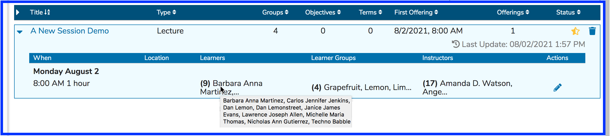
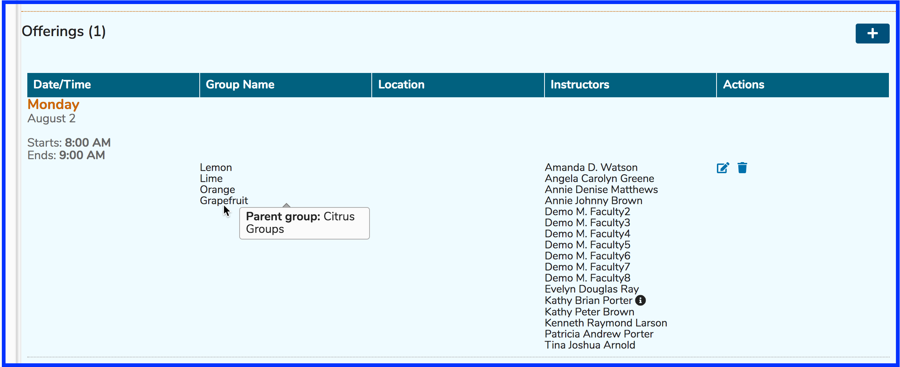

# Single Offering

This refers to the creation of one learning event, which can be attended by any combination of one or more learner groups or individual learners.

## Create Single Offering

The same process as the creation of Small Group Offerings can be performed in reverse where a number of sub-groups can all be invited to the same event. To demonstrate, we will use the same group as in the "Small Groups" example and create one event for them all to attend. This process is shown below.

As indicated below, the Offerings Editor Calendar is initially hidden. To display it and to review the scheduling of this offering as well as all other offerings involving the same learner groups, click [Show Calendar](https://iliosproject.gitbook.io/ilios-user-guide/courses-and-sessions/offerings/offerings-editor-calendar). 

When displayed, the calendar will appear above the controls for editing date / time and other offering attributes.

### Scheduling

Since the offering editor is such a long and complex form, the elements will be handled one at a time starting with "Scheduling". 

### Participants

Underneath the "Scheduling" component is an area to set who will be attending the offering - instructors and learners. Both of these can be set using groups or individuals.

## Instructors

Adding instructors either as a group ([Instructor Group](https://iliosproject.gitbook.io/ilios-user-guide/instructor-groups)) or as individual instructors is shown below. They can even be added both at the same time as shown below.

### Add Instructors

## Learners

The next section shows how this process functions for adding learners to an Offering. Just as with Instructors, learners can be added individually or as a group \(still most common practice\). The difference here is that individual learners are selected in a separate area from where Learner Groups are selected. 

### Add Learner Groups

After searching and selecting as shown above ...

### Remove Parent Group

In the situation detailed, it may be preferable to remvove the parent group "Citrus Groups", which may not have any members enrolled at that level. To do this, use a `shift-click` operation by holding the "Shift" key down and selecting the parent group with the mouse. This will remove the parent group from being explicitly included in the offering.

### Remove Child Group

One or more child groups can be removed using a simple click technique. The "Shift" technique only applies to the parent (highest level) group.

### Add Individual Learners

It is important to note that these Learners being added here do not need to be in the Cohort associated with this Course. 

Now that everything has been added as we want for this offering, clicking Save will complete this process. The resulting screen is shown in the second image below. Mousing over a learner group's name will display the parent group for reference. All instructors \(whether added individually or as a member of an instructor group\) are shown under the Instructors column header. Individual Learners are available to review from the Session List page as shown below.

### View Learner Group Parent

A learner group's parent relationship can be determined by hovering over with the mouse for more details.

## Permissions Note

Adding an Instructor to an Offering automatically adds a "Session Instructor" permission for this Instructor's relationship with this Session. The Instructor can modify this session but **NOT** any other sessions unless they are given higher permissions elsewhere - at the Course, Program, or School level or are attached as an Instructor to Offerings pertaining to other Sessions.

