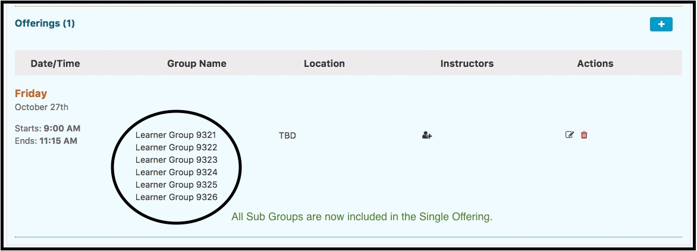

# Single Offering

## Create Single Offering

The same process as the creation of Small Group Offerings can be performed in reverse where a number of sub-groups can all be invited to the same event. To demonstrate, we will use the same group as in the "Small Groups" example and create one event for them all to attend. This process is shown below.

As indicated below, the Offerings Editor Calendar is initially hidden. To display it and to review the scheduling of this offering as well as all other offerings involving the same learner groups, click Show Calendar.

After clicking Done \(further down the screen\), the single event is saved and all of the sub groups appear together in the single event.

### Permissions Note: 

Adding an Instructor to an Offering automatically adds a "Session Instructor" permission for this Instructor's relationship with this Session. The Instructor can modify this session but **NOT** any other sessions unless they are given higher permissions elsewhere - at the Course, Program, or School level or are attached as an Instructor to other Sessions Offerings.

