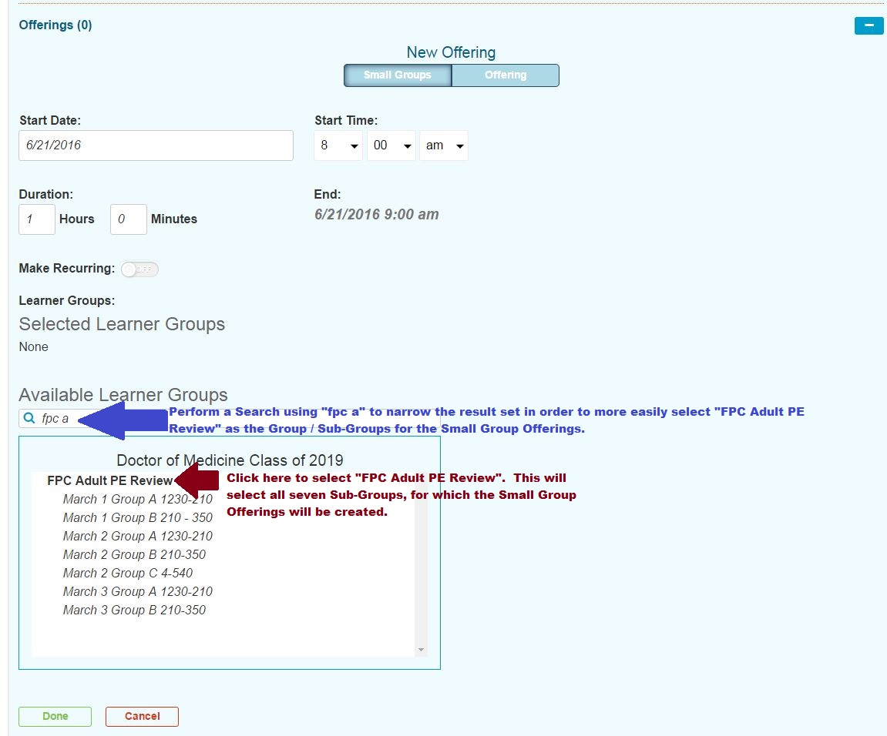
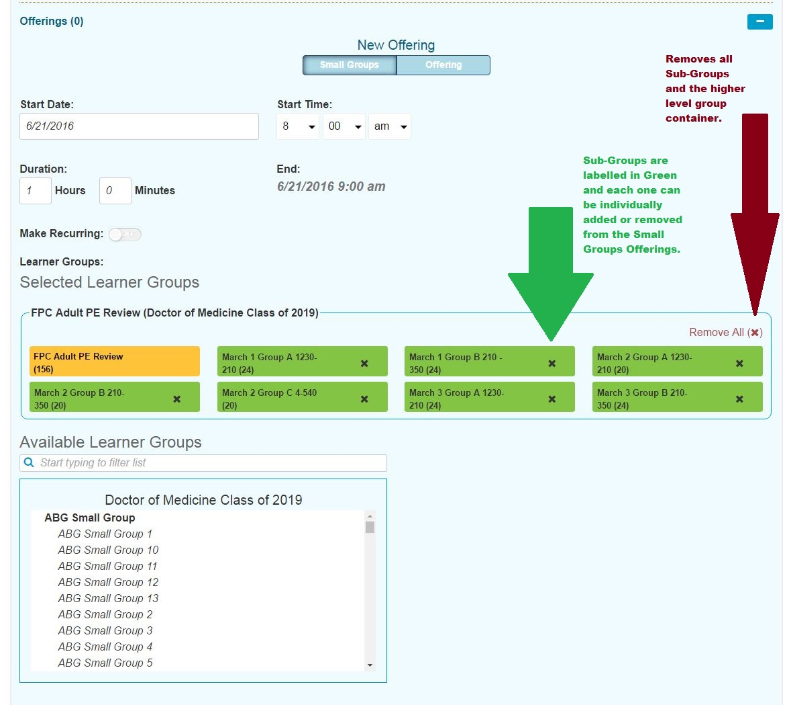
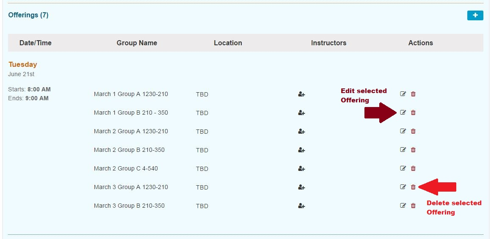
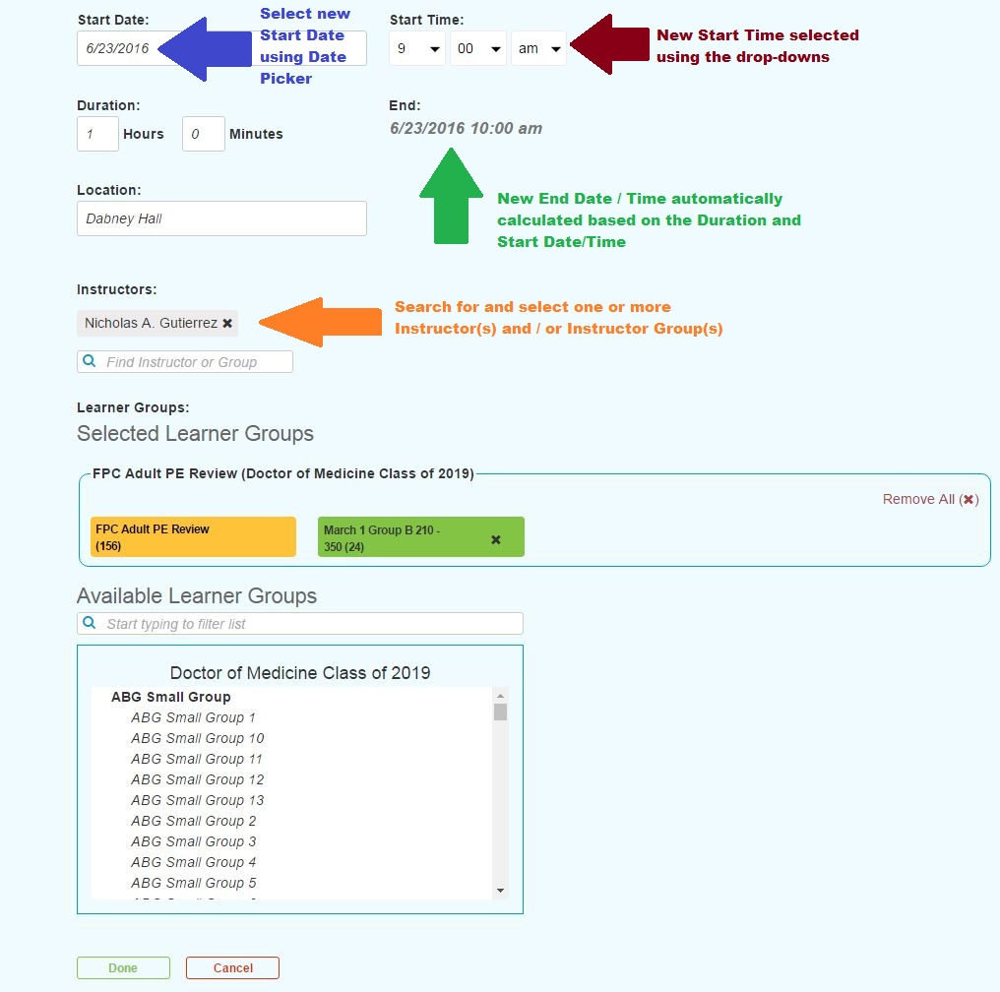
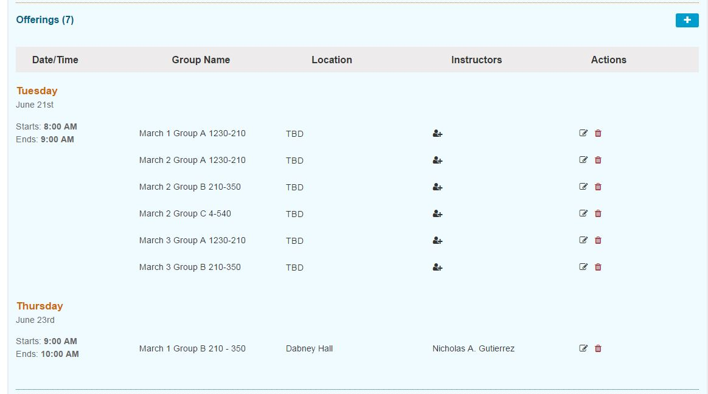

# Small Group Offerings

## Create Small Group Offerings

The default selection for adding offerings is "Small Groups". The Start Date \(and End Date since it is a single day event\) has been set to "6/21/2016" and the event Start and End Time has been set to 8:00 AM - 9:00 AM.

Search for and choose "FPC Adult PE Review" from the "Available Learner Groups" grid as shown below.

The interface for this functionality has been updated. See the screen shot below for details. Once the higher level "FPC Adult PE Review" group has been selected, all of its sub-groups are now in the "Selected" column and are ready to have the small group session events created. Also there is a yellow badge to indicate the higher level Group that is being used as well as a seperate container for each high level Group.

Now we are in the position to create a separate event for each of the seven groups in the "Selected" pane.

The Small Group Offerings are created once the "Done" button shown above has been clicked. If there are default Instructors and / or Locations for any of these Small Groups, those values will be automatically entered here. They can be overriden manually. If there is no default for either of those, the offers appear as shown below with "TBD" for Location and no Instructors entered yet. The Edit and Delete buttons are pointed out in the screen shot below.

### Edit Small Group Offering

In this example, the offering for the group "March 1 Group B 210 - 350" needs to be modified. The correct date for the offering is June 23rd from 9:00 to 10:00. The Instructor and Location will be specified as well as shown below.

Clicking "Done" will process the save event to update this event. The list now appears as follows once the updates have been processed.

**NOTE:** The offerings are sorted by Date/Time in ascending order. Since we just updated an Offering to take place on a different later date, it now appears in its own section.

