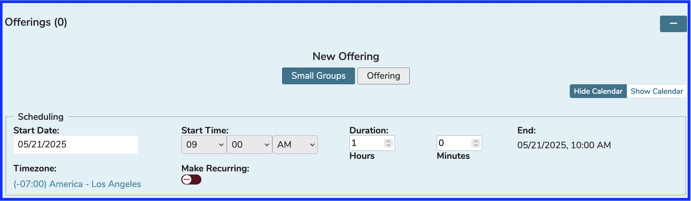
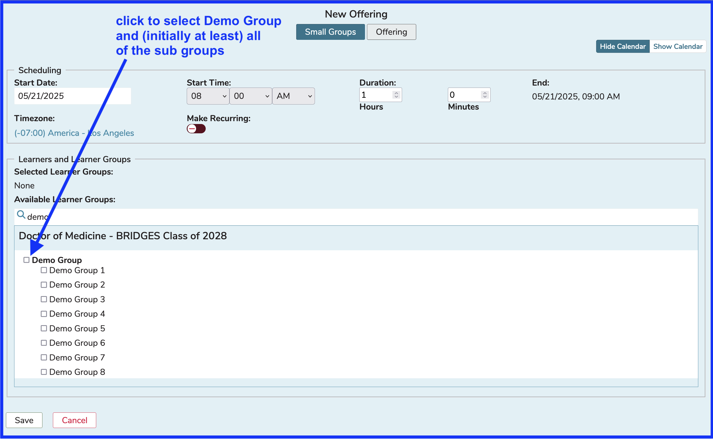
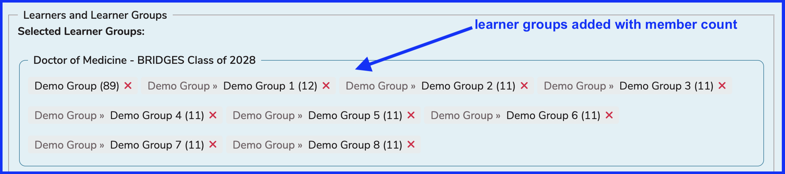
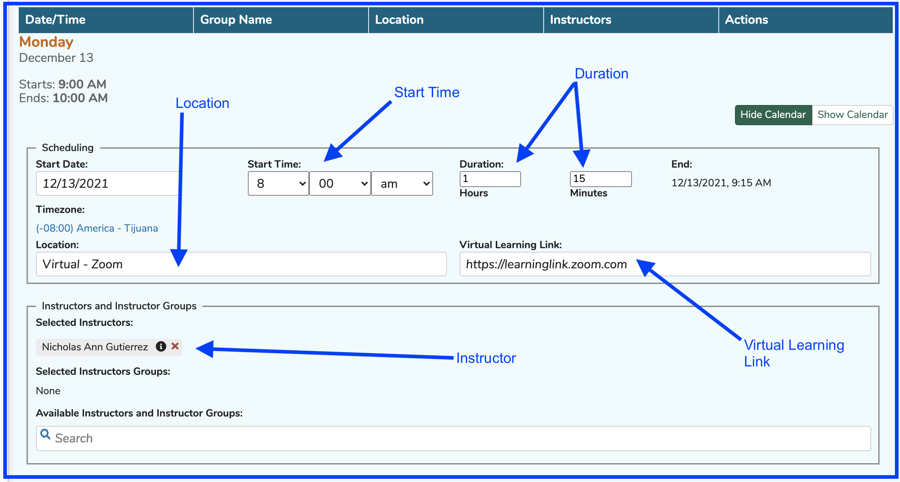
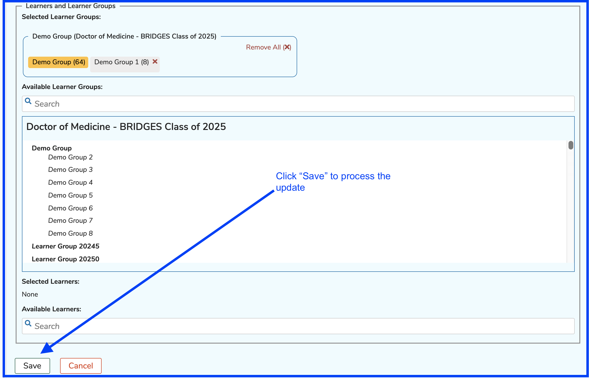
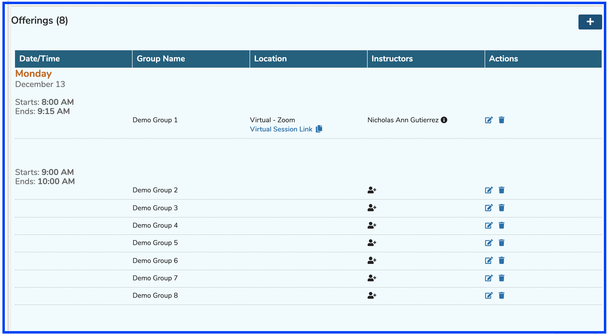

# Small Group Offerings

These are created when it is desired to have each group (sub-groups generally) attend an offering with only other members of the same learner group scheduled to attend. 

## Create Small Group Offerings

The first step in this process is to search for and select the Session to which we will be adding these small group offerings.

After clicking the (+) button to start the process, the screen refreshes as shown below. Data elements that can be set in the top area of the screen include ...

* **Start Date** - Calendar picker is provided to enter this
* **Start Time** - Use the drop-downs and provided fields
* **Duration** - Enter a value in the hours field and minutes field
* **End (Time)** - This gets selected based on the choices made above
* **Timezone** - This can be selected as well - useful if you have multiple campuses in different time zones
* **[Make Recurring]**(https://iliosproject.gitbook.io/ilios-user-guide/courses-and-sessions/offerings/recurring-event) - Used when you wish for an offering to be repeated a specified number of times.

The default selection for adding offerings is "Small Groups". The Start Date (and End Date since it is a single day event) has been set to "12/13/2021" and the event Start and End Time has been set to 9:00 AM -10:00 AM.

Search for and choose "Demo Group" from the "Available Learner Groups" grid as shown below.

Once the higher level "Demo Group" group has been selected, all of its sub-groups are now in the "Selected" column and are ready to have the small group session events created. Also there is a yellow badge to indicate the higher level Group that is being used as well as a separate container for each high level Group.

Now we are in the position to create a separate event for each of the eight groups in the "Selected" pane.

The Small Group Offerings are created once the "Save" button shown above has been clicked. If there are default Instructors and / or Locations for any of these Small Groups, those values will be automatically entered here by the system. They can be overwritten manually. If there is no default for either of those, the offers appear as shown below with no value for Location and no Instructors entered yet. The Edit and Delete buttons are pointed out in the screen shot below.

### Edit Small Group Offering

In this example, the offering for the group "Demo Group 1" needs to be modified. The correct date for the offering is December 13 from 8:00 to 9:15. The Instructor and Location will be specified as well as shown below.

Clicking "Save" will process the save event to update this event. The list now appears as follows once the updates have been processed.

**NOTE:** The offerings are sorted by Date/Time in ascending order. Since we just updated an Offering to take place on a different earlier time but the same date, it now appears in its own section.

