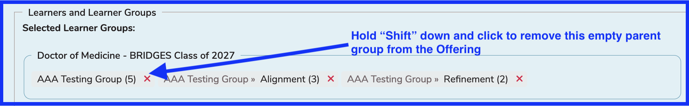

# Edit Offering

## Using Offering Editor

To edit attributes of an existing offering, the steps shown below can be followed.

* Select a [Course](https://iliosproject.gitbook.io/ilios-user-guide/courses-and-sessions/courses).
* When the list of Sessions is displayed, click on the name of the Session that contains offering(s) you want to review and / or modify.
* Ilios brings up the details of the Session.
* Scroll to bottom of the Session details.
* Click the provided "edit offering" check box to edit as shown below.

### Learners and Learner Groups

Under the column heading, "Learners and Learner Groups", an individual learner "Nicholas Ann Gutierrez" has been added to the offering. Also, the learner group "Main Lecture Group" has been added to the offering. It is handy to be able to review both individually assigned learners and learner groups in this context and location.

## Edit Offering

Ilios opens the offering up into an edit mode to allow applicable offering attributes to be modified here. Please refer to the previous chapters in this offerings section for more details. The editing of an offering is similar (as far as the fields go) to the creation of a new offering.

After clicking the Edit button under the Action menu as shown above, a screen similar to the following appears with the ability to modify the following Offering attributes.

**IMPORTANT NOTE:** Any valid Ilios user can be added as an Instructor. This includes students and non-students. Selecting an Ilios user as "Instructor" effectively adds the Instructor (as well as setting the "Perform Non-Learners" value to "Yes") role to this user's profile.

## Add URL - Virtual Session Link

To add a URL (Virtual Session Link), the URL can be generated using an application such as Zoom and pasted into llios.

The URL field is available on the Offerings Editor form directly below Offering Start / End Time. Initially the field appears as shown below.

Clicking into the URL field itself yields the following result.

The value "https://" is highlighted initially. This can be removed by deleting in one keyboard stroke since it is highlighted and selected or the URL can be pasted directly on top of it (replacing it).

After pasting directly on top of the initial value yields the following results.

All that is left to do now is update the offering with this newly added information.

Now that this has been added, the link that was pasted into the URL fields gets converted (for display and usability purposes) to "Virtual Session Link". There is also a "Copy" link if it is desired to have the full URL available for pasting or re-posting elsewhere.

## Inline Editing Options

It is also possible and often desirable to edit one or more Offerings directly from Courses and Sessions >> Session List.

### Immediate Edit - Existing Location

If you wish to edit the **Location** field for an Offering that already has an entry in this field, this can be done immediately as shown below. If there has not been an entry made yet for Location, you will need to go into the full edit mode by clicking the "pencil" icon as shown further below.

After clicking as shown above, "Room 223" can be changed and has been changed to "Room 300". All that is required to save this change is hitting enter on your keyboard or clicking the green confirmation button.

### Expand (All or One)

As shown below, clicking the arrow as shown will expand all of the sessions into inline edit mode. Alternatively, any one or more sessions can be individually expanded into inline edit mode.

To edit an offering from the now expanded Sessions list, clicking the edit icon as shown below will open up the editing options for use.

### Edit Offering

The full capability to edit the offering becomes available without having to navigate any further.

### Inline Offering Editor (top)

### Inline Offering Editor (bottom)

## Shift-click Editing Options

See above for reference on how to select or de-select any individual group (or parent group) in a tree. This same technique can be applied in the location depicting which groups are attached to any given offering. The Shift key can be used to select or de-select any Learner Group within a selected tree.

After learner groups and parents have been selected, the "Shift" key, along with a click can remove the unneeded parent group in a similar manner. This action can be performed in either of the locations shown below - the portion of the screen showing the attachments already selected ("preview") or the editing pane below.

