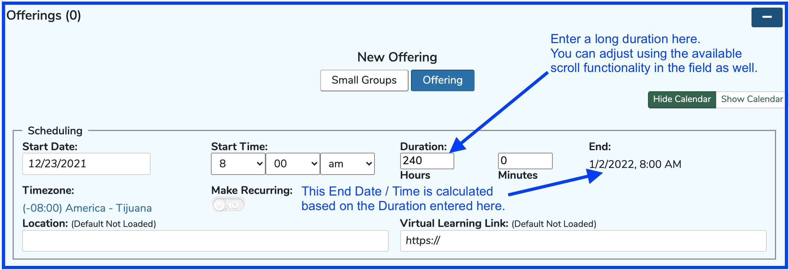
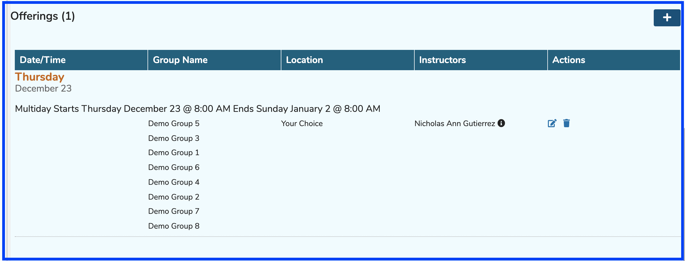
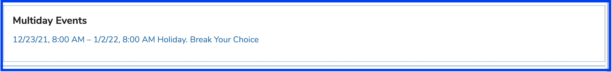
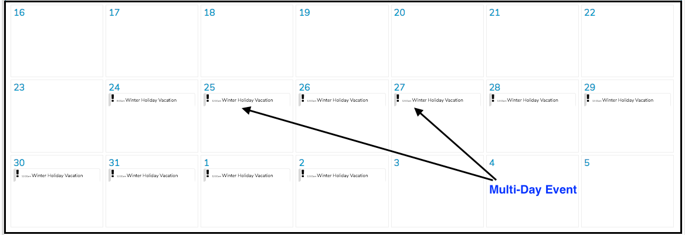

# Multi-Day Offerings

Offerings that start on one day and continue on until the next or a future day are considered Multi-Day Offerings. They are tracked in a slightly different manner than other single day offerings.

### How To Create a Multi-Day Offering

* Pull up a Course and create a Session
* Enter the Duration as shown in the screen shot below. Adjust the Offering's Duration until the correct End Date / Time is displayed.

* Once the correct Duration and End Date / Time have been entered and the Offering has been saved using the "Done" button, the results will appear similar to the screen shot below.

### How Multi-Day events appear on the Calendar

Here is how the multi-day "holiday' event created previously is displayed after having been published.

* For "Day" view and "Week" view ...

* For Month view ...

