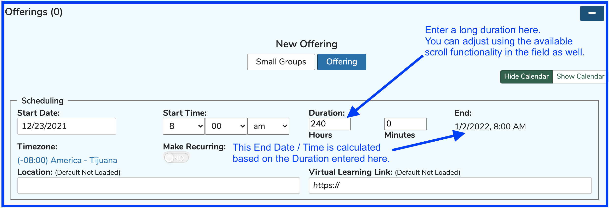
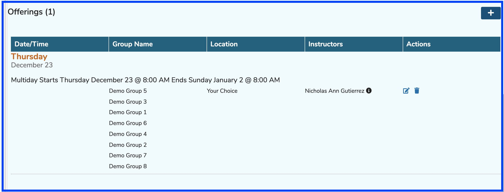
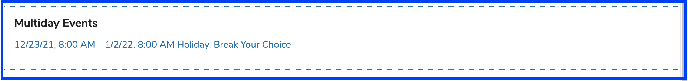
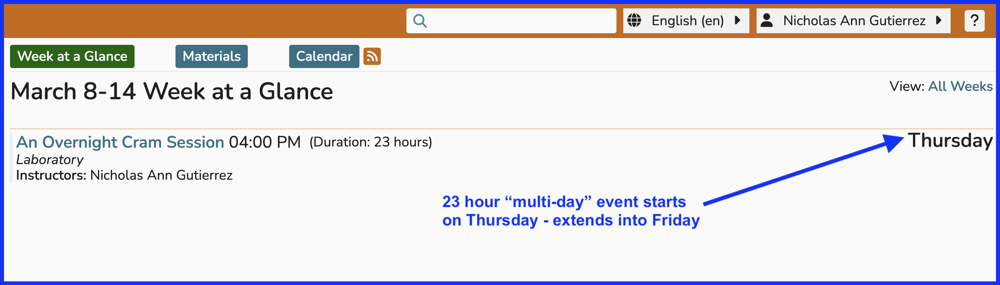

# Multi-Day Offerings

Offerings that start on one day and continue on until the next or a future day are considered Multi-Day Offerings. They are tracked in a slightly different manner than other single day offerings.

## How To Create

* Pull up a Course and create a Session
* Enter the Duration as shown in the screen shot below. Adjust the Offering's Duration until the correct End Date / Time is displayed.

* Once the correct Duration and End Date / Time have been entered and the Offering has been saved using the "Done" button, the results will appear similar to the screen shot below.

## Multi-Day Events on the Calendar

Here is how the multi-day "holiday' event created previously is displayed after having been published. This is true for any "duration" view of the calendar in Ilios. The multi-day offering appears beneath the calendar in "Day", "Week", or "Month" view.

* For all views ...

## Multi-Day Events on WaaG

On Week at a Glance (WaaG), multi-day events appear like any other event and are listed based on start date. 

