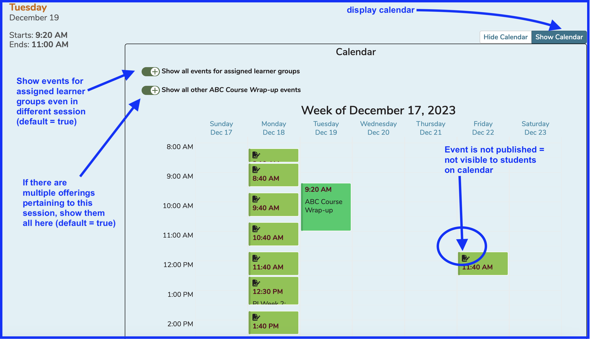

# Offerings Editor Calendar

There is also a calendar available inside the Offerings Editor. There are two toggle controls within the Calendar. They are described inside the image below.

**NOTE:** The "Show Calendar" button must be selected / pressed to view this screen. The default setting is "Hide Calendar".

This calendar is available in create new offering or edit offering mode. When creating a new offerings, it could prove helpful to be able to check the students' availability before creating an offering as well as being able to review if other offerings have been created already for this Session.

