# Recurring Events

Creating recurring session events is extremely easy. To do this, select a Session to attach to the recurring event being added.

Recurring events are session offerings (events) that occur at the same time and place and with the same instructors and learner groups attached for a specified number of weeks. Once the recurring events have been created, these attributes can be modified.

To create a recurring event ...

* Select the Session

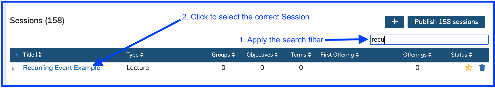

* Add Offerings

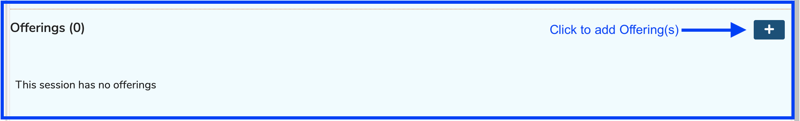

* Turn on Recurring Events

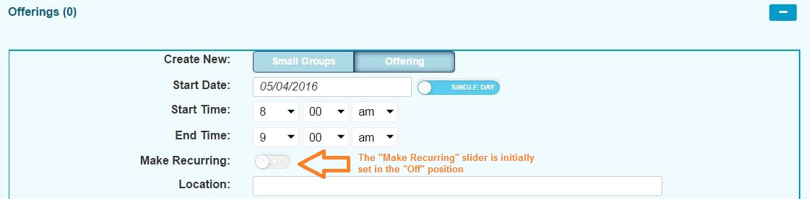

* Set the initial Offering attributes.  Once created, any of the events (recurring or otherwise) can be modified.

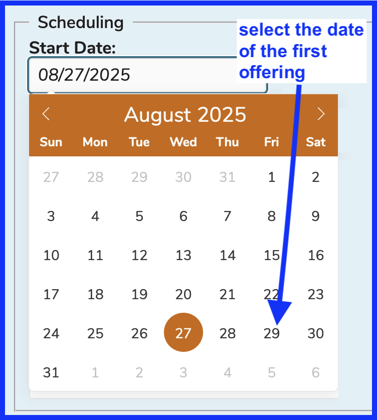

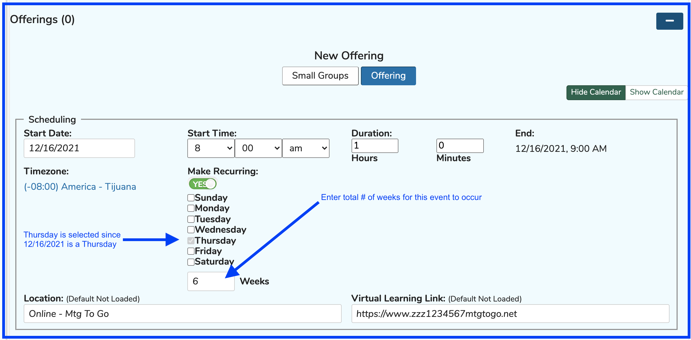

* Select the remaining Offering attributes.

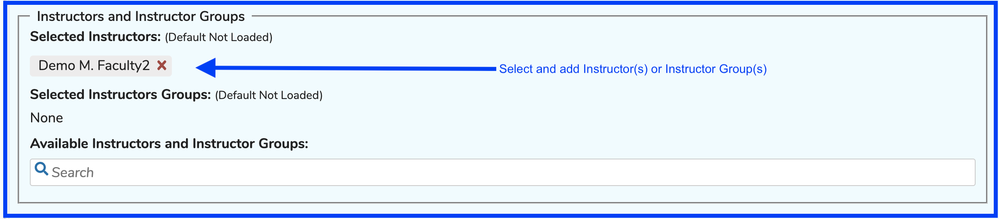

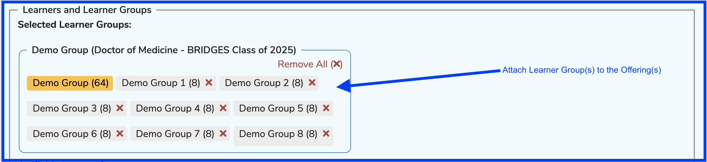

All 8 of the sub groups under Demo Group will be added to these offerings together since Small Groups was NOT selected in the first step. Individual Learners can also be added in this step.

Click "Save" as shown below.

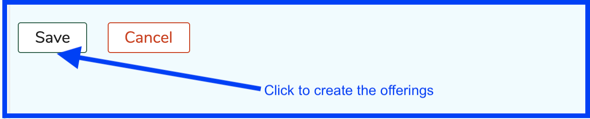

Once "Save" has been clicked, the events now appear as follows and can be modified at will. Only the top two of the six are shown in the Offerings editor.

#### Offerings Editor View

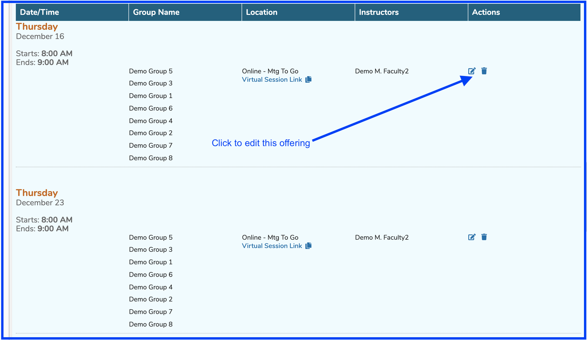

#### Session List View

In the Session List, when this session is expanded, all six offerings can be seen here. The entire editing pane shown in previous steps in this chapter becomes enabled and viewable. Editing can be easily done from here.

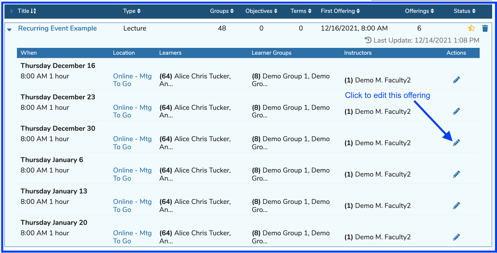

#### Calendar View

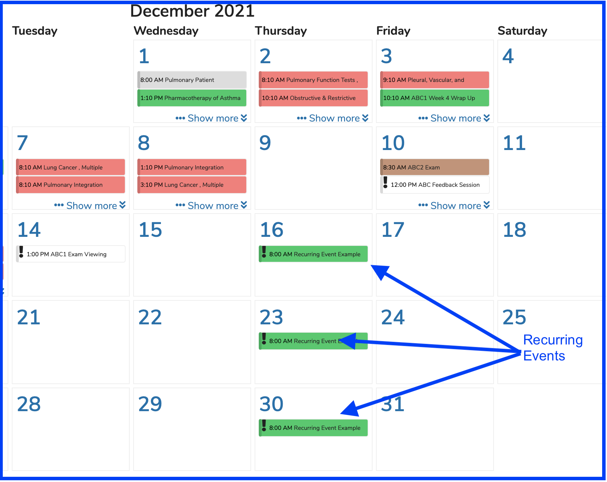
