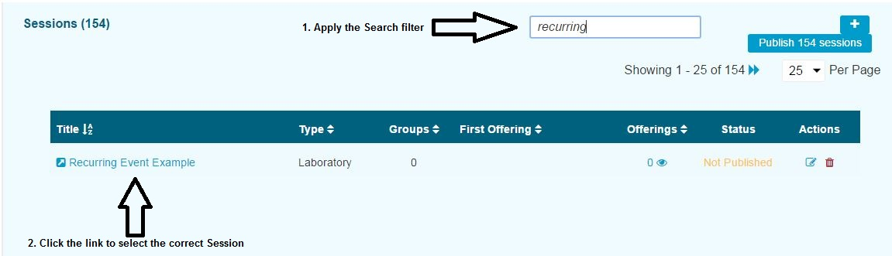
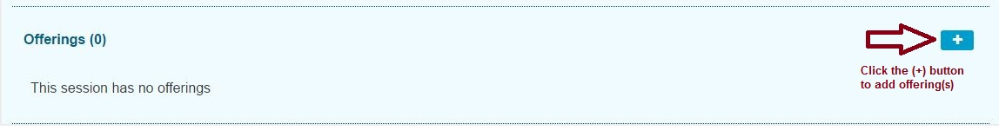
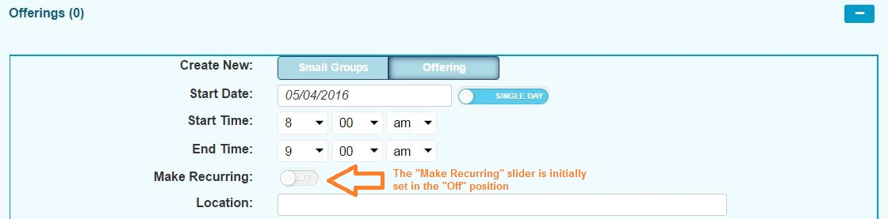
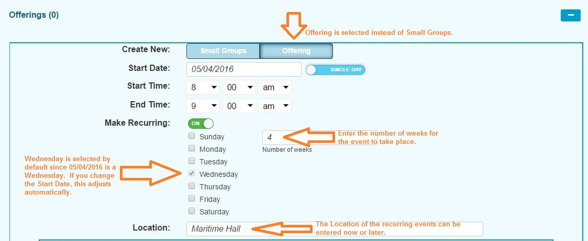
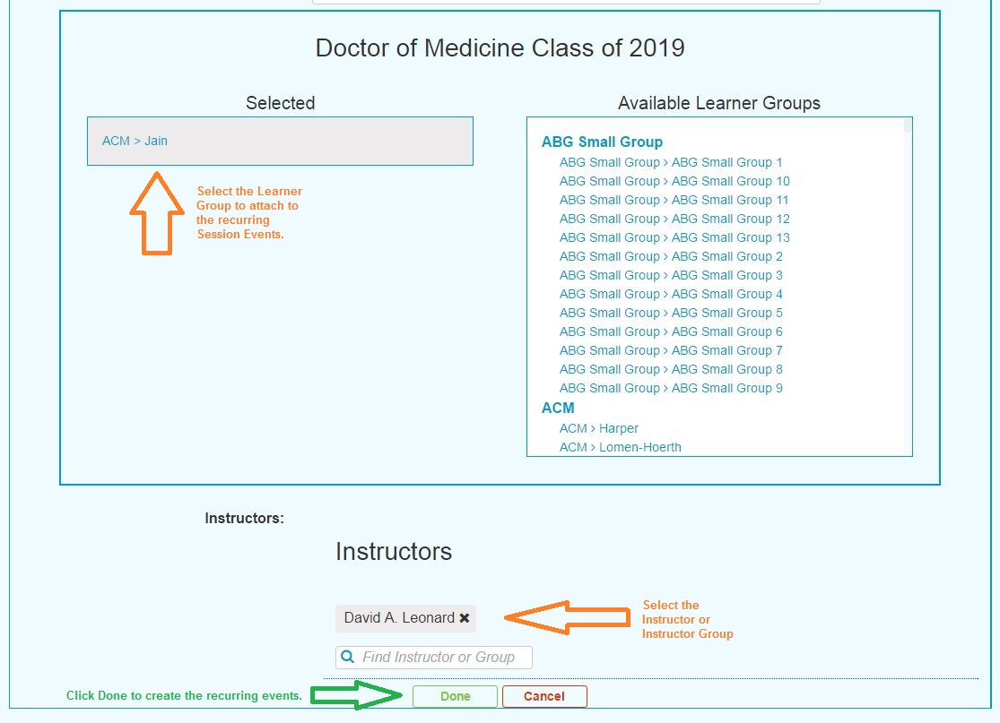
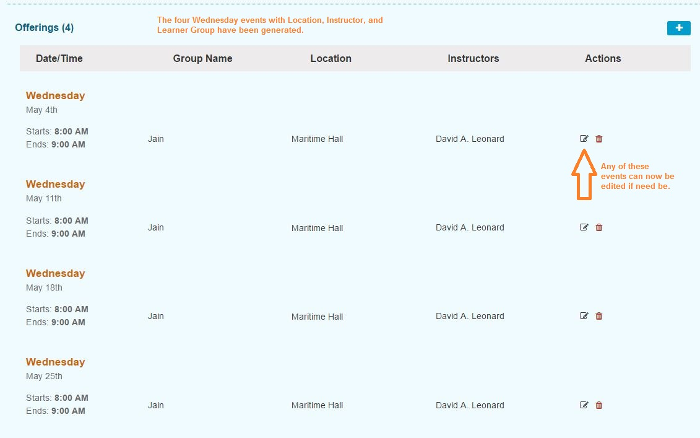

# Recurring Event

Creating recurring session events is extremely easy. To do this, select a Session to attach to the recurring event being added.

Recurring events are session offerings \(events\) that occur at the same time and place and with the same instructors and learner groups attached for a specified number of weeks. Once the recurring events have been created, these attributes can be modified.

To create a recurring event ...

* Select the Session 

* Add Offerings 

* Turn on Recurring Events

* Set the initial Offering attributes.  Once created, any of the events \(recurring or otherwise\) can be modified.

* Select the remaining Offering attributes.

 Once Done has been clicked, the events now appear as follows and can be modified at will.

