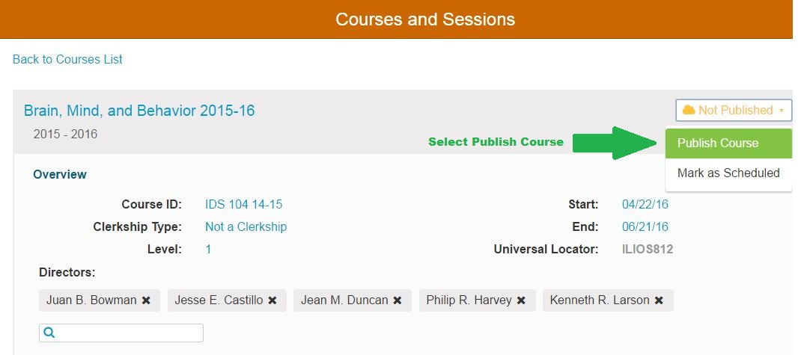
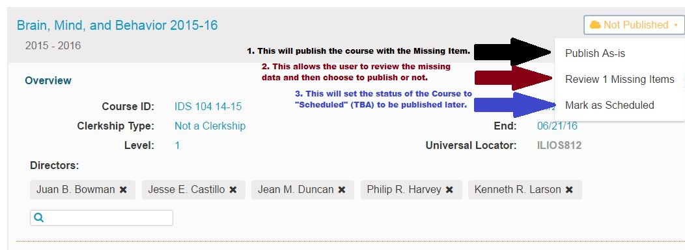
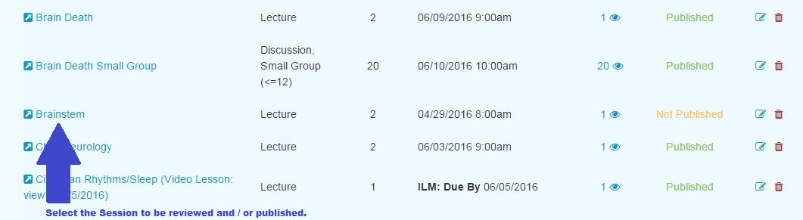
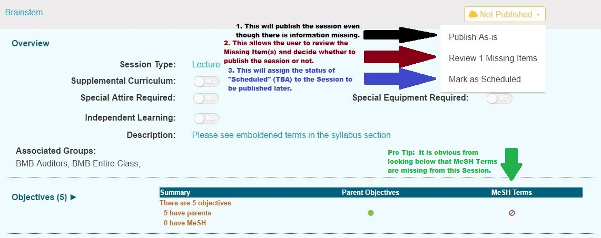
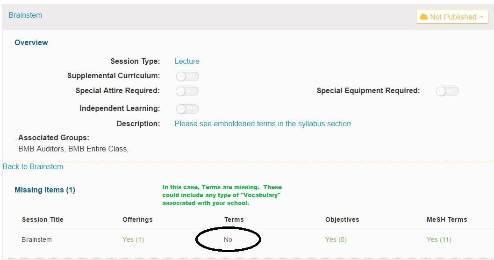

# Publishing

Ilios has a built in publishing workflow for curricular material. The publishing workflow serves the purpose of allowing the review of data prior to release, and to provide for the option of release in both interim \(“TBD” or “Scheduled”\) and final \(“Publish”\) modes. This is made possible by providing a summary checklist to the user for review. The checklist takes one of three different forms, depending on the workflow chosen: _**Course Level Only**_, _**Single Session Only**_, or _**Full Course with All Sessions**_.

There are three places in Ilios where the concept of **"Publishing"** applies ...

*  **Courses** 
*  **Sessions**
*  **Programs**

## To Publish a Course ...

In the example below, all of the required fields have been entered and the Sessions have been entered and are ready to be published as well. Publishing a Course is in effect, finalizing it. If the Sessions for a Course are also published and there are Offerings to display, they will be displayed on a Student's calendar or contained within the Calendar Feed.

Both **Course** and **Session** must be published in order to have the attached Offerings displayed on Student Calendars.

**IMPORTANT** **TO** **NOTE:** This is not the case with **Instructors**. They will see all of their Offerings, even if the Course or Session has **NOT** been published; whereas **Students** will not.

**To Publish a Course \(with one or more Missing Items\) ...**

There are 2 different types of data attributes available for checking in the workflow: _**required**_ fields, which must be present for publishing, and if unavailable will make the publish button in the checklist inactive; and _**desired**_ fields, which may be overridden after review, or left as-is without override. If overridden, the course object publishes normally. If left as-is, the course object is published as “TBD”, or “Scheduled” – which reserves space on the calendar for users to see, but does not provide details of the session. Re-publishing a course or session at any time will update the information contained in it to its most recent state. Courses and sessions are independent of one another in the workflow, and can be published individually. A course, as the umbrellas container of its sessions, may also be published together with all of its associated sessions.

In the _**Course Level Only**_ workflow, the top-level \(“course-level”\) attributes in a course are checked to verify required information. Course level attributes which are checked are:

* Start Date \(required\)
* End Date \(required\)
* Associated Cohort \(required\)
* Topics
* Objectives
* Mesh

The required fields for publishing a Course are indicated above. The others are desired fields. The absence of one or more of the required fields will disallow publishing or override. The absence of one or more of the desired fields will activate the display of a “Review X Items” value on the Publish drop-down menu. If you choose to review the missing items, the Publish option will be available on the review screen. You are required to review the items before publishing the Course or select Publish As Is.

## To Publish a Session ...

In the _**Single Session Only**_ workflow, a single session is checked to verify data. Session level attributes checked are:

* Title \(required\)
* Offering / Due Date \(required\)
* Topics
* Objectives
* Mesh

The fields required to create a Session are indicated above. The others are desired fields. The absence of one or more of the required fields will disallow publishing or override. The absence of one or more of the desired fields will activate the display of a “Review X Missing Items” value on the drop-down menu. If all fields are completed, then clicking the “Publish” button will immediately publish the Session, without a review check. If you choose to review the missing items, the Publish option will be available on the review screen. You can choose Publish As Is if you choose not to review the items before publishing the Session.

_**To Publish a Session \(with one or more Missing Items\)**_

**Session Detail** appears.

_**Review Missing Items**_

Upon clicking Option \#2 \(_**Review 1 Missing Items**_ - see above\), the screen will display what data from among the desired fields is missing.

In the _**Publish Full Course with All Sessions**_ workflow, a display of the course level info and every associated session is made available. The course level info and each session function independently as above, allowing override individually. If an associated session was previously in published state, it will still be displayed in the list and allow for republishing following the rules above. Any changes to a previously published session will overwrite its previous status. A course may be in Not Published state, yet have sessions which are Published or Scheduled. The Published/Scheduled sessions will not display on the public calendar until the parent course is in published or Scheduled state. Not Published sessions never display on the public calendar.

When a course is in Scheduled state and has sessions in Published and/or Scheduled state, those Published and Scheduled sessions will display as TBD until the course is published. A published course will display any Scheduled or Published sessions as their state indicates accordingly.

## 

