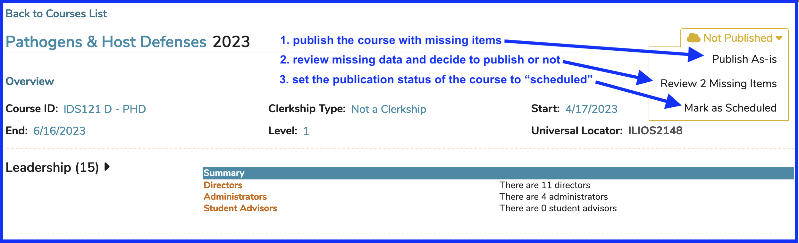
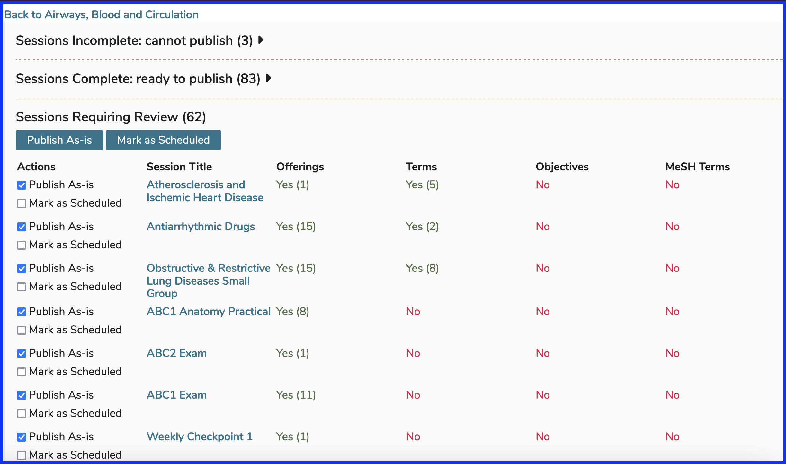

# Publishing

Ilios has a built in publishing workflow for curricular material. The publishing workflow serves the purpose of allowing the review of data prior to release, and to provide for the option of release in both interim (“Not Published” or “Scheduled”) and final (“Published”) modes. This is made possible by providing a summary checklist to the user for review. The checklist takes one of three different forms, depending on the workflow chosen: **Course Level Only**, **Single Session Only**, or **Full Course with All Sessions**.

There are two places in Ilios where the concept of **"Publishing"** applies ...

* [**Courses**](https://iliosproject.gitbook.io/ilios-user-guide/courses-and-sessions/courses)
* [**Sessions**](https://iliosproject.gitbook.io/ilios-user-guide/courses-and-sessions/sessions)

## Publish a Course

In the example below, all of the required fields have been entered and the Sessions have been entered and are ready to be published as well. Publishing a Course is in effect, finalizing it. If the Sessions for a Course are also published and there are Offerings or ILM's to display, these events will be displayed on a Student's calendar and will be included in the .ics Calendar Feed.

Both **Course** and **Session** must be published in order to have the attached Offerings displayed on Student Calendars.

**IMPORTANT TO NOTE:** **Instructors** and other Ilios users with advanced non-learner permissions such as Course or Session Directors and Administrators, will see all of their Offerings, even if the Course or Session has **NOT** been published; whereas **Students** will not. The "not published" icon will appear on the calendar and on event detail to assist with identifying sessions which have not been published.

After performing the step indicated above, the publication status drop-down now reflects the updated Course status as "Published".

### Publish with Missing Item(s)

There are 2 different types of data attributes available for checking in the workflow: **required** fields, which must be present for publishing, and if unavailable will make the publish button in the checklist inactive; and **desired** fields, which may be overridden after review, or left as-is without override. If overridden, the course object publishes normally. If left as-is, the course object is published as “TBD”, or “Scheduled” – which reserves space on the calendar for users to see, but does not provide details of the session. Re-publishing a course or session at any time will update the information contained in it to its most recent state. Courses and sessions are independent of one another in the workflow, and can be published individually. A course, as the umbrellas container of its sessions, may also be published together with all of its associated sessions.

In the **Course Level Only** workflow, the top-level (“course-level”) attributes in a course are checked to verify required information. Course level attributes which are checked are:

### Required Fields

* Start Date (required)
* End Date (required)
* Associated Cohort (required)

### Optional Fields 

* Vocabulary Terms
* Objectives
* MeSH Terms

The required fields for publishing a Course are indicated in the top section above. The others are desired fields and are listed here as optional. The absence of one or more of the required fields will disallow publishing or override. The absence of one or more of the desired fields will activate the display of a “Review X Items” value on the Publish drop-down menu. If you choose to review the missing items, the Publish option will be available on the review screen. You are required to review the items before publishing the Course or select "Publish As Is".

**Publication Options explained**

Using the screen shot above as a guide, here are the options described.

* (1) publish the course with missing items - completes the publishing action of the course without requiring review
* (2) review missing data and decide to publish or not - brings you to review and decide as shown below ...

* (3) set the publication status of the course to "scheduled" - sets the course in a "to be determined" state - students will see "TBD" on calendar (if session is published or if session also has a status of "scheduled") with details to be revealed when the course itself gets published. This is only available on Calendar not Week at a Glance.

## Publish a Session

### Single Session

In the **Single Session Only** workflow, a single session is checked to verify data. Session level attributes checked are:

* Title (required)
* Offering / Due Date (required)
* Topics
* Objectives
* MeSH

The fields required to create a Session are indicated above. The others are desired fields. The absence of one or more of the required fields will disallow publishing or override. The absence of one or more of the desired fields will activate the display of a “Review X Missing Items” value on the drop-down menu. If all fields are completed, then clicking the “Publish” button will immediately publish the Session, without a review check. If you choose to review the missing items, the Publish option will be available on the review screen. You can choose Publish As Is if you choose not to review the items before publishing the Session.

### Publish with Missing Item(s)

### Publishing Options

### Review Missing Items

Upon clicking Option #2 (**Review 1 Missing Items** - see above), the screen will display what data from among the desired fields is missing. In this case, no MeSH terms have been associated with this session. You can ignore this and publish anyway or add one or more MeSH terms.

In the **Publish Full Course with All Sessions** workflow, a display of the course level info and every associated session is made available. The course level info and each session function independently as above, allowing override individually. If an associated session was previously in published state, it will still be displayed in the list and allow for republishing following the rules above. Any changes to a previously published session will overwrite its previous status. A course may be in Not Published state, yet have sessions which are Published or Scheduled. The Published/Scheduled sessions will not display on the public calendar until the parent course is in published or Scheduled state. Not Published sessions never display on the public calendar.

When a course is in Scheduled state and has sessions in Published and/or Scheduled state, those Published and Scheduled sessions will display as TBD until the course is published. A published course will display any Scheduled or Published sessions as their state indicates accordingly.

### Publish All Sessions

In the example above, the Course contains a total of 148 sessions. Many of these may have already been published. After clicking as shown, there will be an opportunity to review all of the sessions before taking action on publication.

After clicking as shown above, the screen appears similar to the image in the screenshot below. Initially, "Sessions Requiring Review" is expanded while the other two sections "Sessions Incomplete" and "Sessions Complete" are contracted. Clicking the triangle arrows to the right of the captions will expand the selected section. In "Sessions Requiring Review", clicking the buttons labeled "Publish As-Is" or "Mark as Scheduled" will apply that setting to the entire list of Sessions below in any given review section. They can be edited individually using the provided check boxes. This same principle applies to "Sessions Complete: ready to publish". 

It is important to note that the sessions in "Sessions Incomplete: cannot publish" can only be reviewed - a listing of missing required items (generally offerings) will be displayed advising why these sessions cannot be published at this time.

### Review Sessions to Publish

