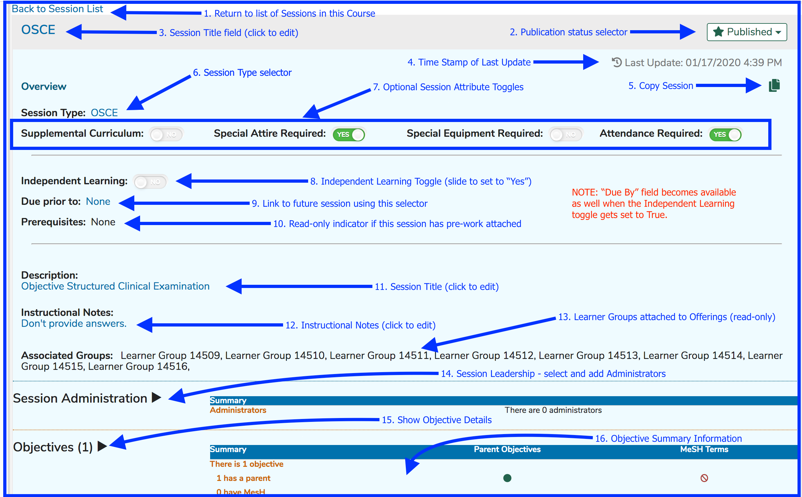
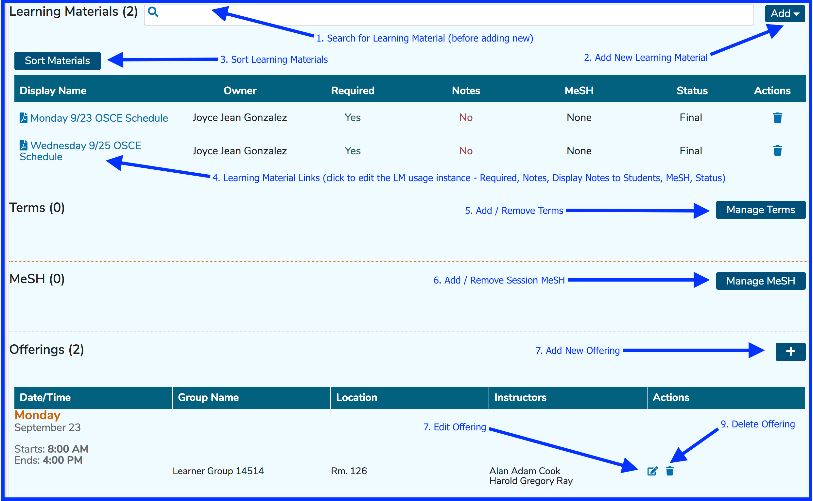
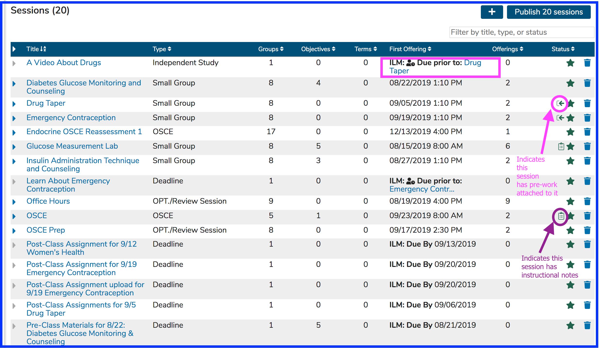
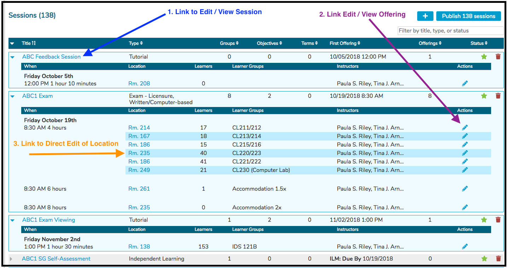
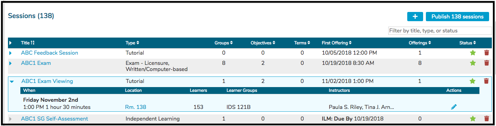
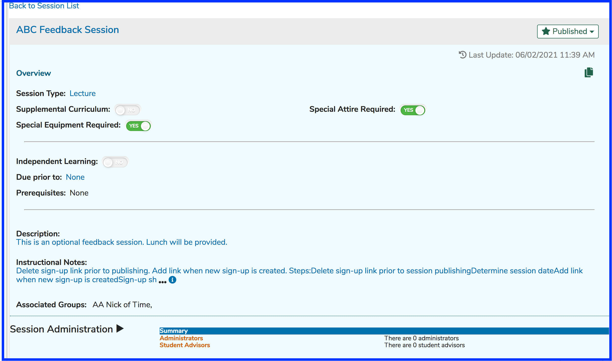

# Sessions

## Session Attributes \(all session types\)

* **Associated Groups**: \(Currently displays only in aggregate at the course level.\) Display only. Shows a list by name of the Learner Groups currently associated with the Session.
* **Session Type**: Selected from a predefined list of instructional and assessment methods, loaded into the system at implementation.  Click [here](https://www.aamc.org/download/273966/data/cistandardizedvocablist.pdf) for more information on Session Types.
* **Description**: Free-text entry allowing for detailed information, instruction, and description of the Session curriculum and activities.
* **Instructional Notes**: These are internal notes specifically used by Course Coordinators to share information about the session. They are not visible to Students.
* **Terms**: Selected from a school-specific, pre-defined list of one or more Vocabularies.
* **MeSH Terms**: Selected by searching the MeSH database.
* **Learning Materials**: Session-level learning materials are available only to the specific Session to which they belong.
* **Objectives**: Free-text entry field. Each Objective entered at the Session level may be associated with any number of the parent course’s Course-level Objectives. Session Objectives may also be assigned their own MeSH terms.
* **Pre-Work**: If a Session has pre-work attached to it, there is an icon displayed on the Session list. This is shown in a screen shot [below](https://iliosproject.gitbook.io/ilios-user-guide/courses-and-sessions/sessions#session-list).

## Session Attributes \(additional for ILM\)

* **Expected instructional hours**: Numeric entry of the total time in hours allotted for the activities associated with the session.
* **Due Date**: Date by which time the activities are expected to be completed. If "Due Prior To" is not used, a Due Date can be used.
* **Due Prior To**: Offering to which this ILM is linked. The learner should accomplish the activities outlined in this independent learning activity before attending the session offering. If this is NOT used, a Due Date for the ILM should be specified.
* **Assigned Learner Groups**: Since there are no calendared offerings for ILM, groups are associated directly to the session.
* **Assigned Instructors**: Since there are no calendared offerings for ILM, the responsible instructors of record are associated directly to the session.

## Optional Session Attributes \(usage assigned at School level\)

* **Core/Supplemental**: Allows for the flagging of elective vs. required curriculum units.
* **Special Attire Required**: flags the content as noted. Special instructions or details should be entered in the Session Description field.
* **Special Equipment Required**: flags the content as noted. Special instructions or details should be entered in the Session Description field.
* **Attendance Required**: flags the content as noted. Attendance is not optional.

## Screen Shots with Field Descriptions

This had to be split into upper and lower portions to allow space to display the entire screen.

#### Upper Portion

#### Lower Portion

## Overview

The screen shot below shows the Courses and Sessions screen with the list of associated Sessions for a course. 

### Session List

The screen shot above points out the icons indicating both the existence of pre-work learning events and instructional notes. The independent study session "A Video About Drugs" is due before the calendared session "Drug Taper".

It is easy to expand the Session List to allow for the maintenance of an Offering's room \(location\) right from this screen. Any Session's Title is a hyperlink and can be clicked to performance to a Session's attributes. After the list has been expanded, links to make changes to the attributes of an Offerings \(other than location\) right from the expanded Session List become available. 

### Expand All Sessions

Expanding all Sessions for a Course as shown above results in the screen changing to something similar to what is shown below. A spinner will appear briefly while the list is being expanded. 

### Expand Single Session

Any single \(or multiple\) session can be expanded if you choose to keep the remainder of the list in a non-expanded state. Only "ABC1 Exam Viewing" has been expanded in the screen shot shown below.

**IMPORTANT NOTE:** Sessions which have been selected to be an ILM \(Independent Learning Module\) are not expandable in this context because all information is already displayed.

### Session Detail

The session detail screen is very lengthy so in this situation, the top part is shown in the screen shot below.

Once a course has been saved, Sessions may be added to the course. A Session is a discrete instructional unit of curricular material or activity within a course. To add a new session, click “Add New”. This will create an empty Session, ready to be populated with the Session's attributes, listed [here](https://iliosproject.gitbook.io/ilios-user-guide/courses-and-sessions/sessions#session-attributes-all-session-types).

