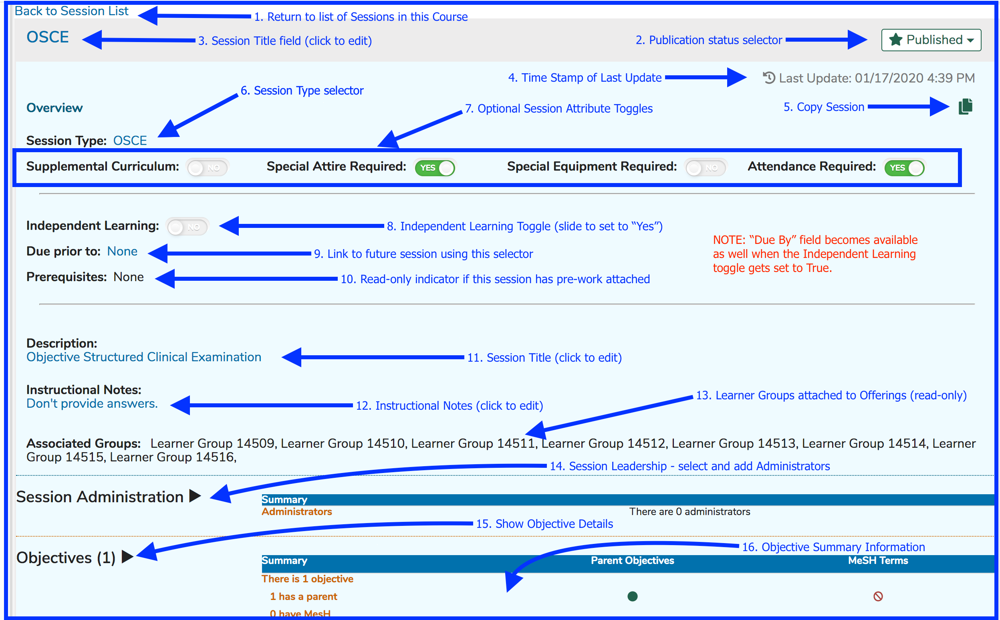
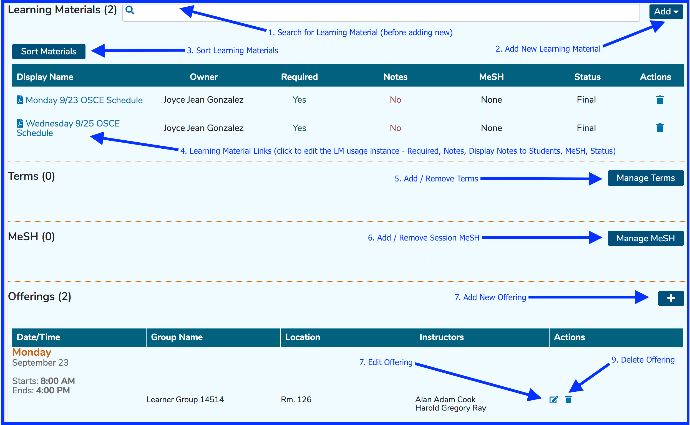
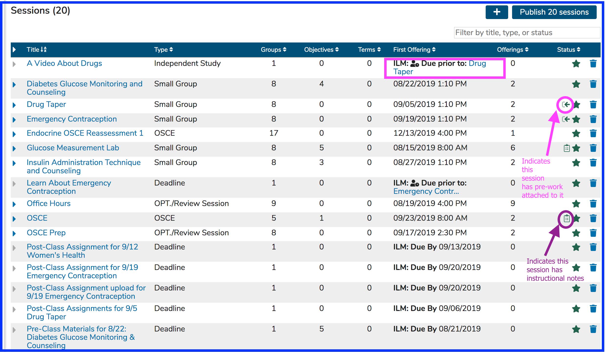
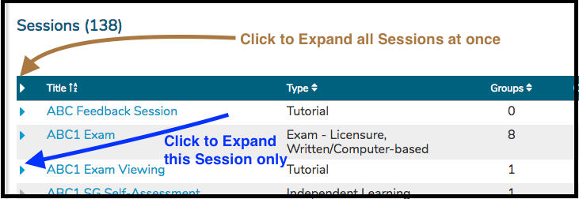
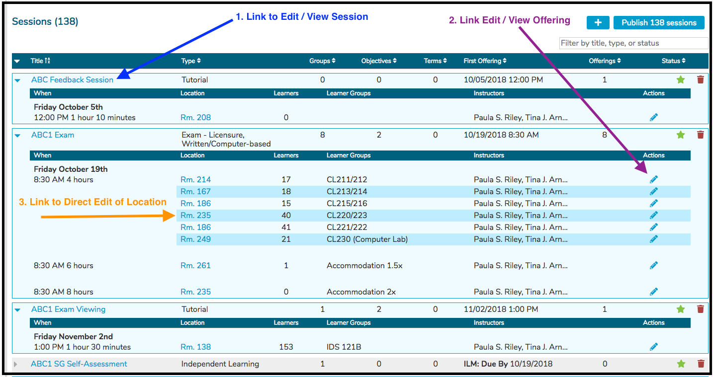
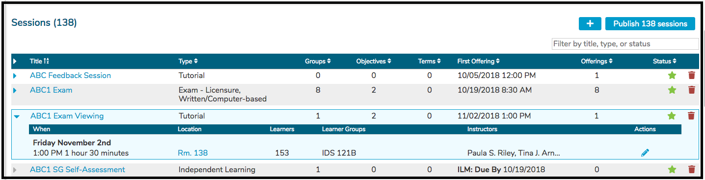
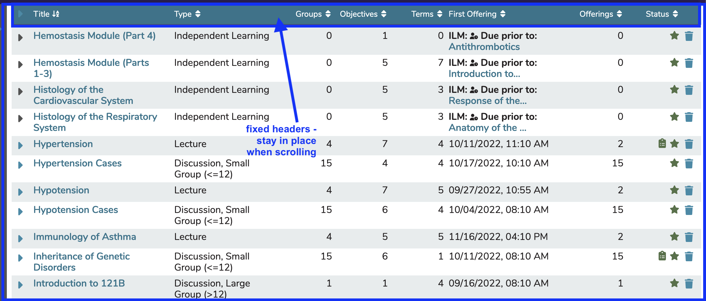
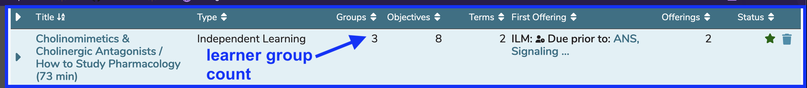

# Sessions

A session refers to a section or unit of a course with specific attributes of type and content. Sessions may be represented as multiple or singular time and place Offerings or as Independent Learning units with an estimated duration of educational time. Sessions (generally Independent Learning Modules (ILM's)) can be associated with a follow-up Session. These learning activities should be completed before the follow-up takes place, or by a specified Due Date and time.

## Session Attributes (all session types)

* **Associated Groups**: (Currently displays only in aggregate at the course level.) Display only. Shows a list by name of the Learner Groups currently associated with the Session.
* **Session Type**: Selected from a predefined list of instructional and assessment methods, loaded into the system at implementation. Click [here](https://iliosproject.gitbook.io/ilios-user-guide/schools/session-types) for more information on Session Types.
* **Description**: Free-text entry allowing for detailed information, instruction, and description of the Session curriculum and activities.
* **Instructional Notes**: These are internal notes specifically used by Course Coordinators to share information about the session. They are not visible to Students.
* **Terms**: Selected from a school-specific, pre-defined list of one or more Vocabularies
* **MeSH Terms**: Selected by searching the MeSH database
* **Learning Materials**: Session-level learning materials are available only to the specific Session to which they belong.
* **Objectives**: Free-text entry field. Each Objective entered at the Session level may be associated with any number of the parent course’s Course-level Objectives. Session Objectives may also be assigned their own MeSH terms.
* **Prerequisites**: If a Session has one or more prerequisites (formerly known as pre-work) associated with it, there will be an icon displayed on the Session list. This is demonstrated [here](https://iliosproject.gitbook.io/ilios-user-guide/courses-and-sessions/sessions#session-list).

### Additional ILM Session Attributes

These apply only to Independent Learning Modules (ILM's)

* **Expected instructional hours**: Numeric entry of the estimated total required time in hours allotted for the activities associated with the session.
* **Due Date**: Date by which time the activities are expected to be completed. If "Due Prior To" is not used, a Due Date can be used.
* **Due Prior To**: Offering to which this ILM is linked. The learner should accomplish the activities outlined in this independent learning activity before attending the session offering. If this is NOT used, a Due Date for the ILM should be specified.
* **Assigned Learner Groups**: Since there are no calendared offerings for ILM, groups are associated directly to the session.
* **Assigned Instructors**: Since there are no calendared offerings for ILM, the responsible instructors of record are associated directly to the session.

### Optional Session Attributes

These [Session Attributes](https://iliosproject.gitbook.io/ilios-user-guide/schools/session-attributes) are customizable and can be set at the School level.

* **Core/Supplemental**: Allows for the flagging of elective vs. required curriculum units.
* **Special Attire Required**: flags the content as noted. Special instructions or details should be entered in the Session Description field.
* **Special Equipment Required**: flags the content as noted. Special instructions or details should be entered in the Session Description field.
* **Attendance Required**: flags the content as noted. Attendance is not optional.

## Screen Shots with Field Descriptions

This had to be split into upper and lower portions to allow space to display the entire screen.

### Upper Portion

### Lower Portion

### Overview

The screen shot below shows the Courses and Sessions screen with the list of associated Sessions for a course.

## Session List

The screen shot above points out the icons indicating both the existence of prerequisite (formerly pre-work) learning events and instructional notes. The independent study session "A Video About Drugs" is due before the calendared session "Drug Taper". As such, it is considered a prerequisite learning activity.

It is easy to expand the Session List to allow for the maintenance of an Offering's room (location) right from this screen. Any Session's Title is a hyperlink and can be clicked to performance to a Session's attributes. After the list has been expanded, links to make changes to the attributes of an Offerings (other than location) right from the expanded Session List become available.

### Viewing Options

The options shown below can be used to either expand individual (one or more) sessions or all of the sessions (non-ILM's with one or more offerings) at the same time.

### Expand All Sessions

Expanding all Sessions for a Course as shown above following "Click to Expand all Sessions at once" in "Options" results in the screen changing to something similar to what is shown below. A spinner will appear briefly while the list is being expanded.

### Expand Single Session

Any single (or multiple) session can be expanded if you choose to keep the remainder of the list in a non-expanded state. Only "ABC1 Exam Viewing" has been expanded in the screen shot shown below.

**IMPORTANT NOTE:** Sessions which have been selected to be an ILM (Independent Learning Module) are not expandable in this context because all information is already displayed.

### Fixed Column Headers

In this view, the column headers stay fixed in position as you scroll down the screen. This is helpful in reviewing the content of each session in the list. In this example, the user has scrolled through 50 or so sessions (sorted by title A-Z) but still can review the data column headers. 

### Learner Group Count

The learner group count aggregates all learner groups associated with offerings for the session along with all learner groups associated with any ILM's for the session. Especially in the case of ILM's, it can be helpful to see that there have been learners assigned. The screen shot below shows a very untypical situation where 2 learner groups are associated with the ILM and 1 learner group is associated with the offering - for the same session. The total comes up correctly as 3 in this rare scenario. 

