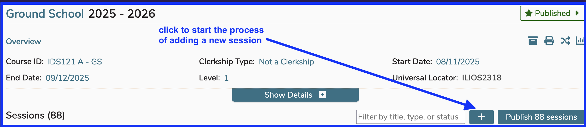
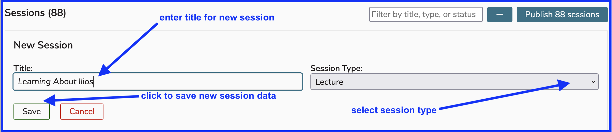

## Create New Session

Once a course has been saved, Sessions may be added to the course. A Session is a discrete instructional unit of curricular material or activity within a course. To add a new session, click “Add New”. This will create an empty Session, ready to be populated with the Session's attributes, listed [here](https://iliosproject.gitbook.io/ilios-user-guide/courses-and-sessions/sessions#session-attributes-all-session-types).

Click as shown below to start the process of adding a new [session](https://iliosproject.gitbook.io/ilios-user-guide/glossary#session).

After clicking as shown above (`first step`), the entry fields for the skeleton of a new session become enabled and visible. Enter the title and select the session type for the new session as shown below. The session type initially displayed is "Lecture". This is a common usage but should be changed here if not applicable. "Cancel" is available like always if you choose to back out of this operation.

Once a session is saved by clicking the "Save" button shown above, 
[offerings](https://iliosproject.gitbook.io/ilios-user-guide/courses-and-sessions/offerings) for that session can be added.

## Independent Learning Modules

A session may also be saved as an Independent Learning Module (ILM), created with an estimated number of educational hours rather than a calendar-based date and time. To create such a session, select the “independent learning” check-box, and enter the associated estimated number of educational hours, a "due-by" date or postrequisite learning activity. Learner groups, individual learners, and instructors can be added as well. 

ILM's can also be created as a pre-requisite for an upcoming session. Click [here](https://iliosproject.gitbook.io/ilios-user-guide/courses-and-sessions/sessions/independent-learning-module-ilm) for more information on the creation and maintenance of ILM's.

