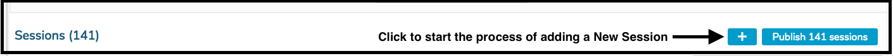
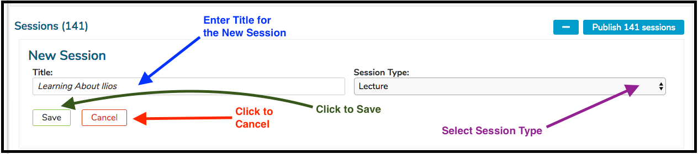

## Add New Session

Click as shown below to start the process of adding a new session.

The entry fields now become enabled and visible. Enter the Title and select the Session Type for the new session as shown below.

Once a session is saved by clicking the Done button shown above,
[offerings](https://iliosproject.gitbook.io/ilios-user-guide/courses-and-sessions/offerings) for that session can be added.

## Independent Learning Modules

A Session may also be saved as an Independent Learning Module (ILM), created with an estimated number of educational hours rather than a calendar-based date and time. To create such a session, select the “independent learning” check-box, and enter the associated number of educational hours, a "due-by" date, Description. Learner Groups and Instructors can be added by clicking the "Manage Learner Groups" button.

ILM's can also be created as a pre-requisite for an upcoming session. Click [here](https://iliosproject.gitbook.io/ilios-user-guide/courses-and-sessions/sessions/independent-learning-module-ilm) for more information on ILM's.

