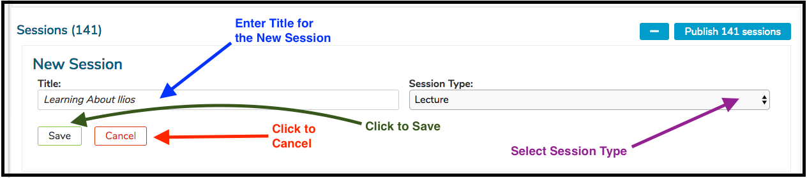

# Add New Session

## Add New Session

Click as shown below to start the process of adding a new session.

The entry fields now become enabled and visible. Enter the Title and select the Session Type for the new session as shown below.

Once a session is saved by clicking the Done button shown above, offerings for that session can be added. Offerings may be created individually on the calendar and populated with group, instructor and location information using the calendar tools. Offerings also may be generated using specific learner groups as the seeding mechanism, by selecting the “Open Offering Small Group Generator” link. This link allows you to select one or more eligible learner groups, a time slot on the calendar, and automatically generated offerings via one of two strategies:

1. A single offering in that time slot for each selected group, regardless of the number of subgroups or divisions in the selected group \(“add an offering per parent group”\)
2. An offering for each subgroup within a selected group \(“add an offering per subgroup”\). For example, using the first strategy, selecting the student group “anatomy labs” which has 38 subgroups would create a single offering for all the learners in the group anatomy labs and its subgroups --- in other words, all the small groups would be lumped together for a single event Offering date and time.

Using the second strategy, selecting the group “anatomy labs” would create 38 unique offerings, and associate each of the subgroups and its learners with one of those offerings. The default selection is strategy \#2. The Default Instructors and locations for each group will be displayed as the Instructors and Locations for the offerings created; these may be edited via the calendar any time after creation.

## Independent Learning Modules

A Session may also be saved as an Independent Learning Module \(ILM\), providing an estimated number of educational hours rather than a calendar-based date and time. To create such a session, select the “independent learning” check-box, and enter the associated number of educational hours, a "due-by" date, Description. Learner Groups and Instructors can be added by clicking the "Manage Learner Groups" button.

Click [here](https://iliosproject.gitbook.io/ilios-user-guide/courses-and-sessions/sessions/independent-learning-module-ilm) for more information on ILM's.

