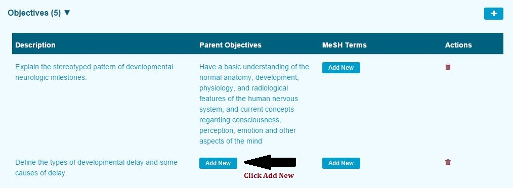
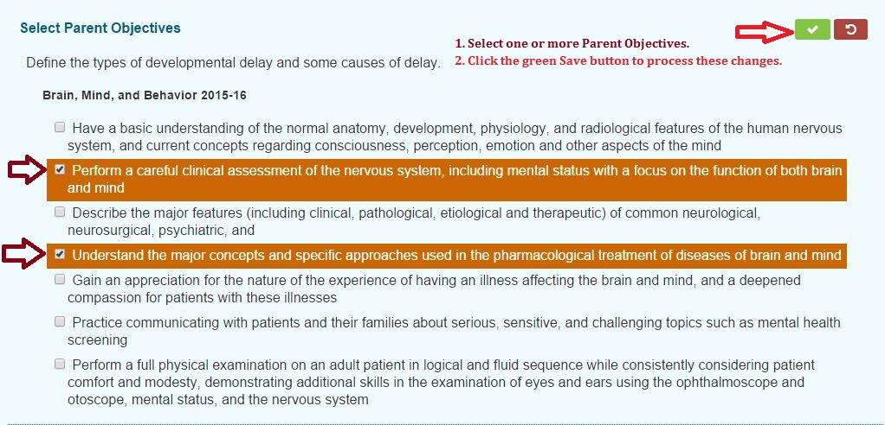
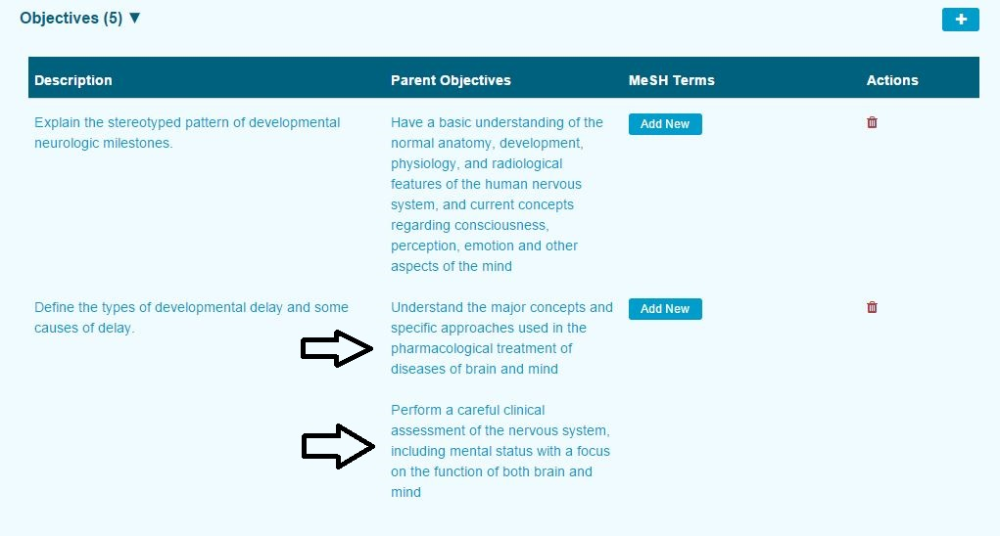

# Add Parent Objective\(s\)

As mentioned before, Session Objectives can have one or more Parent Objectives. Session Objectives are linked to Course Objectives, which in turn are linked to Program Year Competencies (which may include Competency Domains).

To add Parent Objectives to Session Objectives ...

* Pull up and select a Session and review the list of Session Objectives.
* Expand the Objectives to display the list.  

Once the list has been expanded, select the Session Objective that needs to have a Parent Objective associated to it. In the case shown below, the second Session Objective is lacking a Parent Objective.

Once "Add New" has been clicked, the screen changes its appearance and allow for the Parent Objectives to be selected and saved.

After the Save has been completed, we can now see the Parent Objectives now attached to the Session Objective.

The arrows indicate where the Parent Objectives were added to be associated with this Session Objective.

