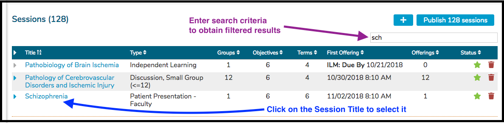
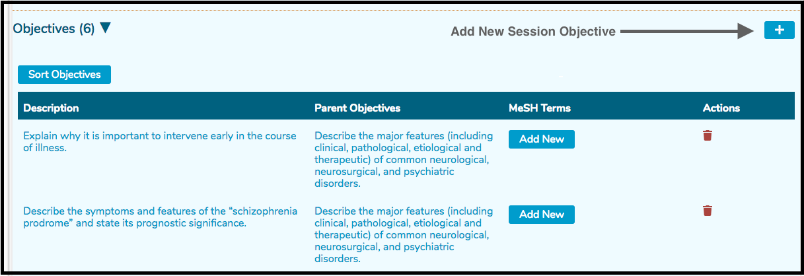
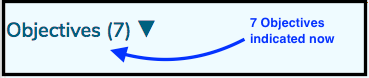

# Add Objective

## Enter A Session Objective

To enter a Session level Objective, follow the steps detailed below.

**1. Go To Courses and Sessions**

**2. Search for and select the Course**

**3. Search for and select the Session**

**4. Click to expand the existing Session Objectives** 

**5. Click to add new** 

**6. Enter the Session Objective Details**

Once the save has been processed, the Objective counter is incremented to include the Objective that was just entered. The new Objective is appended to the bottom of the list.

