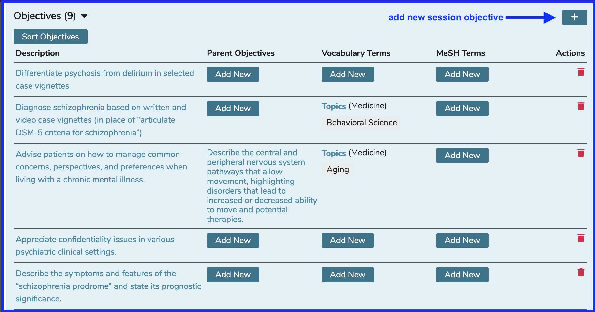

Objectives are the desired learning or teaching outcomes for a given curricular object. These may be general Program level Objectives (also referred to as graduation requirements), Course level learning Objectives, or Session level teaching Objectives. Objectives may be associated with Competencies; however, only one higher level competency can be associated with each Learning Objective at the Session level.

# Add New Objective

To enter a Session level Objective, follow the steps detailed below.

## Open Courses and Sessions

## Select Course

## Select Session

## View Existing Objectives

## Add New Objective

## Enter Details

## Save Objective

Once the save has been processed, the Objective counter is incremented to include the Objective that was just entered. The new Objective is appended to the bottom of the list.

