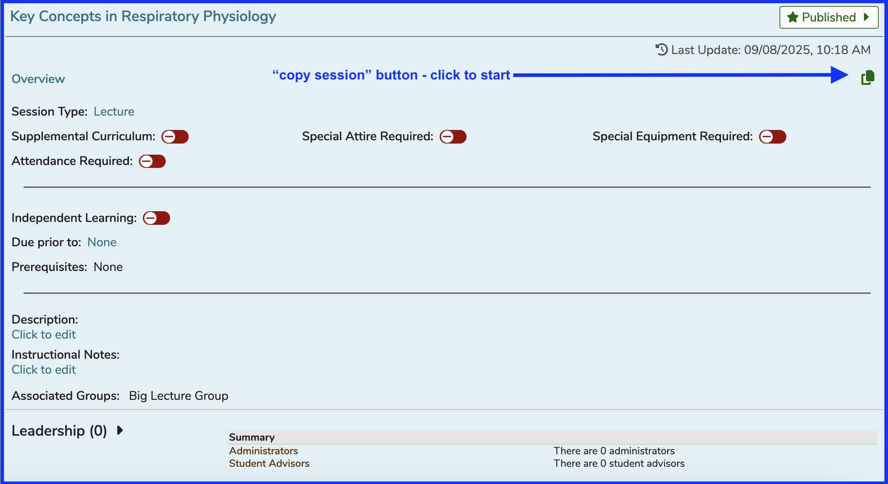
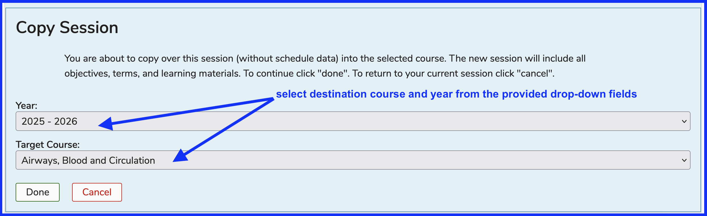
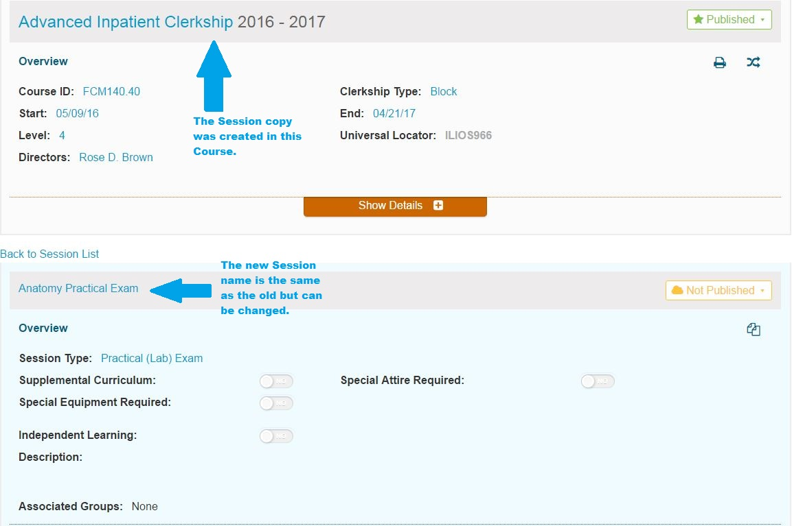

# Copy Session

Session copying is performed from inside Session Detail so it is necessary to select a Course and then select a Session. In the example in the screen shot below, a Session has been selected. The Session Copy button / icon is indicated by the arrow for reference.

**NOTE**: If you are copying a session into the same Course, keep in mind that the names of the two Sessions will be identical, which can lead to confusion.

## Step 1 - Select a Session to Copy

After the Session Copy functionality has been activated by clicking the icon as shown above, the destination for this newly created Session must be specified. In this case, the "Anatomy Practical Exam" is part of the 2015-16 academic year. However, that year has been completed at the time of this writing so this particular session can only be copied into future years. As a rule, a session can only be copied into the current (if still active) or future years; and, it can be copied into any Course.

## Step 2 - Select Destination Course

For reference, the session we are copying here is from the course "Airways, Blood and Circulation 2025-2026". The years available to copy this session into are one year into the future, the current year, and the previous year. 

The "Copy Session" field specifications occur at the bottom of the form. This is shown below. Any course available in those years can be selected. In this case, we are going to create a copy of the session to be added to the current year's course as a duplicate to be modified post-creation.

## Step 3 - Click Done to process the Session Copy

Like always, you can cancel out here as well by clicking the "Cancel" button. However, once "Done" has been clicked, a confirmation message flashes across the top of the screen (with green background). You are then taken directly to the newly created Session in the location specified in Step 2. Editing can now take place on the new Session. This is shown below. Scroll down to edit Obejctives, Terms, and Learning Materials (and MeSH) as well as to set up Offerings.

