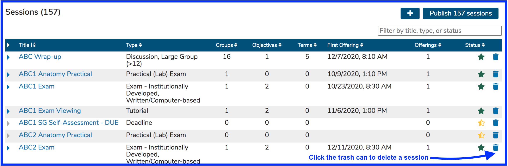
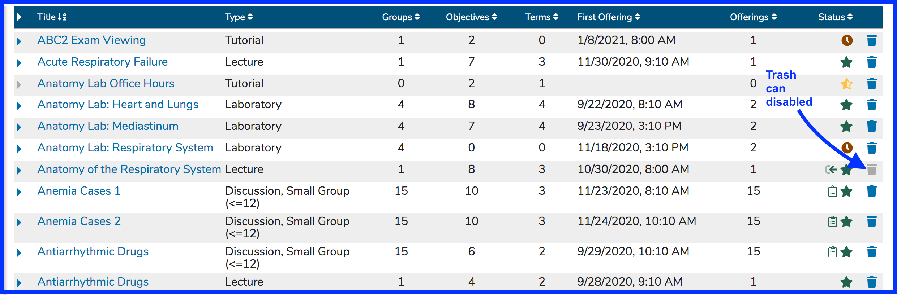
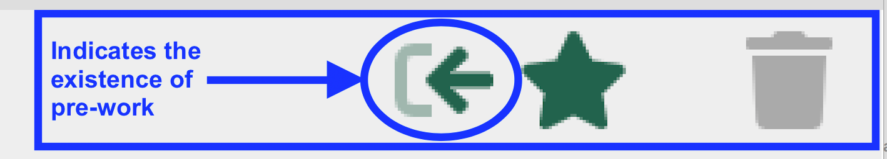

# Delete Session

Sessions (like Courses) can be deleted if you have sufficient permissions to do so. The trash can icon that is used to perform session deletion is located as shown below. 

**IMPORTANT NOTE**:  If a Session cannot be deleted, the trash can icon will appear in a disabled state. This occurs when a session has pre-work attached to it. The pre-work relationships must be removed before the target Session can be deleted. Once this has been taken care of, the trash can will become enabled allowing for the Session's deletion.

An example of this is shown below. Any of these sessions can be deleted except for "Anatomy of the Respiratory System", which has pre-requisites attached. As mentioned before, any pre-requisite relationships need to be removed before the target session can be deleted.

