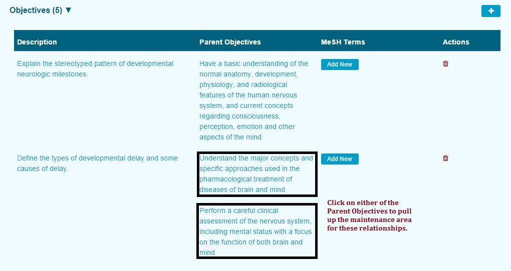
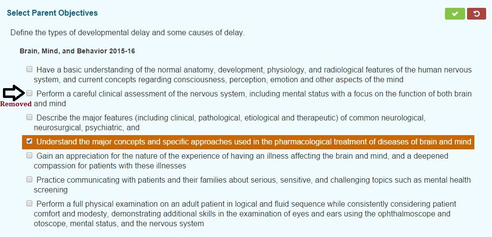

# Edit Parent Objective\(s\)

Editing the selection of Parent Objectives for Session Objectives is merely a matter of clicking anywhere in the text description of one of the Parent Objectives as shown below. The same selection process as performed during the initial addition of the Parent Objective\(s\) is done here as well. Parent Objectives can be removed or added here. It is also possible to remove all Parent Objectives by de-selecting any and all of them that were associated with this Session Objective.

In this example, the first of the Parent Objectives was kept attached to the Session Objective. The second one was removed.

Now after processing the save, only one Parent Objective remains attached to the Session Objective.

