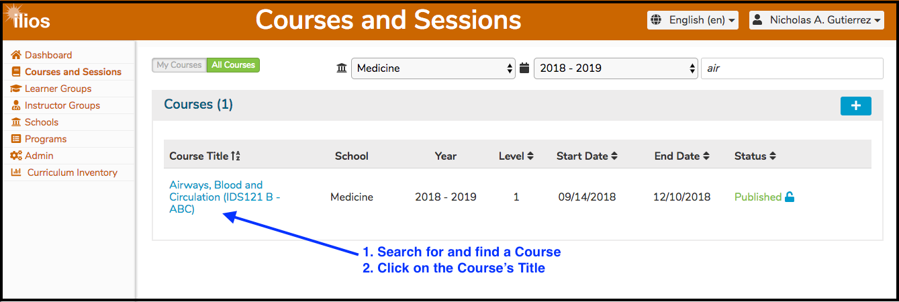
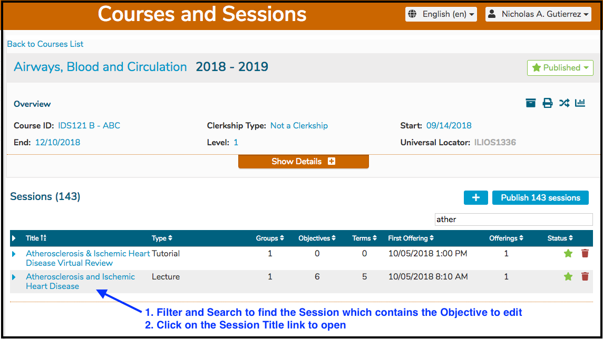
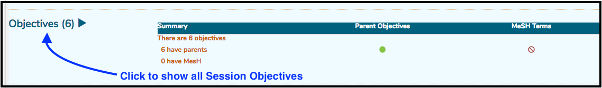
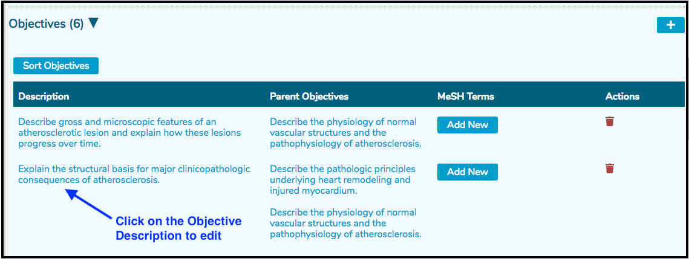
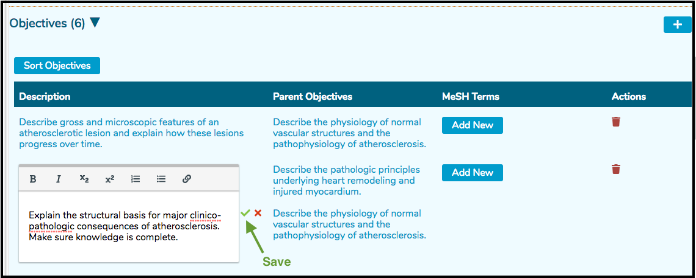
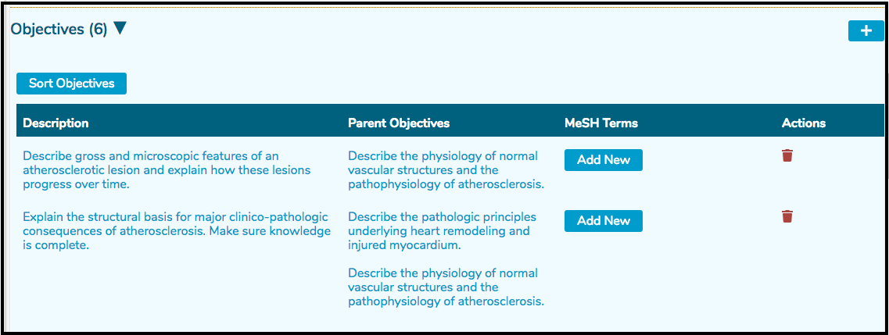

# Edit Objective

Editing an Objective is easily accomplished following the the steps listed below.

* Select a Course

* Select a Session

* Expand the Objectives: Objectives are displayed in a collapsed detail view initially. 

* Select the Objective to modify

* Edit the Objective
* Click the Green "Save" button as indicated once the text editing is complete. Alternatively, you can cancel out of this action by click the Red "Cancel" button.

* The screen refreshes and reflects the change.

#### Add MeSH Terms / Vocabulary Terms

Since the process of adding these at a Session level is identical to how it is accomplished at the Course level, please refer to the following links for reference.

[Add MeSH Terms](https://iliosproject.gitbook.io/ilios-user-guide/courses-and-sessions/courses/edit-objective#add-mesh-term-s)

[Add Vocabulary Terms](https://iliosproject.gitbook.io/ilios-user-guide/courses-and-sessions/courses/edit-objective#add-vocabulary-terms)

