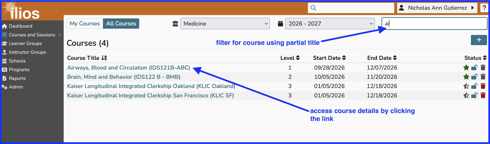
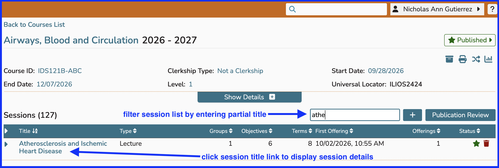
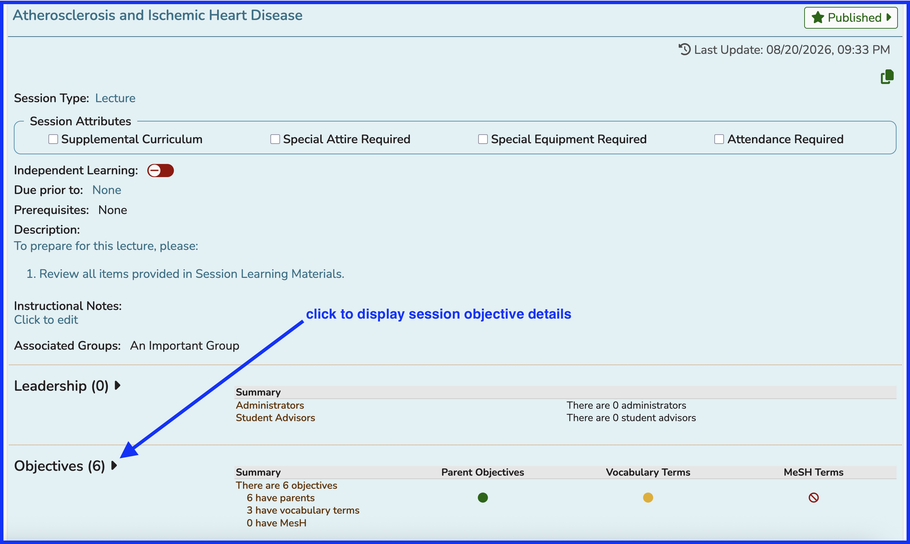
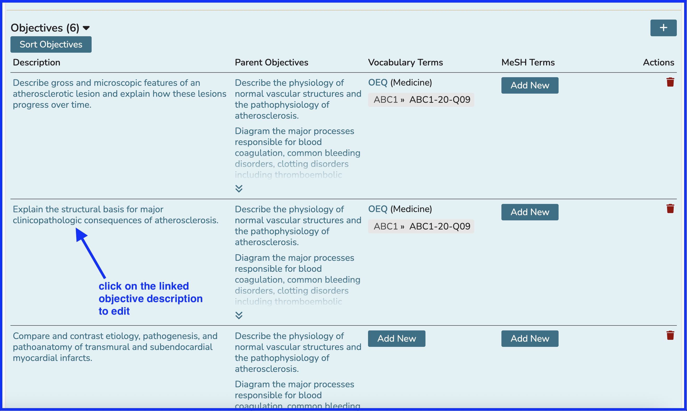
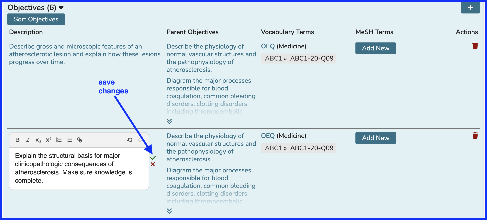
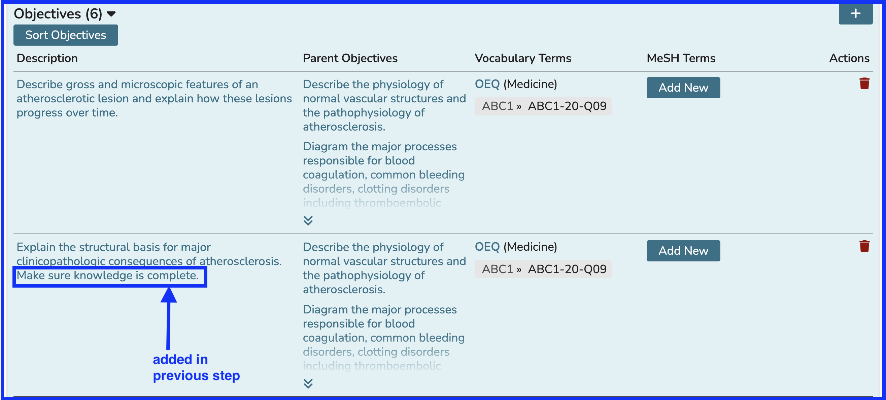

# Edit Objective

Editing an objective is easily accomplished following the the steps listed below.

## Select Course

Since a session objective is located within a course and a session after that, it is necessary to find and open up the course in which the session exists.

## Select Session

After applying a filter, pull up the session containing the objective to be modified.

**Expand the Objectives:** Objectives are displayed in a collapsed view initially.

## Expand Objective List

Click as shown below to expand the list and reveal the details of the session objectives.

## Select Objective

The objective description can be clicked anywhere within the linked text to perform an edit.

## Edit Objective Text

Exit the text value for the session objective and then click the green "Save" button as indicated once the text editing is complete. Alternatively, you can cancel out of this action by click the red "Cancel" button.

## Update Saved

The screen refreshes and reflects the change.

## Add MeSH / Vocabulary Terms

Since the process of adding MeSH and / or Vocabulary Terms to a Session objective is identical to how it is accomplished at the Course objective level, please refer to the following links for reference.

[Add MeSH Terms](https://iliosproject.gitbook.io/ilios-user-guide/courses-and-sessions/courses/course_objectives/edit-objective#attach-mesh-term-s)

[Add Vocabulary Terms](https://iliosproject.gitbook.io/ilios-user-guide/courses-and-sessions/courses/course_objectives/edit-objective#add-vocabulary-term-s)

A quick screen shot of how this looks at the session objective level is shown below for reference. 

<figure>
  
  <figcaption>
      
add MeSH or vocab terms

  </figcaption>
</figure>