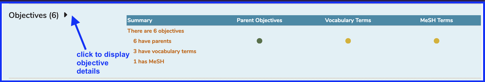

## Edit objective

Editing an Objective is easily accomplished following the the steps listed below.

### Select course

### Select session

**Expand the Objectives:** Objectives are displayed in a collapsed detail view initially.

### Expand objective list

### Select objective

### Edit objective

Click the Green "Save" button as indicated once the text editing is complete. Alternatively, you can cancel out of this action by click the Red "Cancel" button.

### Save changes

The screen refreshes and reflects the change.

### Add MeSH / Vocabulary terms

Since the process of adding these at a Session level is identical to how it is accomplished at the Course level, please refer to the following links for reference.

[add MeSH Terms](https://iliosproject.gitbook.io/ilios-user-guide/courses-and-sessions/courses/edit-objective#attach-mesh-term-s)

[add Vocabulary Terms](https://iliosproject.gitbook.io/ilios-user-guide/courses-and-sessions/courses/edit-objective#add-vocabulary-terms)

