# Edit Session

Any and all attributes of a session can be modified if you have sufficient permission to do so. Students who only have the student role will not have access to modify sessions. Instructors, Course Directors, and School Administrators (among others) are able to perform these actions.  Refer to the [Permissions Matrix](https://www.dropbox.com/s/431sdj2bfoi3v1f/Ilios%20New%20Default%20Permissions%20Matrix.pdf?dl=0) to verify who can (or cannot) edit sessions.

It is assumed that first you will search for and select the Course to be modified.

Once that has been done, it is necessary to find the session to modify as shown below.

## Quick LInks

* [Session Description](https://iliosproject.gitbook.io/ilios-user-guide/courses-and-sessions/sessions/edit-session#session-description)
* [Add URL](https://iliosproject.gitbook.io/ilios-user-guide/courses-and-sessions/sessions/session_actions/edit-session#add-url)
* [Instructional Notes](https://iliosproject.gitbook.io/ilios-user-guide/courses-and-sessions/sessions/edit-session#instructional-notes)
* [Manage Session Attributes](https://iliosproject.gitbook.io/ilios-user-guide/courses-and-sessions/sessions/edit-session#special-session-attributes)
* [Inline Editing](https://iliosproject.gitbook.io/ilios-user-guide/courses-and-sessions/sessions/edit-session#inline-editing)
* [Manage MeSH ](https://iliosproject.gitbook.io/ilios-user-guide/courses-and-sessions/sessions/manage_mesh)
* [Vocabulary Terms](https://iliosproject.gitbook.io/ilios-user-guide/courses-and-sessions/sessions/vocabulary_terms)

## Find Session

There are two easy and effective ways to find a session -- either by filtering or by sorting or a combination of both.

### Filtering

The screen shot below shows the screen before any search criteria has been entered. The following three fields can be searched:

1. Title
2. Type
3. Status

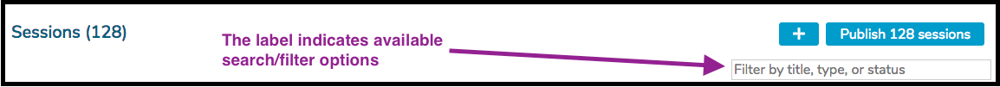

It is even possible to use a combination search if you prefer.  This is shown below where the search is being performed on "ana lecture".  This is not necessarily recommended but it can be done.  In this case, sessions which are of the type "lecture" and contain "ana" in their titles are returned.

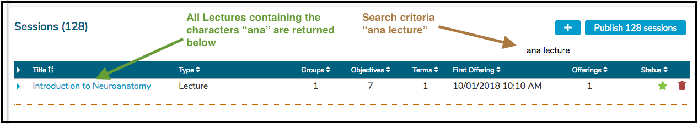

### Sorting

The Session output grid can be sorted by any of the column headers that have arrow or A-Z indicators. These include ...

* Title (ascending or descending alpha-numeric)
* Type (ascending or descending alpha-numeric)
* Groups (ascending or descending count)
* First Offering (date ascending or descending)
* Offerings (ascending or descending count)

Only one sort can be applied at any time.

**Important Note:** The sorts **DO** retain their state when the user is returned to the list after reviewing a Session.

## Session Description

Adding or editing a session's description is accomplished easily as shown below. Initially, a session will have "Click to Edit" link if nothing has been entered yet. After a session description exists, the text itself is clickable and the description can then be edited.

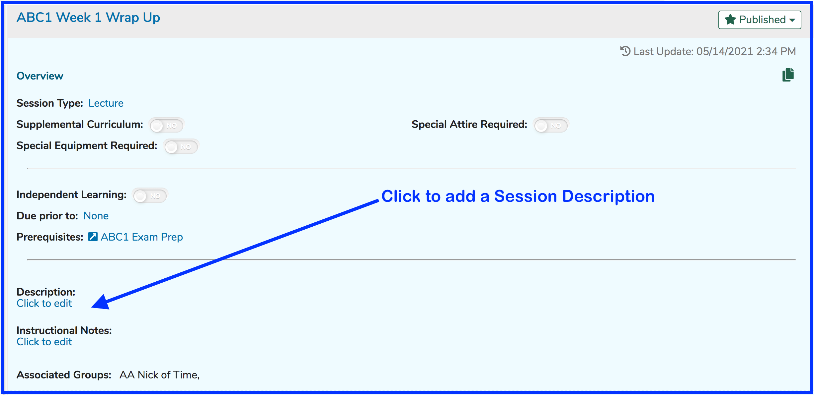

After clicking as shown above, a text value of any length can be entered as shown below.

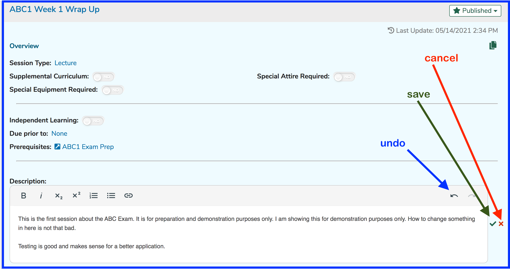

**NOTE**: Clicking the "undo" button will get rid of some of the more recently entered text. Once "undo" has been used, the "redo" button (to the right of "undo") will become enabled to put back the text that was recently removed.

After saving in the scenario above, the screen changes to something similar to the following. To edit the session description, simply click on it.

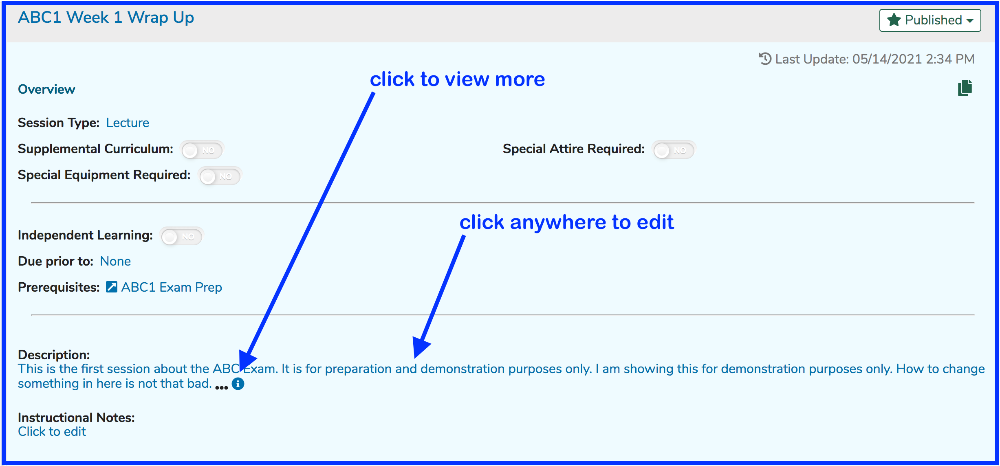

The Description will get truncated in this view. Clicking on the ellipses or the information symbol will change the screen to display the rest of the session description if it is truncated due to being too lengthy. This will look the same as it looked earlier when editing the description.

## Add URL

This applies to any text box in Ilios; but `Description` and `Instructional Notes` are both good examples of this. To add a URL to a Session `Description`, follow the steps shown below.

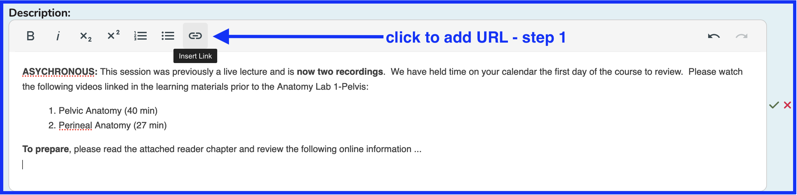

After clicking as shown above, the entry area appears to add a URL, displayed to the user as the "Text" value entered here. There is a check box available if you would like the link to appear in a new tab (or not if left in un-checked state).

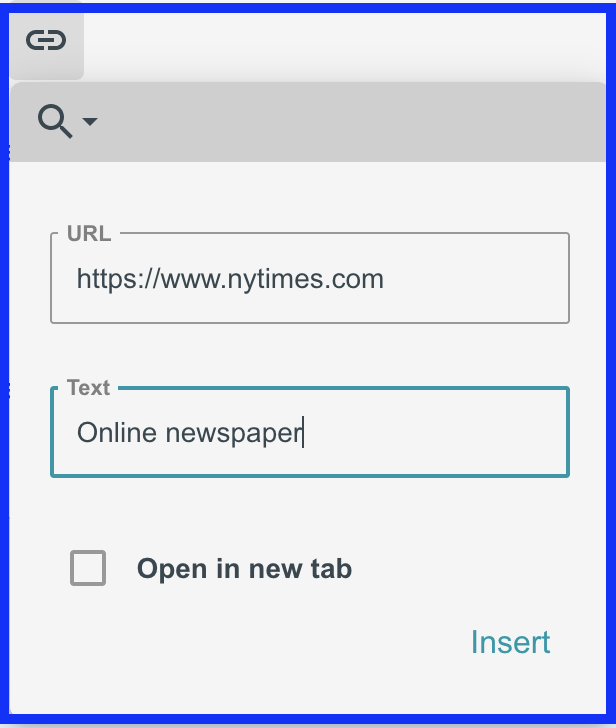

This is how it appears when entered as shown above. In this case, the "Open in new tab" check box has been left unselected. This means that the link will open in the same tab as Ilios. As mentioned with .pdf viewing in learning materials, the user will also close Ilios and be required to log back in if they close the tab when this is set as shown.

Alternatively, this can be set to true, which will result in a new tab being opened to display the link.

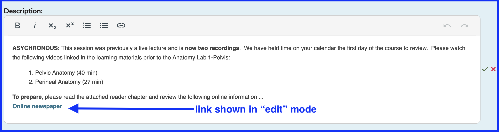

After being saved, the link appears as shown below in "display" (post-save) mode.

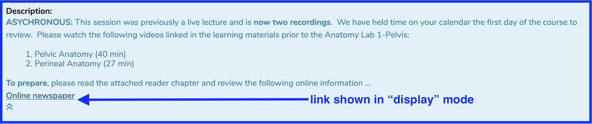

### Edit Link Settings

Below is an example using the same link entered above but using a different description. It is in read-only (pre-edit) mode now. 

Click anywhere (except the link itself) to enter edit mode. The screen changes to the following. Now in edit mode, clicking on the link itself will display two options ...

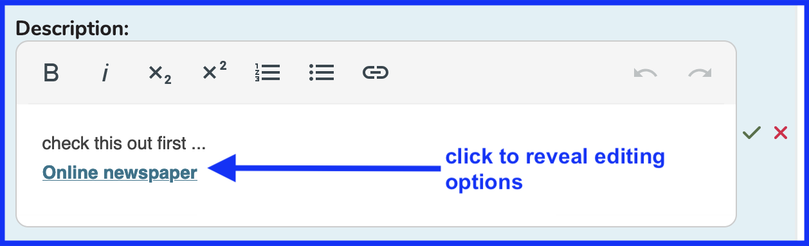

After clicking as shown above, the options below are displayed.

1. Edit link - edit link and / or link properties 
2. Unlink - text remains but the active link is removed

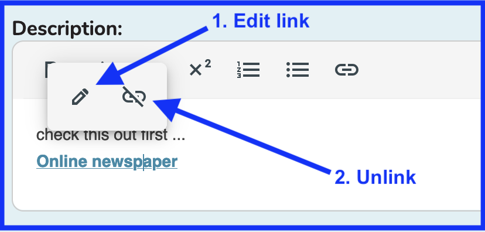

Assuming we do want to edit / review the link properties and have chosen option #1 shown above, the screen changes to allow editing of the URL properties as shown below. 

Clicking as shown below will set the behavior so that the link will open in a new tab. This may be beneficial in situations where it is not optimal for the user to accidentally close and log out of Ilios after following and reviewing the linked information. To process this save, the keyboard "Return" or "Enter" can be used or the "Update" link can be clicked.

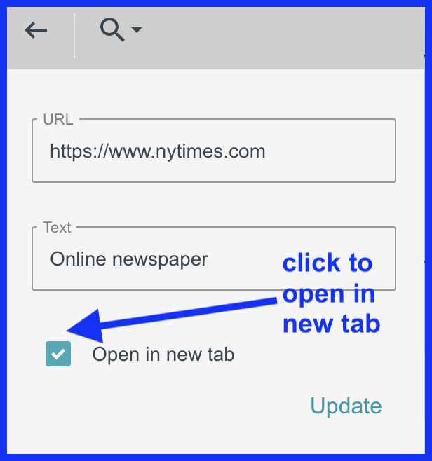

## Instructional Notes

The process for editing and entering Instructional Notes is basically identical to the process detailed above for session description. 

**NOTE**: Session-level instructional notes do **not** appear on Event Detail or anywhere in the Calendar or feed. They are used internally and are accessible only through Courses and Sessions. These are notes that can be left by Course Administrators for instructors or other Administrative users to review.

## Special Session Attributes

It is possible to select additional session attributes to advise students about certain aspects of the upcoming (or past) learning activities.

There are four options, none of which have been selected yet. These session attributes are configurable at the [School](https://iliosproject.gitbook.io/ilios-user-guide/schools/session-attributes) level.

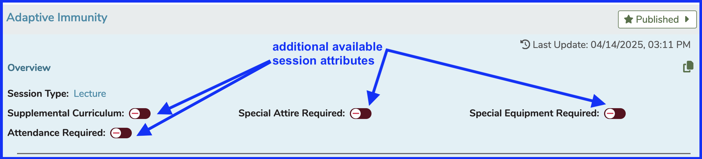

For this example, all four will be selected for this session. An image that shows the screen once this action has been taken is shown below for reference. Simply slide the toggle to the right or click it to put it into use.

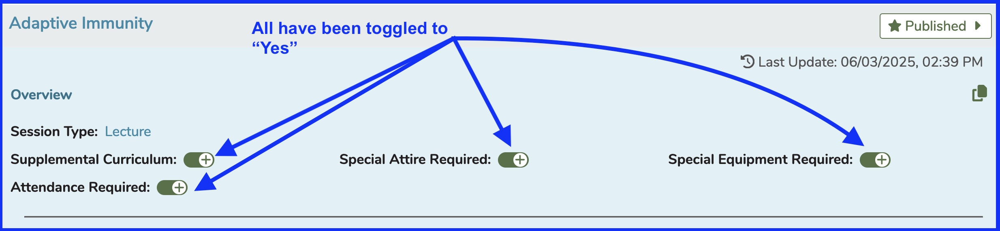

## Inline Editing

This refers to the ability to be able to edit sessions directly from the Session List. It is detailed below.

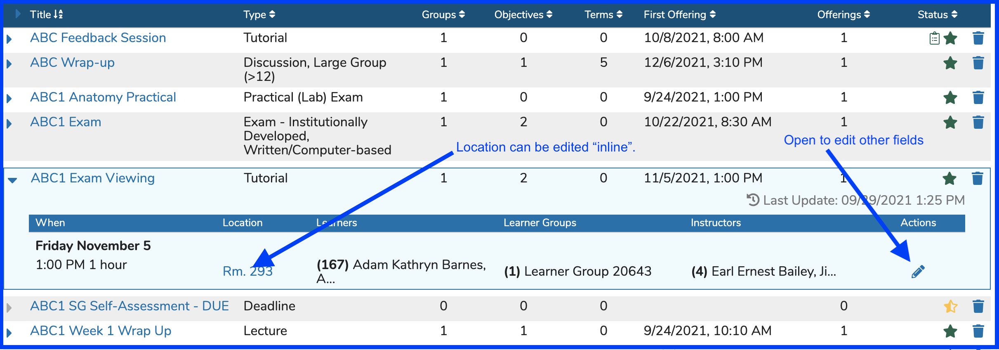

Referencing the screen shot above, after clicking on the Location as shown, here is how it looks for inline editing to be performed.

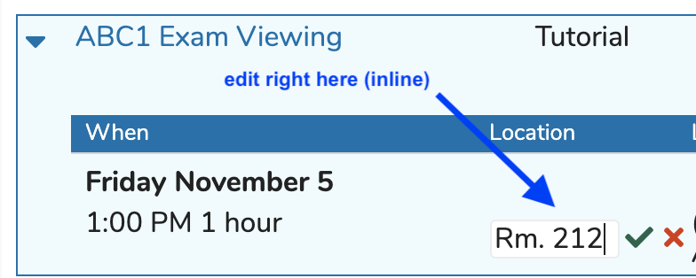

The following screens are also still technically "inline" since you will not need to navigate anywhere to edit all of these attributes of this Offering. This is all on one screen in the application but for documentation purposed, it was necessary to divide it up into two sections.

**Upper Part**

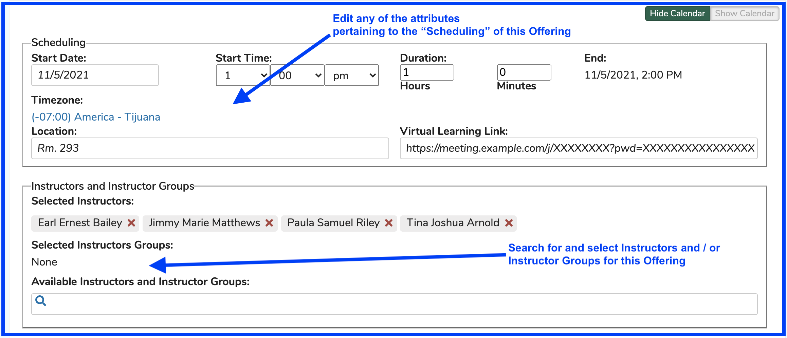

**Lower Part**

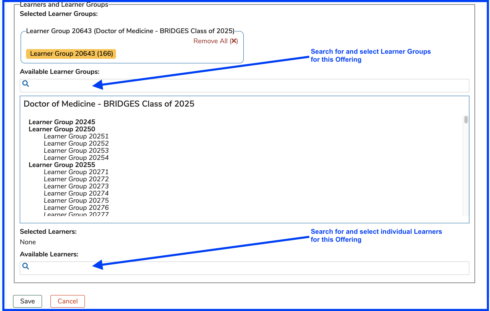
