# Edit Session

Any and all attributes of a session can be modified if you have sufficient permission to do so. Students who only have the student role will not have access to modify sessions. Instructors, Course Directors, and School Administrators \(among others\) are able to perform these actions.  Refer to the [Permission Matrix](https://docs.google.com/spreadsheets/d/1FbR53C2clvNoWZHMElQRfuJ4jHbZtr5pFl11et0zszY/edit?ts=5ad90141#gid=0) to verify who can \(or cannot\) edit sessions.

It is assumed that first you will search for and select the Course to be modified.

Once that has been done, it is necessary to find the session to modify as shown below.

**Quick Links**

* [Session Description](https://iliosproject.gitbook.io/ilios-user-guide/courses-and-sessions/sessions/edit-session#session-description)
* [Instructional Notes](https://iliosproject.gitbook.io/ilios-user-guide/courses-and-sessions/sessions/edit-session#instructional-notes)
* [Add MeSH](https://app.gitbook.com/@iliosproject/s/ilios-user-guide/courses-and-sessions/sessions/edit-session#add-mesh) 
* [Manage Terms](https://iliosproject.gitbook.io/ilios-user-guide/courses-and-sessions/sessions/edit-session#manage-terms)
* [Manage Session Attributes](https://iliosproject.gitbook.io/ilios-user-guide/courses-and-sessions/sessions/edit-session#special-session-attributes)

### Find Session

There are two easy and effective ways to find a session -- either by filtering or by sorting or a combination of both.

#### Filtering

The screen shot below shows the screen before any search criteria has been entered. The following three fields can be searched:

1. Title
2. Type
3. Status 

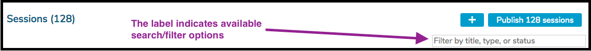

It is even possible to use a combination search if you prefer.  This is shown below where the search is being performed on "ana lecture".  This is not necessarily recommended but it can be done.  In this case, sessions which are of the type "lecture" and contain "ana" in their titles are returned.

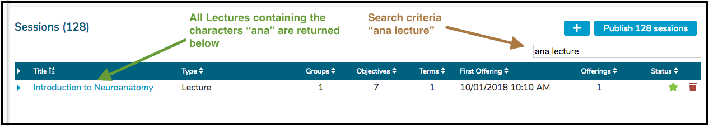

#### Sorting

The Session output grid can be sorted by any of the column headers that have arrow or A-Z indicators. These include ...

* Title \(ascending or descending alpha-numeric\)
* Type \(ascending or descending alpha-numeric\)
* Groups \(ascending or descending count\)
* First Offering \(date ascending or descending\)
* Offerings \(ascending or descending count\)

Only one sort can be applied at any time. 

**Important Note:** The sorts **DO** retain their state when the user is returned to the list after reviewing a Session.

### Session Description

Adding or editing a session's description is accomplished easily as shown below. Initially, a session will have "Click to Edit" link if nothing has been entered yet. After a session description exists, the text itself is clickable and the description can then be edited.

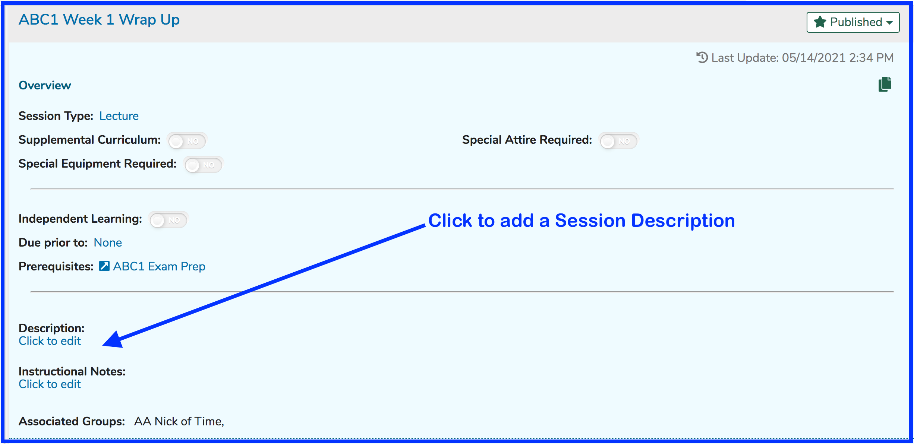

After clicking as shown above, a text value of any length can be entered as shown below.

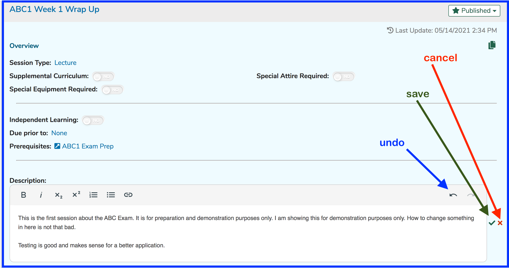

**NOTE**: Clicking the "undo" button will get rid of some of the more recently entered text. Once "undo" has been used, the "redo" button \(to the right of "undo"\) will become enabled to put back the text that was recently removed.

After saving in the scenario above, the screen changes to something similar to the following. To edit the session description, simply click on it.

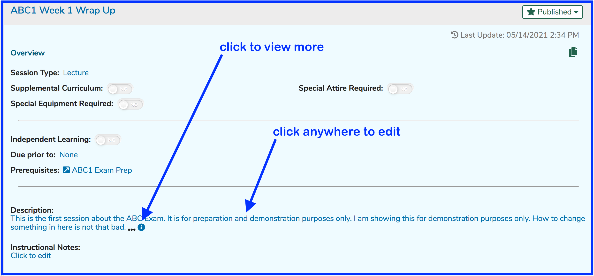

The Description will get truncated in this view. Clicking on the ellipses or the information symbol will change the screen to display the rest of the session description if it is truncated due to being too lengthy. This will look the same as it looked earlier when editing the description.

### Instructional Notes

The process for editing and entering Instructional Notes is basically identical to the process detailed above for session description. One difference is that Instructional Notes do not get truncated in the interface if lengthy.

### Add MeSH

To add a MeSH Term to a Session, follow the steps below. The steps for adding MeSH are the same wherever MeSH \(Medical Subject Headers\) can be attached - Sessions, Courses, Learning Materials, and Objectives.

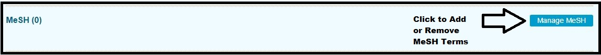

In the case of searching for MeSH, it is necessary to hit the Enter key on the keyboard to run the search. This is because there is a large data set of MeSH terms so it is necessary to run a special query in this manner.

In the example below, a search was performed for 'helmet'. The results of this query are listed. `Head Protective Devices` is selected.

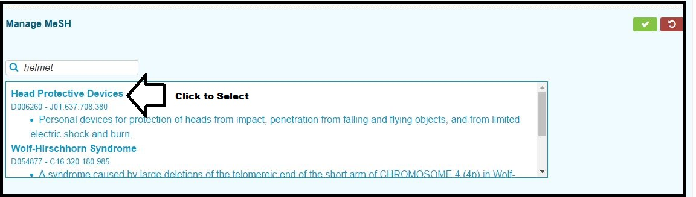

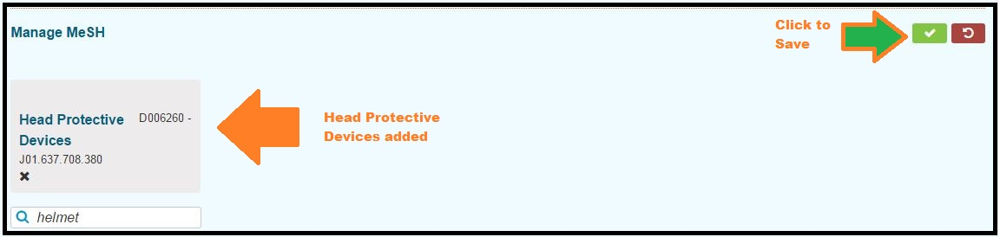

Once confirmed in the step shown above, the Manage MeSH functional area closes \(collapses\) back up. If you need to make further additions or removals from Session MeSH terms, click Manage MeSH and repeat these steps. To remove a MeSH Terms, simply click on it to remove it and then confirm the delete action by saving the data.

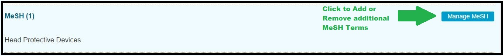

### Manage Terms

Terms are selected a school-specific, pre-defined list of one or more Vocabularies. These can be attached at the Course level and / or at the Session level.

The first step is to pull up a Session to modify. That is covered elsewhere. Terms are located below Learning Materials and above MeSH on the Session Detail screen.

In the case below, two terms have already been selected for the Session.

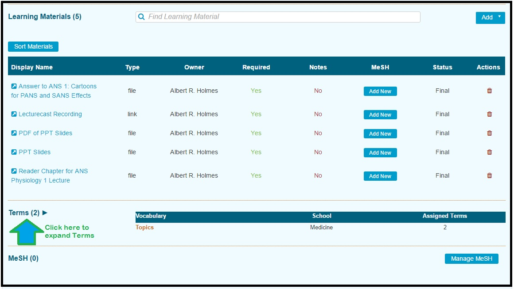

Once expanded, click the `Manage Terms` button as shown below.

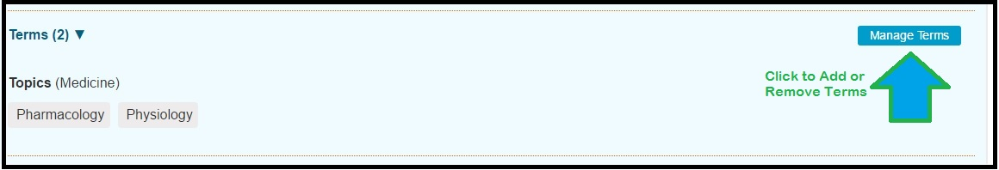

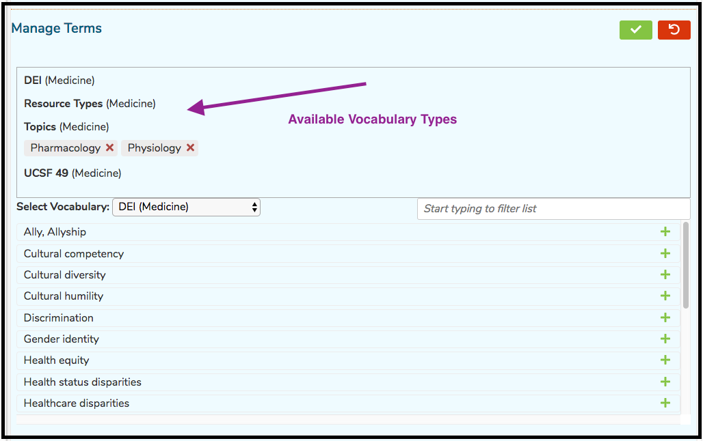

#### Add Session Term

It has been decided we need to add "Renal System" to this Session. "Renal System" is in the Vocabulary of "Topics". In the screen shot below, "Topics" has been chosen as the Vocabulary in which to search or select. The list has been filtered down by entering "ren" as search criteria to make it easier to find "Renal System". 

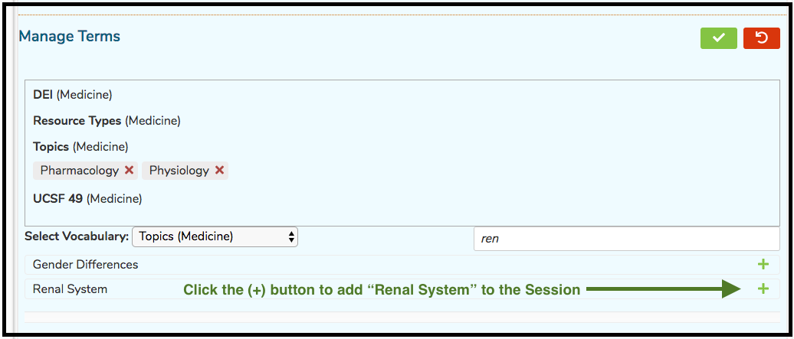

After clicking as shown above ...

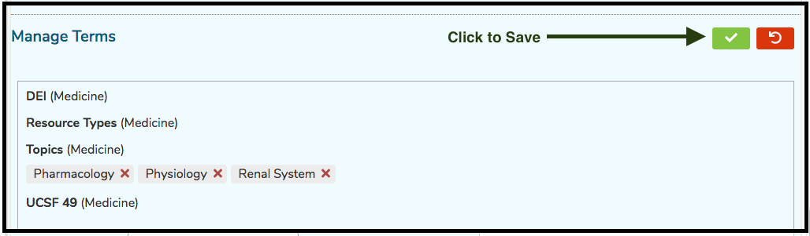

After confirming the addition of the Term "Renal System" to the Session, it appears in saved mode as . shown below.

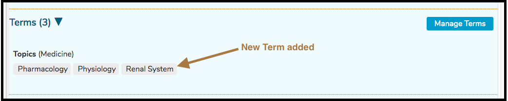

#### Special Session Attributes 

It is possible to select additional session attributes to advise students about certain aspects of the upcoming \(or past\) learning activities.

There are three options, none of which have been selected yet. There is also another attribute this particular school has decided not to use. This is "Attendance Required". These session attributes are configurable at the [School](https://iliosproject.gitbook.io/ilios-user-guide/schools/session-attributes) level.

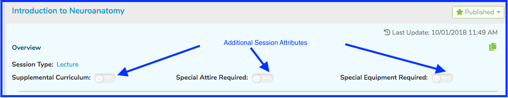

For this example, all three will be selected for this session. An image that shows the screen once this action has been taken is shown below for reference. Simply slide the toggle to the right to put it into use.

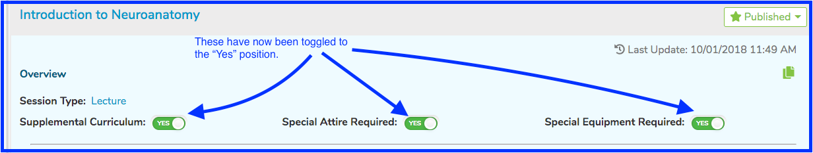

