# Independent Learning Module \(ILM\)

ILM's are a specific type of Session which does not necessarily meet in any particular location at an appointed time. It refers to a curricular activity of a specified required length of time that should be completed by a particular date or before a particular Session offerings is to take place. They are specifically meant to track learning which occurs independently and “asynchronously” outside the classroom, which may or may not be associated with synchronous / didactic learning. 

These are displayed in one of two places ...

1. **ILM with Due Date:** An ILM will appear on the Calendar at 5pm on the Due Date that was assigned. It shows up in a half hour block on the Calendar regardless of the actual duration of the expected activity.
2. **ILM linked to an upcoming Session**: An ILM that is linked to an upcoming Session will be displayed in its own area on the [Week at a Glance](https://iliosproject.gitbook.io/ilios-user-guide/dashboard/week-at-a-glance) - right at the top for easy reference for students. In the Calendar View, it will be displayed below. Screen shots of all of these views will be here soon.

**NOTE:** Any Session Type can be assigned to an ILM. It is possible to have an available Session Type of "Independent Learning" which is not the same or linked in any way to what is being described here.

Also, it is important to note that the background color on the Calendar will reflect the background color of the Session Type selected. It does not matter if it has been selected as ILM or not.

To create an ILM ...

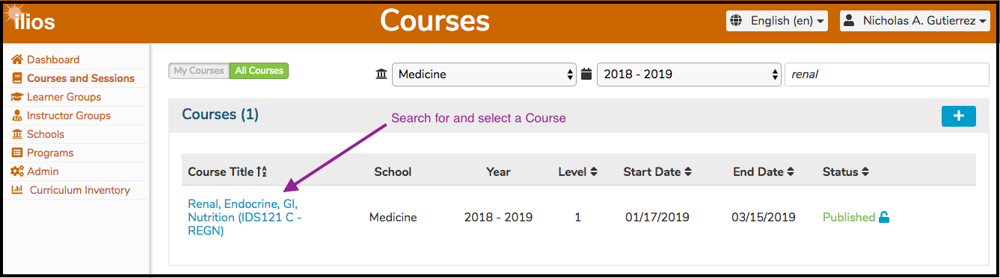

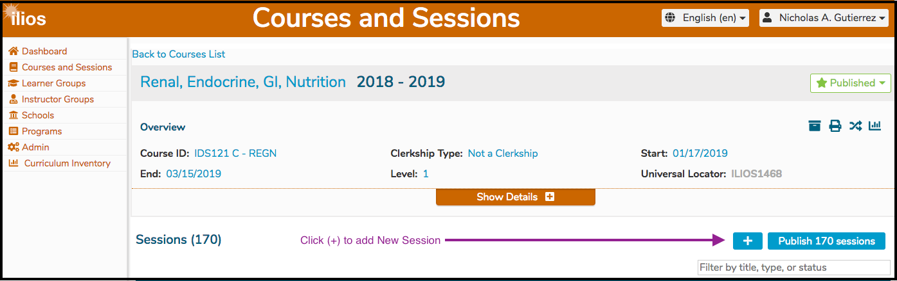

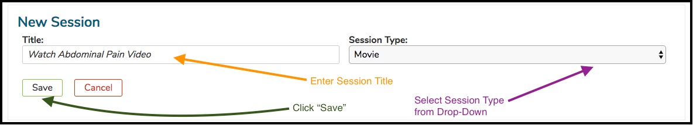

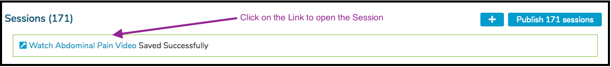

### ILM with Due Date

In the case below, the ILM was set with a Due Date of 3/26/2019. Once the Session is published, the ILM will appear on the Learner's calendar in a 15 minute time-slot at 5:00PM on the Due Date \(3/26/2019\).

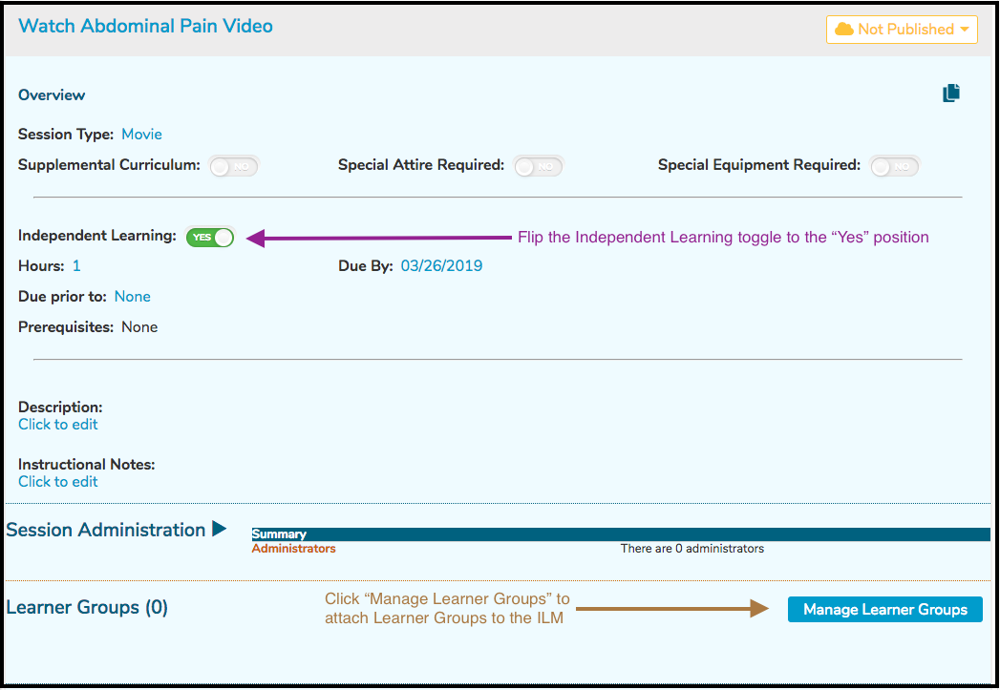

It is important to note that one or more Learner Groups must be added to ILM's so students will see the offerings on their calendars. The ILM \(like any other type of session\) must also be published.

### ILM Linked to Session

It is also possible to link and ILM to an upcoming Session. This way the student will know to complete the activities required by the ILM before the Offering of the Session to which the Learner is assigned.

After clicking as shown above, select the Session \(in the same Course\) to which this ILM should be linked.

After the "Cholesterol Transport and Metabolism 02/13/2019 3:10 PM" Session gets selected, it can be attached to the ILM. 

**NOTE**: The first offering date is appended to the end of the Session Title to make it easier to select the correct Session.

After clicking the green Save button to confirm ...

As mentioned elsewhere, these linked ILM's appear in the top portion of the Week At A Glance.

The lower part of the screen is shown below. Any \(or all\) of the following Session-level attributes may be added here ...

* **Objectives** 
* **Learning Materials**
* **Terms**
* **MeSH Terms**
* **Offerings** \(ILM's can have associated Offerings but frequently do not since this is normally asynchronous learning that is performed by students outside of the classroom setting\).

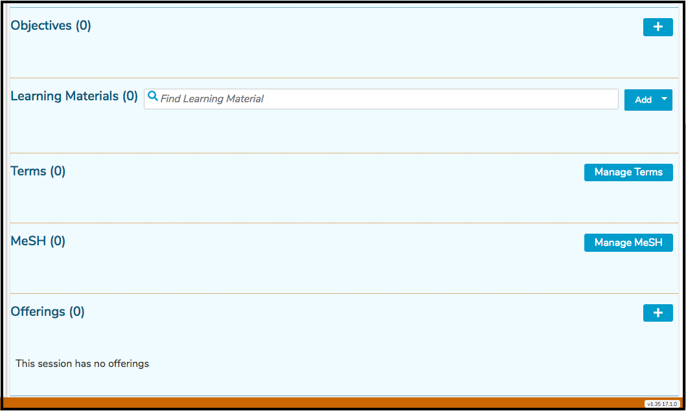

## Manage Learner Groups

After clicking the "Manage Learner Groups" button as shown in the screen shot above, follow the steps outlined below. Keep in mind that if this Session has attached Offerings with Learner Groups attached, this is a separate process. It is necessary to attach Learner Groups and Instructors specifically to this ILM being created or no one will know it exists.

Now that \(in this example\) H&I Exam Groups has been selected, the display has been updated to reflect this selection. Now that the higher level group H&I Exam and all 6 of its Sub Groups have been attached to this ILM Session, the Sub Groups can be removed individually or they can be removed all at the same time. These options are illustrated below.

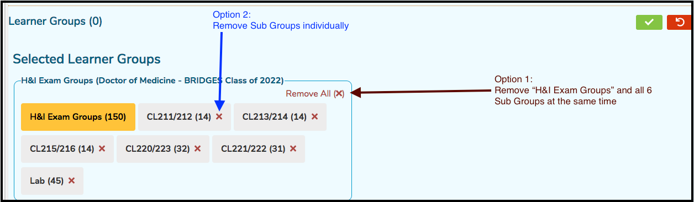

For the sake of documentation and to demonstrate, choosing Option 2 leads to the following results.

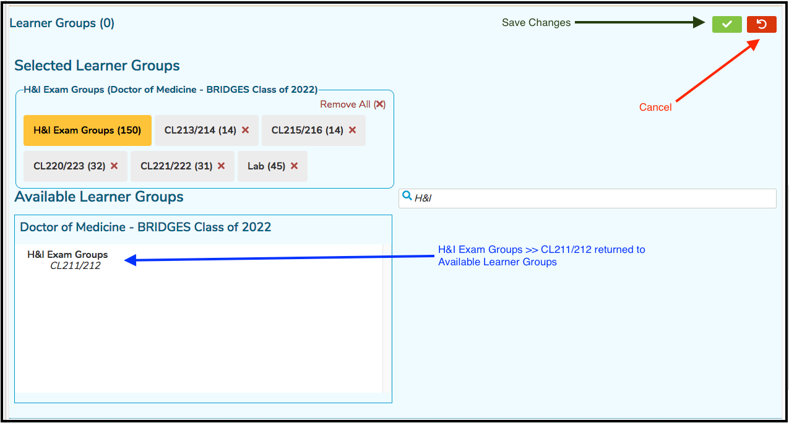

Clicking "Remove All" \(Option 1\) would have removed all of the Sub Groups and the higher level group back to "Available Learner Groups", thus removing all of these groups from the ILM Session.

**NOTE:** Each higher level group with its associated Sub Groups now comes with its own container, allowing for the "Remove All" of just that higher level Group and its Sub Groups. Other Groups / Sub Groups will remain in their own container for individual Group maintenance.

Below is a screen shot featuring several containers for reference.

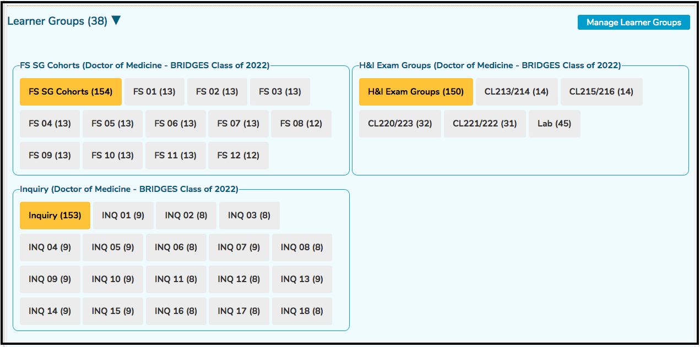

After saving \(clicking the green check box button\), the Learner Groups counter updates as shown below to reflect the total count of attached Learner Groups.

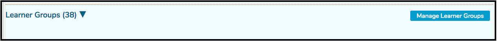

## Manage Instructors

Instructors also need to be attached specifically to this newly created ILM. To do this, follow the steps outlined below.

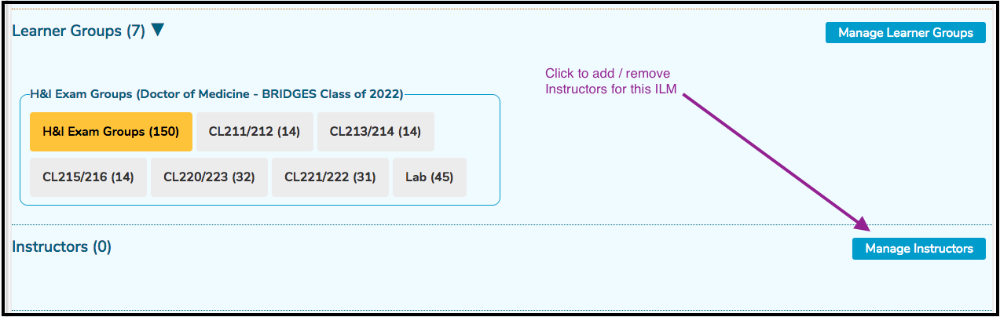

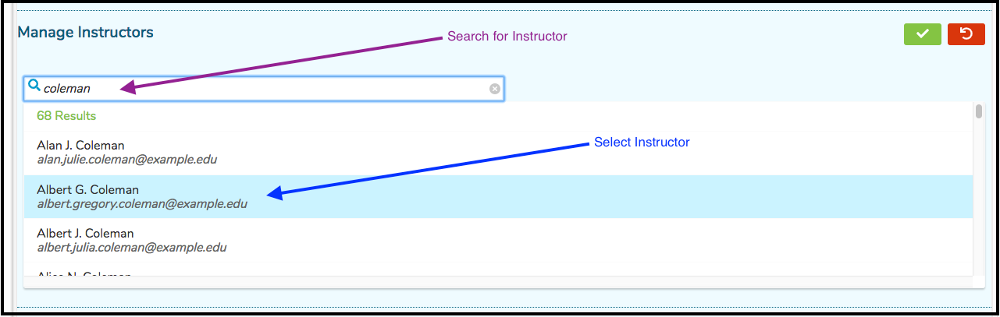

