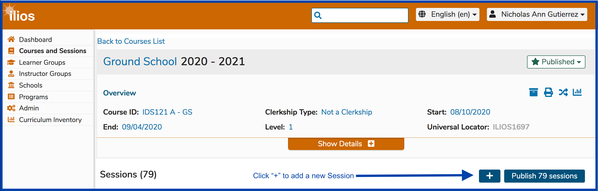
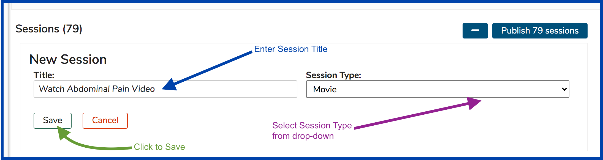
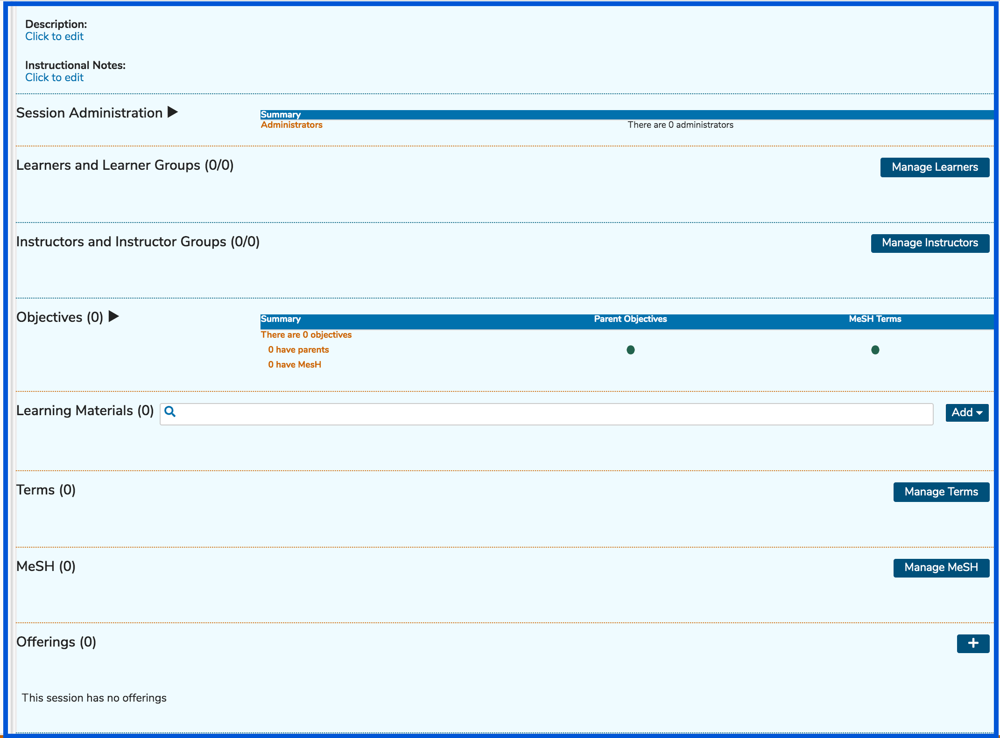
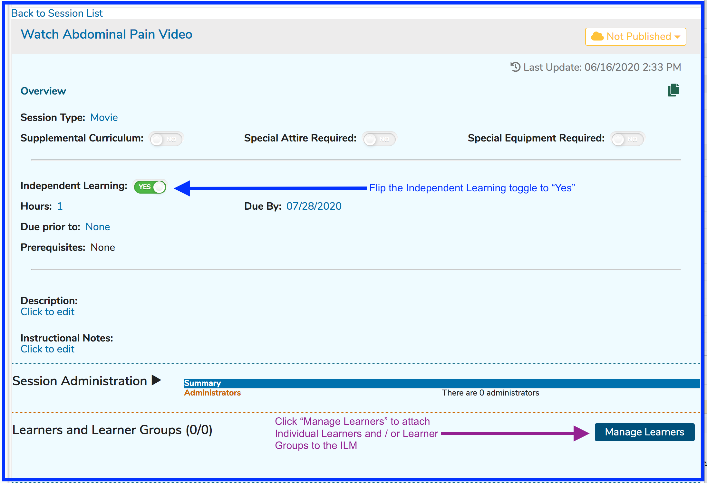
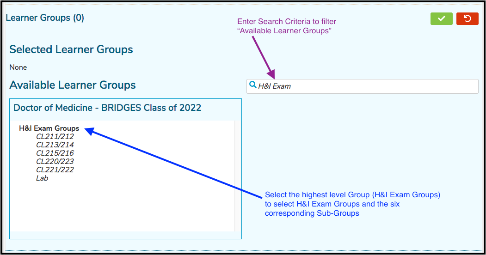
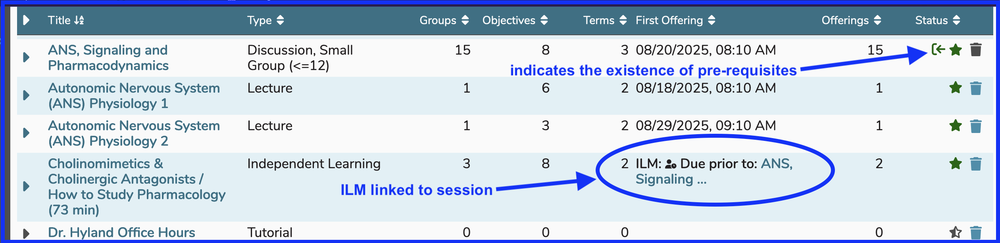

Independent Learning Modules (ILM's) are a specific type of Session which does not necessarily meet in any particular location at an appointed time. It refers to a curricular activity of a specified required length of time that should be completed by a particular date or before a particular Session offering is to take place. They are specifically meant to track learning which occurs independently and “asynchronously” outside the classroom, which may or may not be associated with synchronous / didactic learning.

These are displayed in one of two places ...

1. [**ILM with Due Date / Time**](https://iliosproject.gitbook.io/ilios-user-guide/courses-and-sessions/sessions/independent-learning-module-ilm#ilm-with-due-date-time): An ILM will appear on the Calendar at the specified time on the Due Date that was assigned. It shows up in a fifteen minute block on the Calendar regardless of the actual duration of the expected activity. If a time is not specified, the default is 5pm. An example of this is shown below.
<figure>
    
    <figcaption>
      
displayed on calendar

    </figcaption>
</figure>

2. [**ILM linked to an Upcoming Session Offering**](https://iliosproject.gitbook.io/ilios-user-guide/courses-and-sessions/sessions/independent-learning-module-ilm#ilm-linked-to-session): An ILM that is linked to an upcoming Session will have the learning activities listed on the target session in all places session offerings appear in Ilios, among them on [Week at a Glance](https://iliosproject.gitbook.io/ilios-user-guide/dashboard/week-at-a-glance).

An example of #2, as far as the learner view is concerned, is shown below. The image below shows the icon presented to students on Week at a Glance. 

<figure>
    
    <figcaption>
      
linked ILM icon

    </figcaption>
</figure>

# Options

## Linked ILM - All Weeks

<figure>
  
  <figcaption>
    
All Weeks linked ILM's

  </figcaption>
</figure>

In the example shown above, the student will need to click the link to "Hemostasis Module (Part 4)" in order to have access to the Learning Materials (activities) associated with that ILM. The "Hemostasis Module (Part 4)" ILM is linked to the Session entitled "Antithrombotics", which takes place at 10:50 AM on Wednesday. The student can access the progress checking boxes from the ILM. Here is how that appears in Event Detail of the target session.

<figure>
  
    <figcaption>
    
linked ILM learning material activities

  </figcaption>
</figure>

The check box for the Learning Material "Hemostasis Module Part 4: Drugs" appears in the check box state of "completed", meaning the student has reviewed and processed this learning material's contents. It appears in more of a greyed out appearance on the target session but is more blue colored when accessed on the ILM (formerly known as Pre-work) itself.

**NOTE:** Any Session Type can be designated as an ILM. It is also possible to have an available Session Type of "Independent Learning" which is not the same or linked in any way to what is being described here.

Also, it is important to note that the background color on the Calendar will reflect the background color of the Session Type selected. It does not matter if it has been selected as ILM or not.

To create an ILM ...

## ILM with Due Date / Time

In the case below, the ILM was set with a Due Date of 9/16/2021. Once the Session is published, the ILM will appear on the Learner's calendar in a 15 minute time-slot at the specified time of day (5:00 PM) on the Due Date (9/16/2021).

It is important to note that one or more Learner Groups or Individual Learners must be added to ILM's so students will see the offerings on their calendars. The ILM (like any other type of session) must also be published.

### Change Due Date / Time

Following the instructions shown above for changing the due date and / or time of an ILM, the following controls appear to handle this task. Either or both can be modified as shown below. In this situation, the date field has been clicked, calling up the date picker control. Due time is controlled by changing the values in the drop-down menus.

## ILM Linked to Session

It is also possible to link an ILM to an upcoming Session offering. This way the student will know to complete the activities required by the ILM before attending the learning activity to which the Learner has also been assigned.

After clicking as shown above, select the Session (in the same Course) to which this ILM should be linked.

A handy scrollable and searchable grid appears for the selection process to take place. All sessions in the current course are displayed and available for selection. The location of the mouse is an example of where the session can be clicked. Anywhere in the row or on the "+" button is fine.

After the "Ischemic Injury 06/25/2020 10:00 AM" Session gets selected, it can be attached to the ILM.

**NOTE**: The first offering date is included in the grid to make it easier to select the correct Session.

After clicking the green Done button to confirm ...

As mentioned elsewhere, these linked ILM's appear in the top portion of the Week At A Glance. If you are viewing the Calendar, the linked ILM's will appear below the actual calendar.

Here is a filtered view from Courses and Sessions showing how this looks from that perspective.

The lower part of the screen is shown below. Any (or all) of the following Session-level attributes may be added here ...

* **Session Administration:** Add Session Administrators
* **Learners and Learner Groups:** Attach Learner Groups and / or Learners to the ILM
* **Instructors and Instructor Groups:** Attach Instructors (or Instructor Groups) to the ILM
* **Session Objectives:** Add Objectives to this Session. Once added, Session Objectives can have the following associated items added ...
  * **Parent Objectives** (Course level Objectives)
  * **Vocabulary Terms**&#x20;
  * **MeSH Terms**
* **Learning Materials**
* **Terms:** Associate Vocabulary Terms to the Session
* **MeSH**: Associate MeSH Terms to the Session
* **Offerings** (ILM's can have associated Offerings but frequently do not since this is normally asynchronous learning that is performed by students outside of the classroom setting).

## Manage Learner Groups

After clicking the "Manage Learners" button as shown in the screen shot above, follow the steps outlined below. Keep in mind that if this Session has attached Offerings with Learner Groups attached, this is a separate process. It is necessary to attach Learner Groups or Individual Learners and Instructors or Instructor Groups specifically to this ILM being created or no one will know it exists.

Now that (in this example) H\&I Exam Groups has been selected, the display has been updated to reflect this selection. Now that the higher level group H\&I Exam and all 6 of its Sub Groups have been attached to this ILM Session, the Sub Groups can be removed individually or they can be removed all at the same time. These options are illustrated below.

For the sake of documentation and to demonstrate, choosing Option 2 leads to the following results.

Clicking "Remove All" (Option 1) would have removed all of the Sub Groups and the higher level group back to "Available Learner Groups", thus removing all of these groups from the ILM Session.

**NOTE:** Each higher level group with its associated Sub Groups now comes with its own container, allowing for the "Remove All" of just that higher level Group and its Sub Groups. Other Groups / Sub Groups will remain in their own container for individual Group maintenance.

Below is a screen shot featuring several containers for reference.

After saving (clicking the green check box button), the Learner Groups counter updates as shown below to reflect the total count of attached Learner Groups.

## Manage Individual Learners

Adding individual learners to ILM's can be done by clicking "Manage Learners". Individual learners can now be added in addition (or as an option) to the more traditionally assigned Learner Groups - detailed above. The process of searching for and selecting individual learners starts as shown below.

## Manage Instructors

Instructors can be attached specifically to this newly created ILM. To do this, follow the steps outlined below.

## Session List View

The icons showing pre-requisites and linked ILM's appear a bit different here on the session list. 

