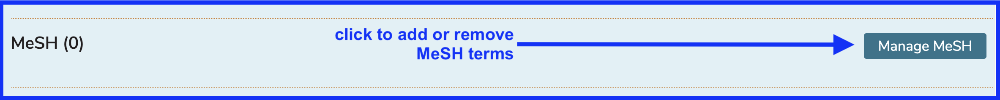
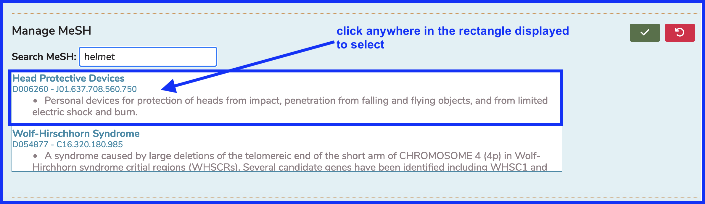
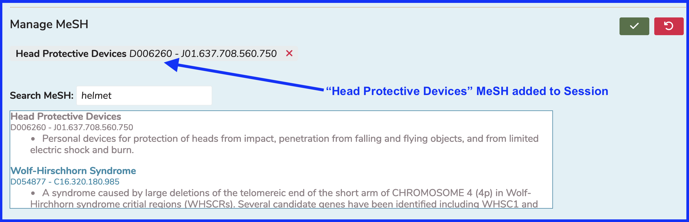
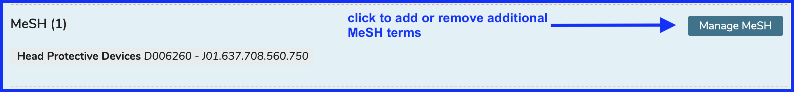
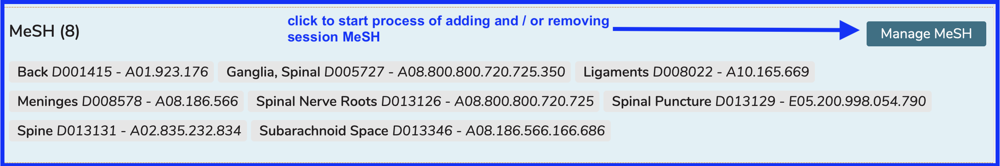
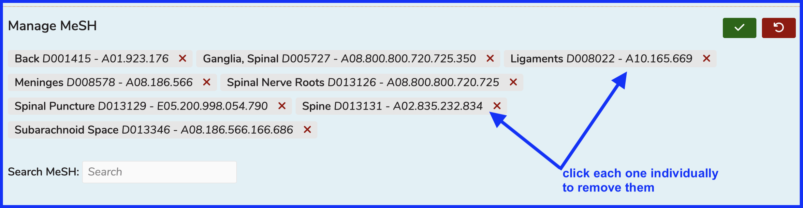
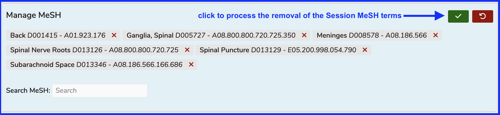
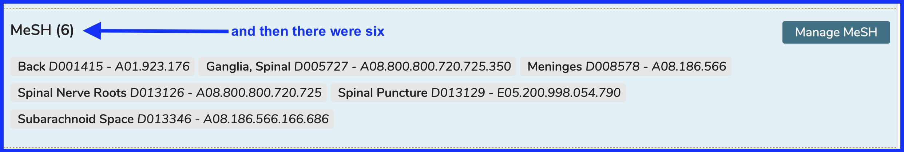

# Manage MeSH 

MeSH terms can be mainatained at the session level as well. Refer to [this](https://iliosproject.gitbook.io/ilios-user-guide/additional-information/mesh) page for a quick introduction to MeSH.

## Add MeSH

To add a MeSH Term to a Session, follow the steps below. The steps for adding MeSH are the same wherever MeSH (Medical Subject Headers) can be attached - Sessions, Courses, Learning Materials, and Objectives.

### Click to Manage

In the case of searching for MeSH, it is necessary to hit the Enter key on the keyboard to run the search. This is because there is a large data set of MeSH terms so it is necessary to run a special query in this manner.

In the example below, a search was performed for 'helmet'. The results of this query are listed. `Head Protective Devices` is selected.

Once confirmed in the step shown above, the Manage MeSH functional area closes (collapses) back up. If you need to make further additions or removals from Session MeSH terms, click Manage MeSH and repeat these steps. To remove a MeSH Terms, simply click on it to remove it and then confirm the delete action by saving the data.

## Remove MeSH

Removing one or more MeSH terms is accomplished by clicking one at a time on the terms that need to be removed and then saving the record. That's it - see below.

### Click to Manage

In this example, there are 8 MeSH terms currently associated with the selected session. We wish to get rid of two of them which are no longer needed. 

Now that the two MeSH terms we wanted to remove have been removed, click the "Save" button to process these changes.

The screen refreshes and the MeSH count is straightened out with only the remaining six MeSH terms associated with the session.

