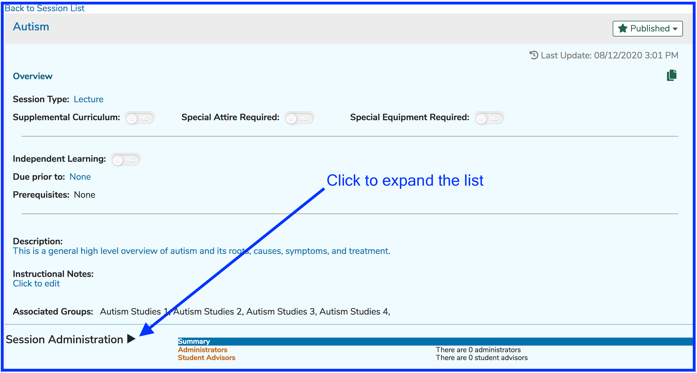
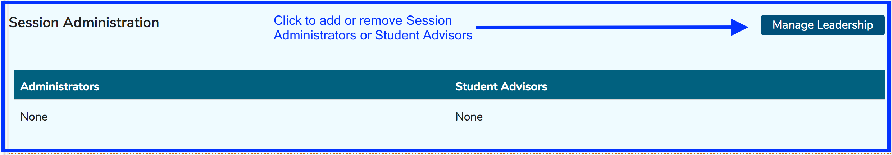
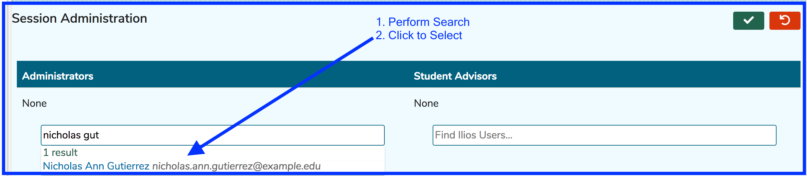
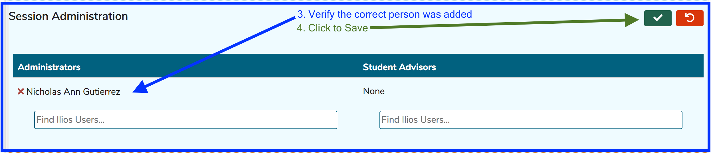
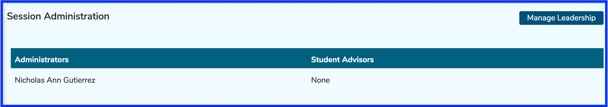

# Session Leadership

For any Session, leadership can be assigned here within the Session. There are two distinct levels \(categories\) that can be set here. 

#### Session Leadership Categories

* **Session Administrators** - can make edits to any Session to which they have assigned this role.
* **Student Advisors** - can only download Learning Materials for this Session from the Calendar. "All Events" must be selected on the Calendar. Filters can and should be applied to make the events easier to find.

Session Administrators can make changes to this Session if they are added to this role. Anyone with a higher permission level can edit this and any other Sessions within the Course. These include Course Administrators and Course Directors along with any user who have had permissions set for them at the Program or School level.

Student Advisors are also added here. They are able to download Learning Materials from the Calendar &gt;&gt; Event Detail. These events must be searched for and the Event clicked on the Calendar. 

Refer to [Calendar Views and Filtering Options](https://iliosproject.gitbook.io/ilios-user-guide/dashboard/calendar-search-and-filter-options) for more information.

To use this functionality, pull up a Session. The screen initially appears similar to what is shown below. 

Click to expand the list as shown above and then click "Manage Leadership" to add and / or remove Session Administrators.

For the sake of example, we want to add "Nicholas Gutierrez" as Course Administrator. To do this ...

After clicking "Manage Leadership", follow the steps shown below to add the correct "Nicholas" to list of Session Administrators.

Below you can see "Nicholas Gutierrez" has been added correctly to the list. 

Once the change has been correctly made and saved, the screen appears as shown below.

After processing the Save event, the correct Ilios user is now confirmed to be a Session Administrator, who can modify any aspect of this Session and any Offerings attached.

**NOTE**: The process for adding Student Advisors is identical, except for the search is performed in using the Student Advisors area instead of Administrators.

Refer to the [Permissions Matrix](https://docs.google.com/spreadsheets/d/1FbR53C2clvNoWZHMElQRfuJ4jHbZtr5pFl11et0zszY/edit?ts=5ad90141#gid=0) for more information on permissions granted when a user is granted Session Administrator rights. Session Administrators will see the offerings for the sessions they administer on their calendars by default.

