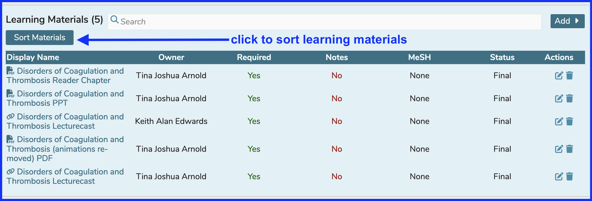
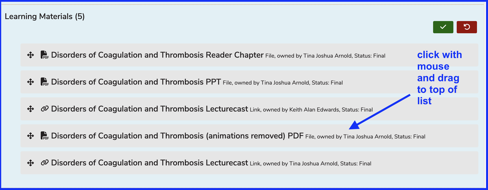
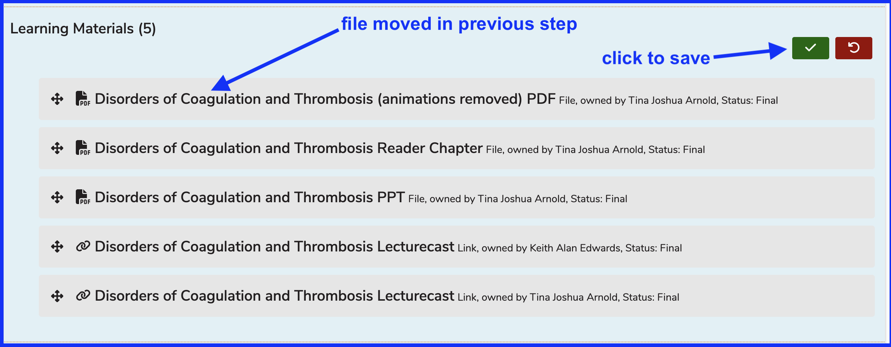
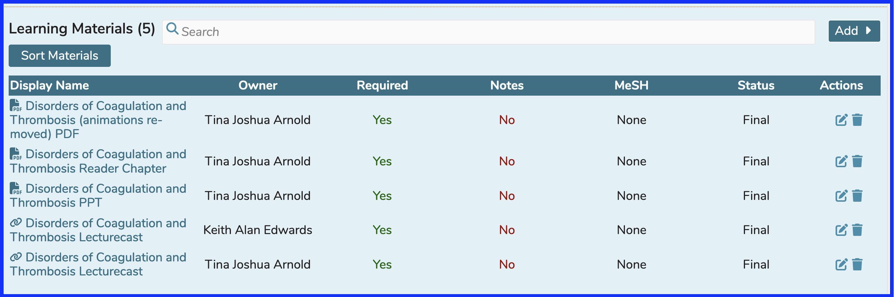

# Sort Learning Materials

The sorting of Learning Materials is available at both the Course and the Session level in Ilios. This ensures that Learners will see the Learning Materials in a specified order. Course Coordinators can set this order whenever an adjustment is desired.

To sort Learning Materials within a Session ...

* Select a Course
* Select a Session which either already has Learning Materials attached (or attach them before doing the sort).

In this example, a Session is selected that already has a number of Learning Materials associated. To start the process of sorting, click as shown below.

## Click to Sort Materials

Once `Sort Materials` has been clicked ...

* Drag and drop any of the learning materials to their respective position in the desired sort order.

In this example, it is preferred to have the learning material "Disorders of Coagulation and Thrombosis (animations removed) PDF" appear first to the students. The following screen shots show how that gets accomplished.

## Update Sort Order

After clicking Save as shown below, the new sort order is accurately displayed once the save event splash screen dissipates.

## Updated Sort Order

The result of all of these steps is shown below. We moved the fourth learning material up to become the first learning material as presented to viewers of this sessions - learners and non-learners alike.

