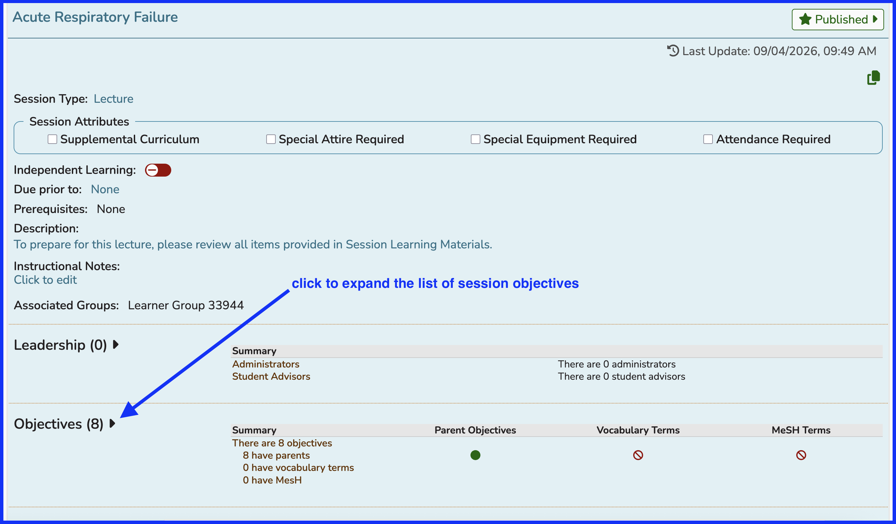
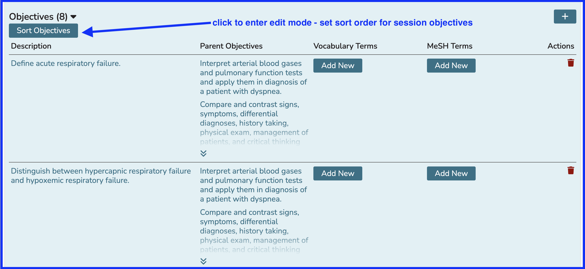
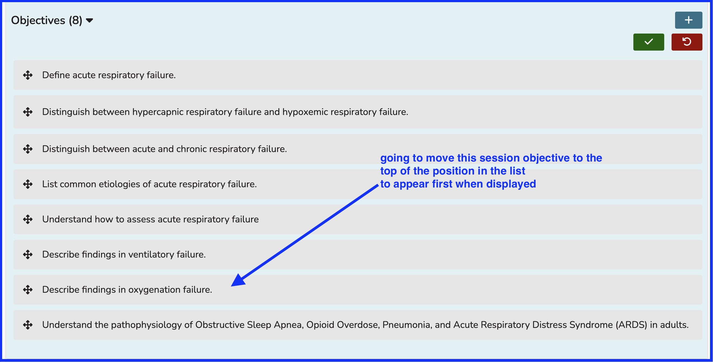
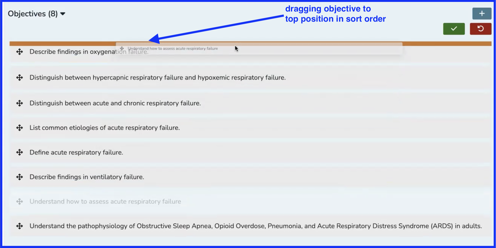
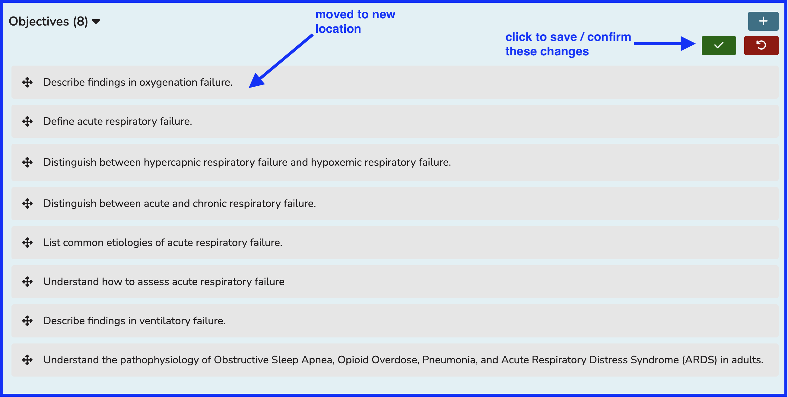
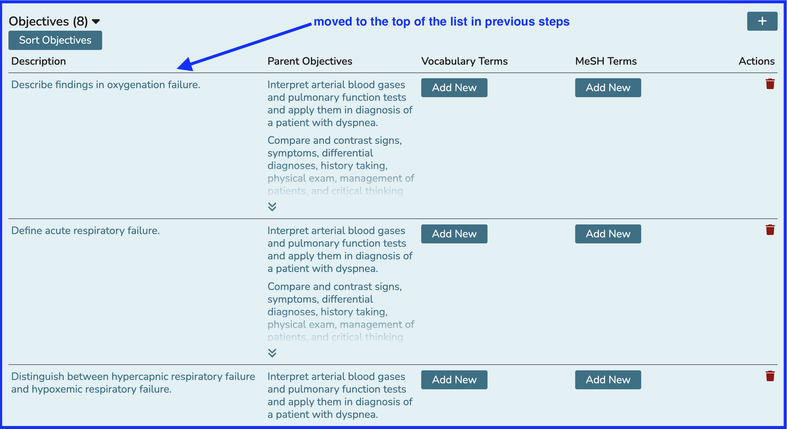

# Sort Objectives

This is accomplished in a very similar manner to sorting Course Objectives as well as Program Year Objectives and Learning Materials at both the course and level and the session level. The screens do look a bit different so for completeness' sake, this is detailed here as well.

To do this, pull up a session that has objectives ready to be sorted.

* Click `Objectives(x)` to expand the objective list as shown below.

* Now that the list of objectives pertaining to this session has been expanded, they can be dragged and dropped into the desired location. This location will determine the order in which they are presented to learners wherever and however they access this information.

After activating the functionality by clicking the `Sort Objectives` button as shown above, the screen is expanded to allow for the re-ordering of the Session Objectives. For the sake of demonstration, it is desired that the Objective titled **"Describe findings in oxygenation failure."** be moved up to the number one position. Students (or anyone who views the Event Detail for this session) will see this session objective first, indicating its relative importance.

To do this, select the second to last Objective we want to move to the top and drag it up to the first position. The Objective will appear ghosted out along with its destination. Let go of the mouse button when the Objective being moved (re-prioritized) is in position as shown below.

After dropping the Objective, the list is re-sorted as shown below. Click `"Save"` to complete this process or `"Cancel"` to abort.

After click the green Save button, a quick percentage counter will appear. The screen will rapidly settle in on the newly applied session objective sort order. 

