Vocabulary terms can be assigned at many levels in Ilios. Sessions can be tagged with these terms as well.

# Manage Vocabulary Terms

Terms are selected a school-specific, pre-defined list of one or more Vocabularies. These can be attached at the Course level and / or at the Session level.

The first step is to pull up a Session to modify. That is covered elsewhere. Terms are located below Learning Materials and above MeSH on the Session Detail screen.

In the case below, two terms have already been selected for the Session.

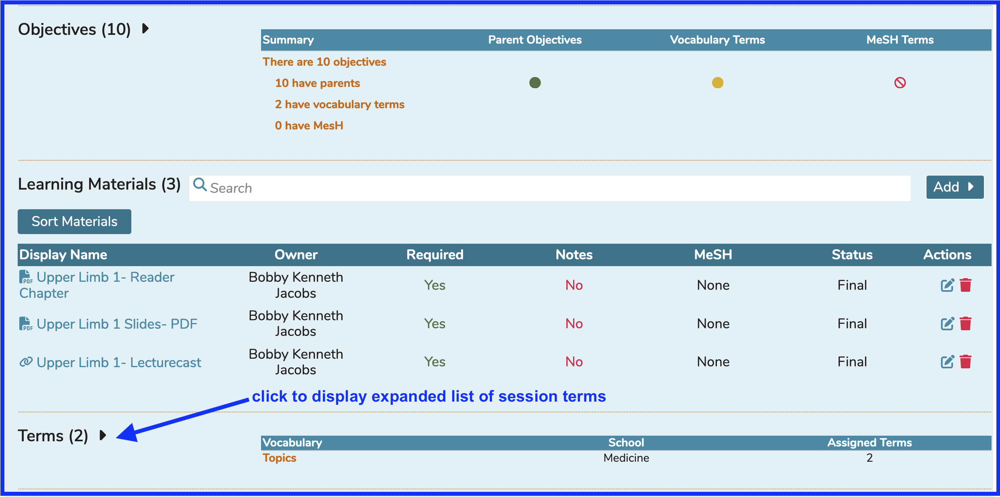

Once expanded, click the `Manage Terms` button as shown below.

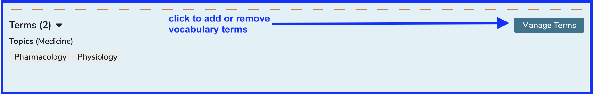

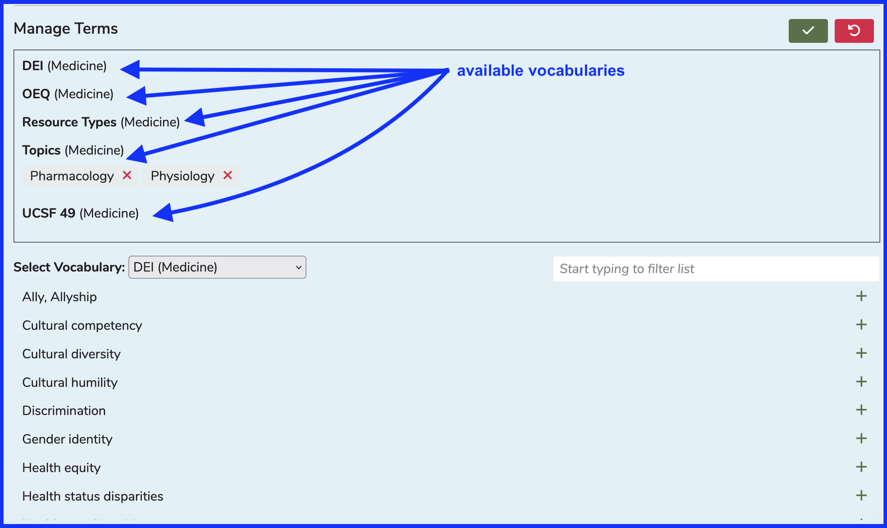

## Add Term

It has been decided we need to add the Vocabulary Term "Renal System" to this Session. The session needs to be tagged with this term. "Renal System" is in the Vocabulary of "Topics". In the screen shot below, "Topics" is being selected as the Vocabulary to use for Term selection. 

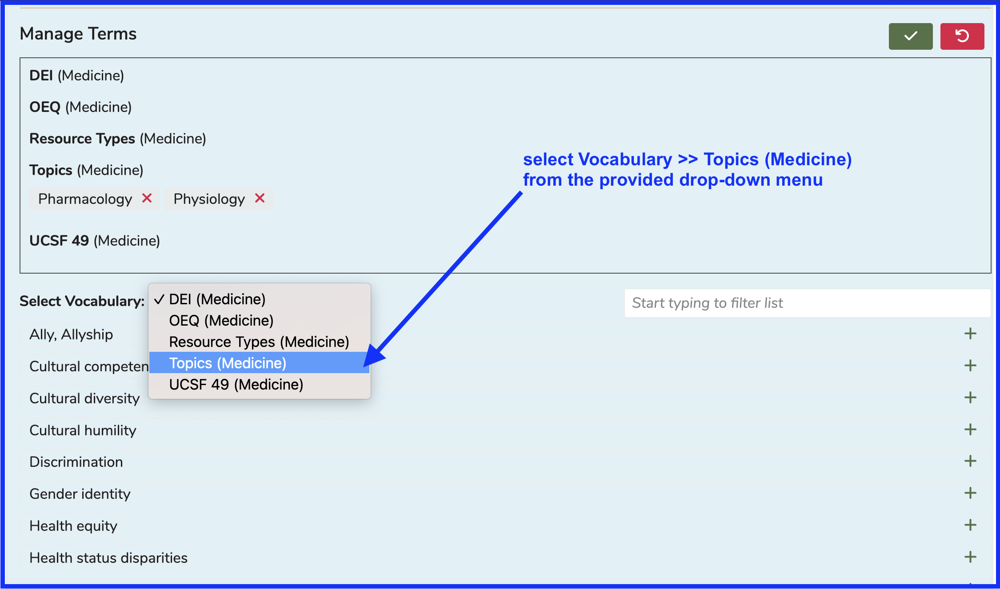

The selection list has been filtered down by entering "ren" as search criteria to make it easier to find "Renal System". The term can be added to the session as shown below.

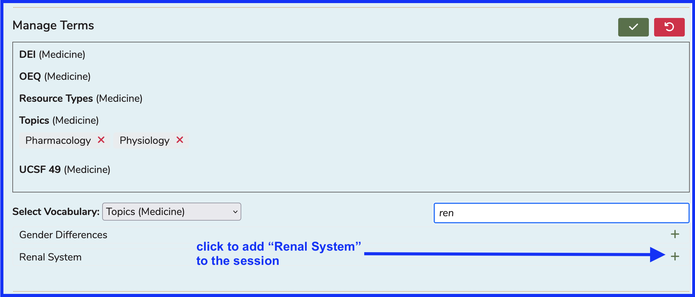

After clicking as shown above ...

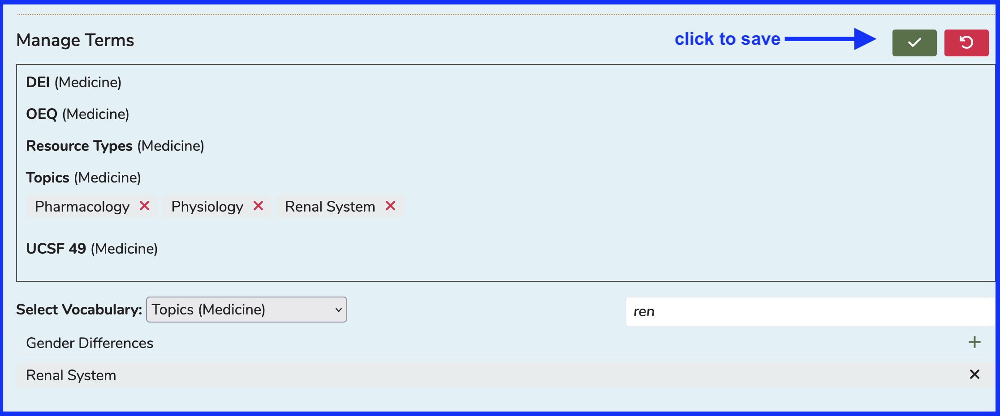

After confirming the addition of the Term "Renal System" to the Session, it appears in saved mode as shown below.

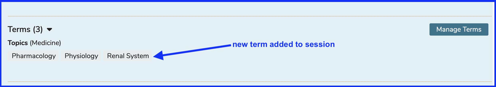

## Remove Term

The process for removing a term from a session is basically the same as what is listed above but in reverse. Clicking on an already-attached term will remove it from being associated with that session. This action does require a save event to occur in order to complete the process.

In this case, we are going to remove the Term that was selected, and erroneously attached, to the session shown below. This is the one from "UCSF 49". 

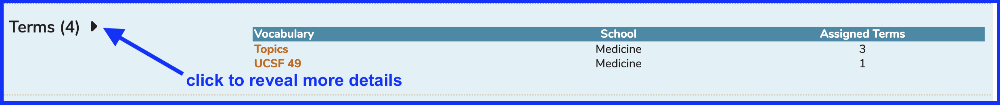

After expanding as shown above, we see there are two Vocabularies that have been used and terms within have been attached to this session. 

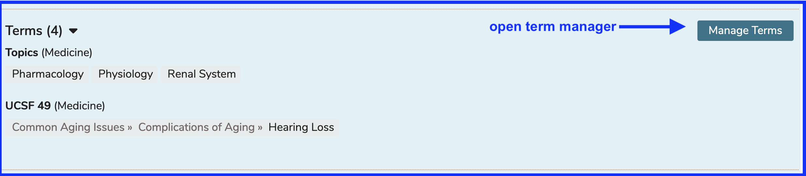

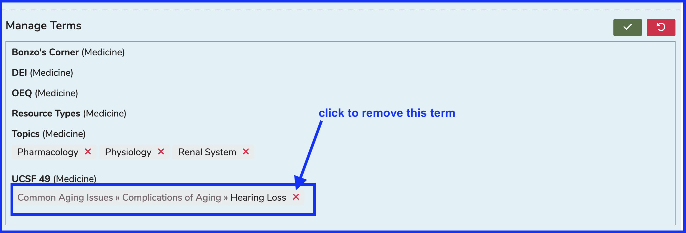

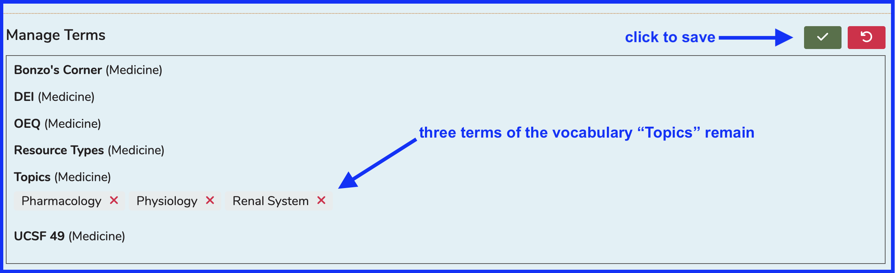

After performing the steps above, the list will refresh verifying the removal of the "UCSF 49" term.

### Updated List

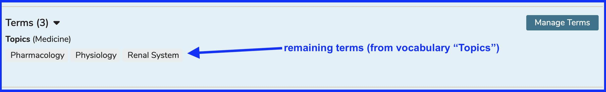
