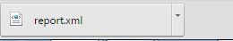

# Curriculum Inventory

## Curriculum Inventory Manager

The Curriculum Inventory Manager is designed to allow Ilios users to craft standards-compliant xml output reports for the AAMC’s new Curriculum Inventory, as well as to provide a platform for modeling new frameworks for the curricula held in Ilios.

Access to the Curriculum Inventory (CI) Manager requires advanced privileges in Ilios. Please refer to the[ Permissions Matrix ](https://www.dropbox.com/s/431sdj2bfoi3v1f/Ilios%20New%20Default%20Permissions%20Matrix.pdf?dl=0)for more information.

In this first iteration, the tools allow for the basic construction of curriculum blocks (“sequence blocks”) and their appropriate population with course and other data.

It is important to note that all fields in the UI forms are effectively mandatory; there are no fields presented to the user which are not explicitly called for by the specification and standard. In certain circumstances, certain attributes may need to be left blank (as in the ‘Course’ attribute for a master parent sequence block with nested child blocks in it); or as in the case of Clerkship dates and durations a selection of either/or variables may alter into a set of mandatory required variables. These circumstances are dictated by the standard and the AAMC business rules. For further details on the various attributes available to the CI, please see the detailed information and examples provided by the AAMC [here](https://www.aamc.org/initiatives/cir/) or contact them for additional information. For information on mapping Ilios data to the PCRS, configuration settings, and further detailed information on the Curriculum Inventory tools, please go to the Ilios wiki [here](https://github.com/ilios/ilios/wiki/The-Curriculum-Inventory-Manager).

Reports may be created, edited and/or deleted up until they are “finalized”. Selecting the finalize button saves the report to the database as part of the historical record. These reports can no longer be modified.

Only one report for each year of each program may be in place at any time; this includes finalized reports.

The export created by the report is compliant with the Medbiquitous standards and the AAMC inventory business rules. Once generated it may be delivered directly to the AAMC for input into the CI and MedAPS system. This was designed with the School of Medicine in mind. However, the provided tools can be used by any school (Pharmacy, Dentistry etc.).&#x20;

## Accessing Curriculum Inventory

The Curriculum Inventory functionality can be accessed (if you have the rights) by clicking on the Ilios Flyout Menu as shown below.

### Main Screen

After clicking the Curriculum Inventory link from the Ilios flyout menu as shown above, the screen will appear similar to what is shown below.

&#x20;The existing Curriculum Inventory (CI) Reports can be sorted by ...

`Report Name`

&#x20;or ...

`Academic Year`

You can see (A - Z) next to Report Name above, which indicates that is the current sort order. In the screen shot above, the five CI Reports have been finalized and can no longer be modified. They can be viewed by clicking on the hyperlinked Report Name or by clicking the Edit icon under the Actions menu. Any of the reports can be downloaded by clicking the Download Button, also under the Actions menu.

### Create a New CI Report

#### 1. Click New Report Button

Click the (+) button as shown below to start the process of creating a new CI Report.

#### 2. Select School, Program, Year and enter Name and optional Description

Once the (+) icon has been clicked as shown above, the screen appears as shown below. Select and / or enter the applicable data for the newly created CI Report.

After the data has been entered or selected as shown above and "Done" has been clicked, the new CI Report gets created. It gets shifted to the bottom of the list (sorted currently by "Report Name").

**NOTE:** The newly created reported can be deleted - use the red trash can icon to do this. Its status is DRAFT. Any report that has not been finalized can be deleted.

### Icons Explained

The red trash can "Delete" is only available when a CI Report has not been finalized. A finalized CI Report is shown with a locked icon and cannot be deleted.

#### 3. Add Sequence Block

When building the report, each “block” of the curriculum, regardless of whether it is a track, a set of courses, or a single course, is created as a “sequence block”. Sequence blocks may be nested at any level, so you can put blocks within blocks (within blocks), and so on, as shown below.

Any number of levels may be nested; it is important to note that the highest level block must be created first, as this iteration does not allow for the moving or shifting of blocks from one container to another or one level to another.

Note that in the current iteration, it is necessary to create the highest level block in a nested set first, and work down. So in the case of complex parallel and intersecting longitudinal curricular mappings, the topmost container (or curricular title or structure) should be created as your first sequence block. For example, for a block of 1st and 2nd year courses associated together as “Essential Core”, which include 5 major course blocks, as well as a parallel longitudinal program for Foundations of Care, you would first create a block called “Essential Core”, and then within it nest 5 ordered blocks – one for each course --- and then an additional parallel block for Foundations of Care.

Now that the new CI Report was saved in Step 2 (above), the report can be accessed and edited by using any of the three routes indicated by the purple arrows in the screen shot below. The congratulatory message only appears until the screen is refreshed or other action is taken.

Now that the newly created report has been selected and opened for editing, to start the process of creating the top level of the nested Sequence Blocks, click the (+) button as shown below.

It is strongly recommended that the structure of your report be well defined prior to creating it in Ilios. This will facilitate the process of modeling your high level tracks, blocks, and nested sequences.

The data entry points for a new Sequence Block are detailed below.

**IMPORTANT NOTE**: By default, courses are set to be "Not A Clerkship". If a Clerkship Type is selected, **BOTH** Start and End Date **AND** Duration are required. This is pointed out because the image above indicates only one is required - not the case with Clerkships.

**Other Fields:**

* Is Selective?:  Enter an optional Minimum and Maximum into the provided fields.

**Minimum:** If there are nested sequence blocks, _minimum_ indicates the minimum number of nested sequence blocks that a learner must take. For optional courses / electives, this value is 0. **Maximum:** If there are nested sequence blocks, _maximum_ indicates the maximum number of nested sequence blocks that a learner can take.

After clicking the **Done** button shown above, the Sequence Block is committed to the database. The meta-information about the Sequence Block is displayed as shown below.

#### 4. Add Nested Sequence Block

This is the process of assigning the Courses (and the Sessions and Offerings) that correspond to the Sequence Block saved in the previous step.

Pull up the recently saved top-level Sequence Block by following one of the routes indicated in the screen shot below to begin the process of adding the Courses and Sessions to the nested Sequence Block being created.&#x20;

Now that the process has been started as shown above the Sequence Block creation screen is displayed again only this time, the new Sequence Block will be "nested" under the higher level one.

After following the steps shown above, the Nested Sequence Block can be created as shown below.

After clicking Done, the new Sequence Block gets created as shown below.

Open up the newly created nested Sequence Block by clicking in one of the locations indicated by the blue arrows above.

The changes that can be made after clicking Manage as shown above are primarily to deal with Instructional Time. In the case that is circled above there are 8 Offerings and the time is not counted as one Offering. The full duration of all 8 Offerings is added up for the total of 32 hours, even though each of the Offerings (Exams) that any one student would attend would last 4 hours. You can select "Count as one offering" to be "Yes" to fix this if that is what you choose to do. In this case, that would probably be the best thing to do since each student only has to take this exam one time.

You may modify this setting for each session at any time until finalization of your report. You can also edit any of the values shown with Blue type above. Click to modify.

### Working with Instructional Time

When you create a course-based sequence block in your report, the block will list every session given for that course, and the total instructional time for each. Along with each session listing, a checkbox is available; checking this checkbox (which is by default in the “unchecked” state) marks the session as a single event, regardless of the number of times it is offered. In other words, for small groups sessions, small lab sessions, and similar, all the group time or labs will be counted only as one event when checked. If a one-hour lab is given for 24 groups, then when checked it will be listed as a one-hour event.

**NOTE:** If a session contains multiple offerings of different time lengths, then when the checkbox is checked Ilios will identify the longest available offering for that session and use that as the basis for its calculation; so if there are three offerings for a lab, with durations of 1 hour, 1.25 hours, and 1.75 hours respectively, with the checkbox checked the report will list the session as 1.75 hours of instructional time. Unchecked it will list it as 4 hours of instructional time.

#### 5. Edit Nested Sequence Block

Since, it is not accurate to have all of the 7 Offerings to be added together to account for Instructional Hours, click Manage to fix this. The Session "Total time" will be calculated as the duration of the longest of any of the Offerings. This is usually the same as the average since in the case of small groups, all of the offerings frequently have the same duration.

### Excluding Offerings from CI Output

Clicking as shown below will adjust the Sequence Block to reflect reality better. The two ILM's at the top of the Sequence Block have been selected to **NOT** be included in the CI Report output. The ABC1 Exam is now counted at its correct duration (4 hours).

Click the Green Check box to process the update(s). The screen refreshes with the updated values indicated.

Once a report is created in draft form, it becomes available in the “select report” list which appears when clicking the “select report” button at the top left of the screen. Reports may be edited at any time until they are finalized. Once finalized, they may not be modified, and changes to the existing active curriculum or Ilios data will not modify their contents.

It may be necessary to go one level deeper into the Block Sequence structure when there are multiple courses that go into making up the Sequence Block.

#### 6. Finalize Curriculum Inventory Report

The example below shows a completed CI Report that is now ready to be finalized. Any of the fields with blue text can still be edited before the report gets finalized. The report can also be downloaded before or after it gets finalized. The same is true for performing a[rollover](https://iliosproject.gitbook.io/ilios-user-guide/curriculum-inventory/ci-report-rollover).&#x20;

After clicking the `Finalize` button as shown above, the user is presented with one final chance to either go through with the finalization of the report or cancel out and make further refinements.

Now, after clicking `Yes`, the CI Report gets finalized and as the message states no further edits will be possible.

The following splash screen appears while the finalizaton process is being performed. It may take a while to complete.

Now the report can be downloaded but cannot be edited. The top part of the screen reflects this fact.

The XML output from the CI Report can be run through an XML parser such as [this one](https://www.corefiling.com/opensource/schemaValidate.html) to check for errors. Common errors include fields that require a value not receiving a value.

Clicking `Download` will create a file called `report.xml` which will be saved to your default download folder.

