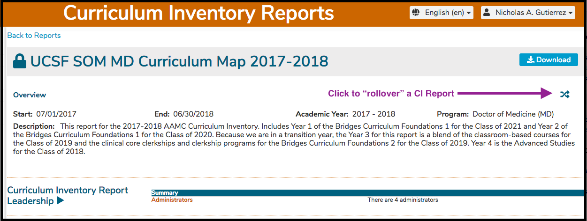
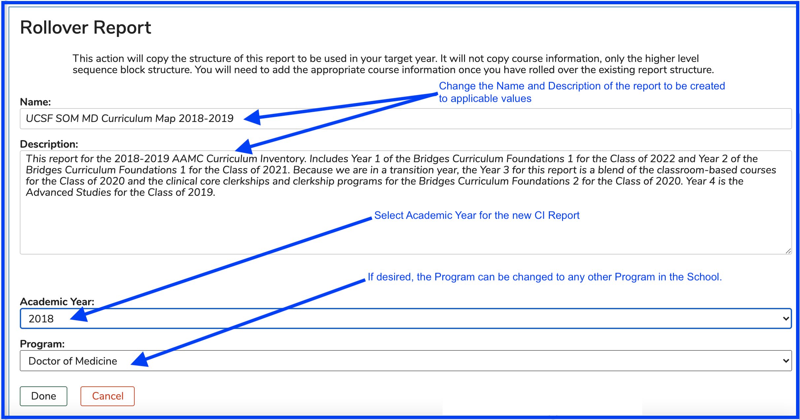
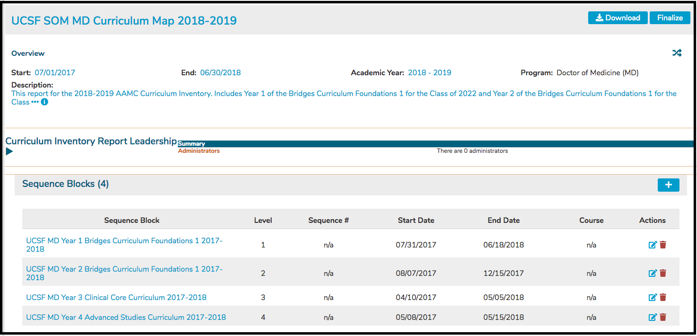

# CI Report Rollover

## Rolling Over a CI Report

Rolling over a CI Report into a future Academic Year in the same program (or into a different program) in the same school is a fairly straight forward process:


Click the Rollover Button from within a Curriculum Inventory report to create a version of this same report in a different Academic Year or Program. 


After clicking as shown above, the default Academic Year to be used is the following year. We are rolling the structure of the report and nothing else over to 2018-2019 from 2017-2018. Click "Done" to process this action.

Now that the values have been set (and after clicking Done), the new CI Report gets created. 

The newly created CI Report still will need considerable tweaking. The Sequence Block titles still reflect the values from the previous report. Since these are entered manually, they will require to be fixed up manually as well. This is true for the start and end dates as well. In addition, the nested Sequence Blocks will need to be attached to the corresponding Courses in the new year as well.

