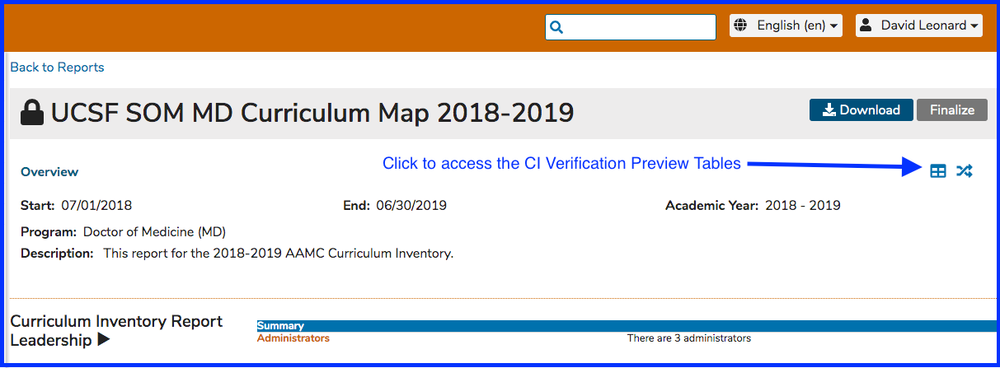
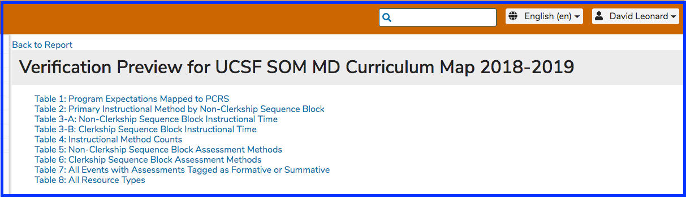

# Verification Preview Tables

Ilios now includes a major improvement to the Curriculum Inventory toolset. Now as you build your report, you will be able to review your data compiled to reflect the primary tables of the CI Verification Report -- which in turn reflect the DCI \(Data Collection Instrument\) tables you will use to support your LCME Site Visit. 

To access this functionality, click as shown below. 

The following screen shot briefly shows the table of contents which is displayed after clicking to access the CI Verification Preview Tables. The 8 tables are listed below. 

