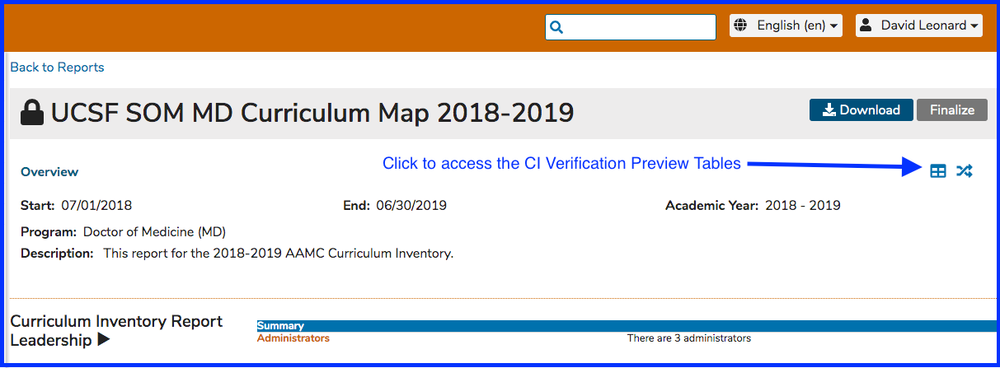
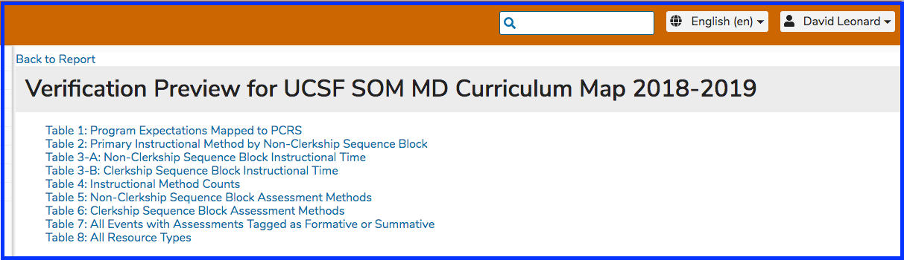

# Verification Preview Tables

Ilios now includes a major improvement to the Curriculum Inventory toolset. Now as you build your report, you will be able to review your data compiled to reflect the primary tables of the CI Verification Report -- which in turn reflect the DCI \(Data Collection Instrument\) tables you will use to support your LCME Site Visit. 

To access this functionality, click as shown below. 

The following screen shot briefly shows the table of contents which is displayed after clicking to access the CI Verification Preview Tables. The 8 tables are shown in the screen shot of the Table of Contents in the application. 

#### User Guide Links to the Table Descriptions

These tables may be subject to change by the AAMC. The detailed linked pages may be removed from the user guide in the future. As of late 2019, they are as follows. 

* Table 1: [Program Expectations Mapped to PCRS ](https://iliosproject.gitbook.io/ilios-user-guide/curriculum-inventory/verification-preview-tables/program-expectations-mapped-to-pcrs)
* Table 2: [Primary Instructional Method by Non-Clerkship Sequence Block](https://iliosproject.gitbook.io/ilios-user-guide/curriculum-inventory/verification-preview-tables/primary-instructional-method) 
* Table 3: [Instructional Time ](https://iliosproject.gitbook.io/ilios-user-guide/curriculum-inventory/verification-preview-tables/instructional-time)\(A. Non-Clerkship Sequence Block\) \(B. Clerkship Sequence Block\)
* Table 4: [Instructional Method Counts](https://iliosproject.gitbook.io/ilios-user-guide/curriculum-inventory/verification-preview-tables/instructional-method-counts)
* Table 5: [Non-Clerkship Sequence Block Instructional Time](https://iliosproject.gitbook.io/ilios-user-guide/curriculum-inventory/verification-preview-tables/non-clerkship-sequence-block-assessment-methods) 
* Table 6: [Clerkship Sequence Block Assessment Methods](https://iliosproject.gitbook.io/ilios-user-guide/curriculum-inventory/verification-preview-tables/clerkship-sequence-block-assessment-methods) 
* Table 7: [All Events with Assessments Tagged as Formative or Summative](https://iliosproject.gitbook.io/ilios-user-guide/curriculum-inventory/verification-preview-tables/all-events-with-assessments-tagged-as-formative-or-summative) 
* Table 8: [All Resource Types ](https://iliosproject.gitbook.io/ilios-user-guide/curriculum-inventory/verification-preview-tables/all-resource-types)

