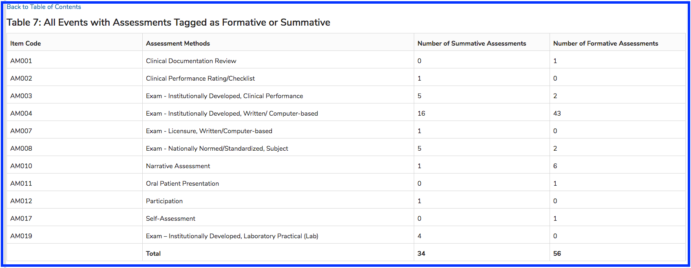

# All Events with Assessments Tagged as Formative or Summative

Table 7 is shown below. Because this output was not too lengthy, this is a good example of viewing the **Total** row along with the details above. 

