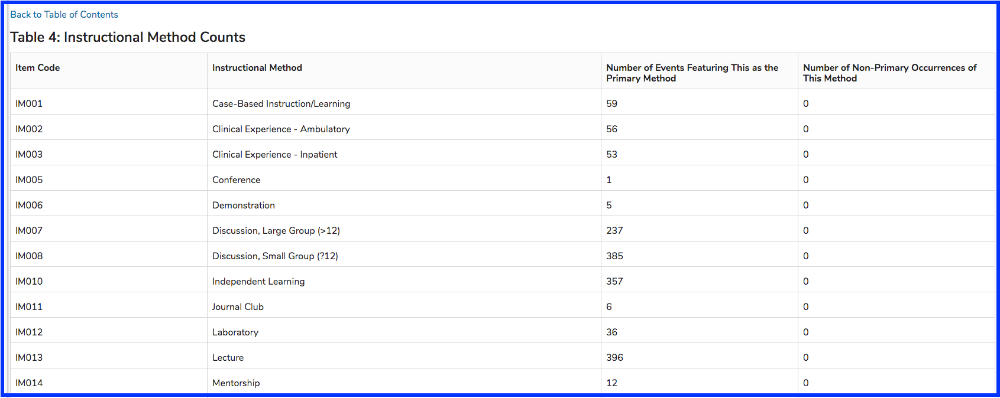

# Instructional Method Counts

#### Table 4: Instructional Method Counts

This table shows the count of the number of times the Instructional Method was used either as primary or secondary method of instruction. The Item Code is also included for reference and to determine the mapping accuracy.

**Totals**

At the bottom of Table 4, there is a row displaying the total of the Number of Events Featuring This \(the Instructional Method\) as the Primary Method as well as row totaling the number of occurrences when the Instructional Method is not the primary method of instruction. In our example from UCSF, there were none of these secondary methods noted.

