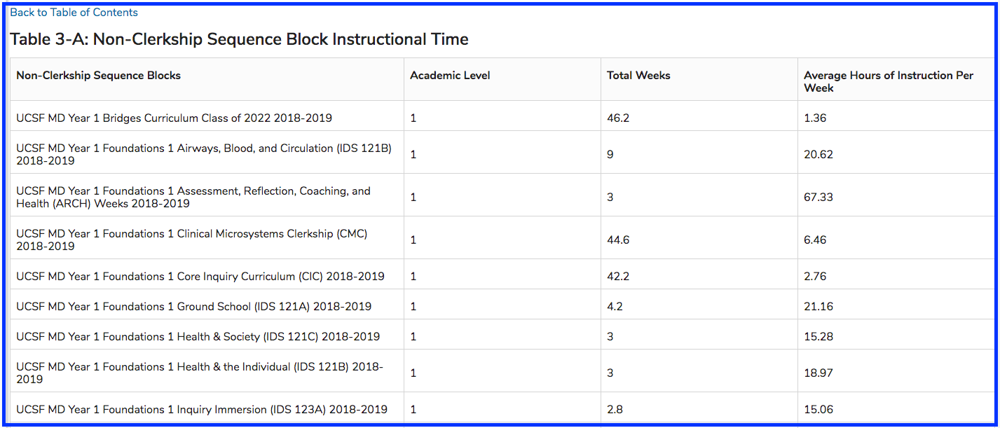
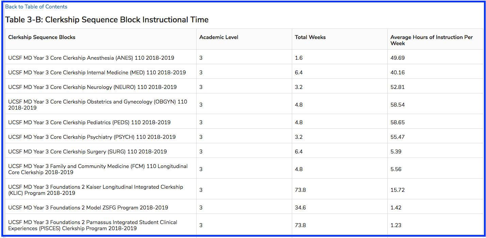

# Instructional Time

#### Table 3-A

#### Table 3-B 

In both cases, the Verification table returns the Sequence Block title, Academic Level, Total Weeks of instruction, along with the Average Hours of Instruction per week. This is helpful to determine if adjustments should be made before submitting the CI Report.

